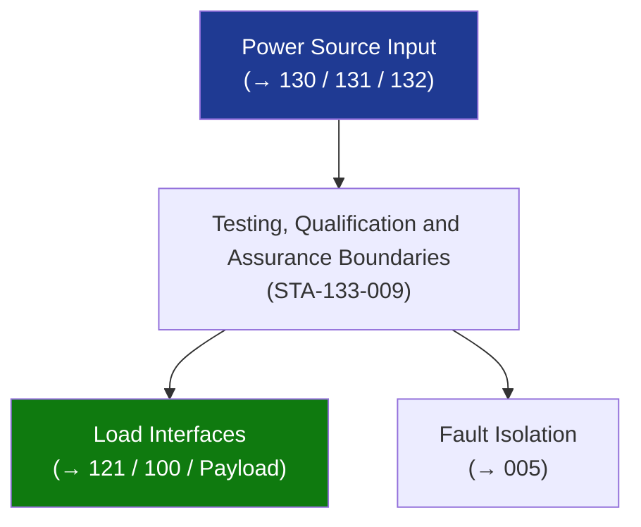

# STA 130-139 · Section 03 · Subsection 133 · Subsubject 009 — Testing, Qualification and Assurance Boundaries

## 1. Purpose

Defines **testing, qualification, and assurance requirements** for the electrical distribution subsystem on Q+ATLANTIDE STA-band platforms.

## 2. Scope

- **Unit-level qualification** — DC/DC converters, RPCs, LCLs: thermal vacuum, vibration, radiation TID; functional test pre/post; per ECSS-E-ST-20C and ECSS-E-ST-10-03C.
- **Harness qualification** — continuity, insulation resistance (≥ 1 MΩ at 500 V DC), dielectric withstanding voltage per NASA-STD-8739.4.
- **System-level EPS test** — power budget verification under simulated orbital conditions (eclipse, peak load, safe-mode); measured efficiency, bus regulation, and load-shedding verification.
- **EMC test** — subsystem-level conducted emission/susceptibility and radiated emission per MIL-STD-461G; test report mandatory at CDR.
- **Acceptance test** — each flight harness: continuity, insulation resistance, hi-pot; each flight RPC/LCL: functional switch/limit test.

## 3. Diagram — Testing, Qualification and Assurance Boundaries

## 4. Footprint

| Metric | Value |
|---|---|
| Subsection | `133` — Distribución Eléctrica |
| Subsubject | `009` — Testing, Qualification and Assurance Boundaries |
| Primary Q-Division | Q-SPACE[^qdiv] |
| Governance class | `baseline`[^gov] |

## 5. References & Citations

[^ecssest20]: **ECSS-E-ST-20C — Electrical and Electronic**.
[^qdiv]: **Q-Division authority** — See [`organization/Q+ATLANTIDE.md` §4](../../../../organization/Q+ATLANTIDE.md#4-notes).
[^gov]: **Governance class** — `baseline`.

### Applicable industry standards
- ECSS-E-ST-20C; ECSS-E-ST-10-03C; NASA-STD-8739.4
