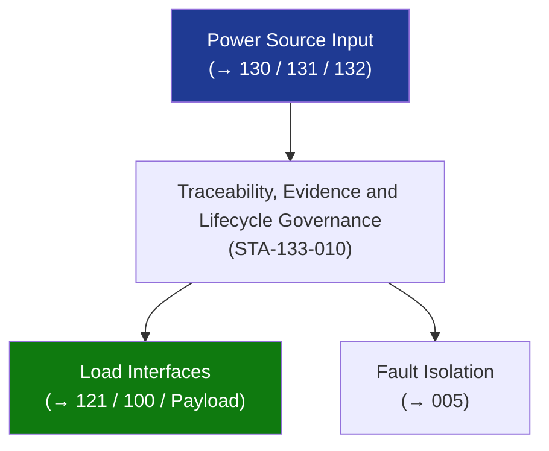

# STA 130-139 · Section 03 · Subsection 133 · Subsubject 010 — Traceability, Evidence and Lifecycle Governance

## 1. Purpose

Establishes **traceability, design evidence, and lifecycle governance** for the electrical distribution subsystem on Q+ATLANTIDE STA-band platforms.

## 2. Scope

- **Requirements traceability** — bus topology, load priority, fault isolation, redundancy, EMC limits traced to system-level power and safety requirements; managed in Q+ATLANTIDE requirements register.
- **Design evidence gates** — PDR: power budget with load model; CDR: detailed harness ICD freeze, RPC/LCL selection with margin evidence; safety-critical bus topology verified.
- **Qualification evidence** — unit and harness test reports; EMC test report; system EPS test report.
- **ICD freeze** — electrical ICD (connector pinouts, wire gauge allocations, current limits) frozen at CDR; delta-CDR change process for post-CDR modifications.
- **Lifecycle records** — harness serial numbers, RPC/LCL serial numbers and lot traceability; firmware version for smart RPCs; maintained through decommissioning.

## 3. Diagram — Traceability, Evidence and Lifecycle Governance

## 4. Footprint

| Metric | Value |
|---|---|
| Subsection | `133` — Distribución Eléctrica |
| Subsubject | `010` — Traceability, Evidence and Lifecycle Governance |
| Primary Q-Division | Q-SPACE[^qdiv] |
| Governance class | `baseline`[^gov] |

## 5. References & Citations

[^ecssest20]: **ECSS-E-ST-20C — Electrical and Electronic**.
[^qdiv]: **Q-Division authority** — See [`organization/Q+ATLANTIDE.md` §4](../../../../organization/Q+ATLANTIDE.md#4-notes).
[^gov]: **Governance class** — `baseline`.

### Applicable industry standards
- ECSS-E-ST-20C — Electrical and Electronic
