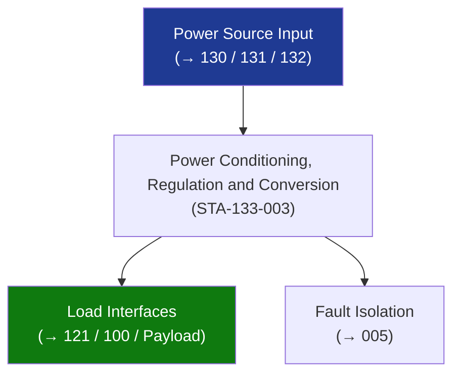

# STA 130-139 · 133-030 — Power Conditioning Regulation and Conversion

## 1. Purpose

Defines **power conditioning, point-of-load regulation, and DC/DC conversion** requirements for Q+ATLANTIDE STA-band platforms.

## 2. Scope

- **Primary DC/DC converters** — bus-to-load converters; input voltage range tracking battery SOC; output: 3.3 V / 5 V / 12 V / 15 V / 28 V regulated for subsystem loads.
- **Linear regulators** — low-noise, low-efficiency (η ≈ 60–90%); used for analogue/RF loads sensitive to switching noise.
- **Switching converters** — buck, boost, buck-boost; η ≥ 85%; switching frequency ≥ 100 kHz; filtered to MIL-STD-461G CE102/CS101.
- **Ripple and noise limits** — output ripple ≤ 1% of nominal; conducted noise per ECSS-E-ST-20C Table A-3.
- **Soft-start** — inrush current limit ≤ 3× steady-state; implemented via soft-start pin or external NTC thermistor.

## 3. Diagram — Power Conditioning, Regulation and Conversion

## 4. Footprint

| Metric | Value |
|---|---|
| Subsection | `133` — Distribución Eléctrica |
| Subsubject | `003` — Power Conditioning, Regulation and Conversion |
| Primary Q-Division | Q-SPACE[^qdiv] |
| Governance class | `baseline`[^gov] |

## 5. References & Citations

[^ecssest20]: **ECSS-E-ST-20C — Electrical and Electronic**.
[^qdiv]: **Q-Division authority** — See [`organization/Q+ATLANTIDE.md` §4](../../../../organization/Q+ATLANTIDE.md#4-notes).
[^gov]: **Governance class** — `baseline`.

### Applicable industry standards
- ECSS-E-ST-20C — Electrical and Electronic
