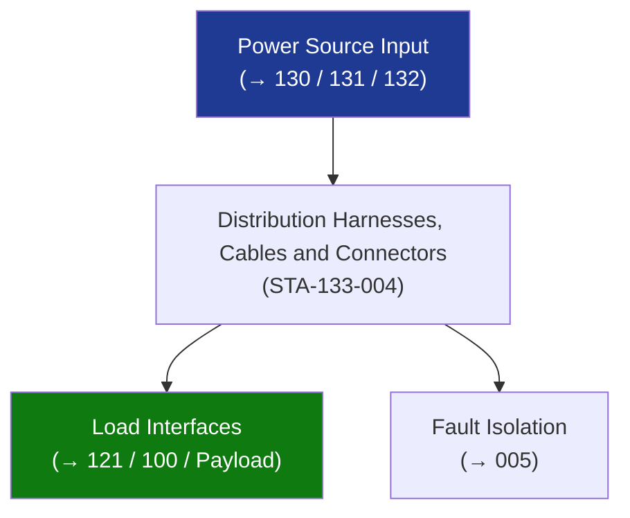

# STA 130-139 · 133-040 — Distribution Harnesses Cables and Connectors

## 1. Purpose

Establishes **harness, cable, and connector design requirements** for electrical distribution on Q+ATLANTIDE STA-band platforms.

## 2. Scope

- **Wire gauge** — sized per current × derating (0.7 derate for bundled harness); minimum 24 AWG; high-current buses: 16–8 AWG; NASA-STD-8739.4[^nasastd87394].
- **Insulation** — PTFE (polytetrafluoroethylene) or Kapton-laminated wire; outgassing per ECSS-Q-ST-70C (TML ≤ 1%, CVCM ≤ 0.1%) (→ `111_Materiales-Espaciales`).
- **Shielding** — 360° shield termination at chassis ground; shield coverage ≥ 85%; per MIL-STD-461G RE102/RS103.
- **Connectors** — Mil-C-38999 or EN2997-series; potting at RF/propulsion interfaces; contact size matched to wire gauge.
- **Routing** — separation ≥ 50 mm from RF cables; no routing over sharp edges without grommet; tie-down per IPC/WHMA-A-620.

## 3. Diagram — Distribution Harnesses, Cables and Connectors

## 4. Footprint

| Metric | Value |
|---|---|
| Subsection | `133` — Distribución Eléctrica |
| Subsubject | `004` — Distribution Harnesses, Cables and Connectors |
| Primary Q-Division | Q-SPACE[^qdiv] |
| Governance class | `baseline`[^gov] |

## 5. References & Citations

[^ecssest20]: **ECSS-E-ST-20C — Electrical and Electronic**.
[^qdiv]: **Q-Division authority** — See [`organization/Q+ATLANTIDE.md` §4](../../../../organization/Q+ATLANTIDE.md#4-notes).
[^gov]: **Governance class** — `baseline`.

### Applicable industry standards
- ECSS-E-ST-20C — Electrical and Electronic; NASA-STD-8739.4
