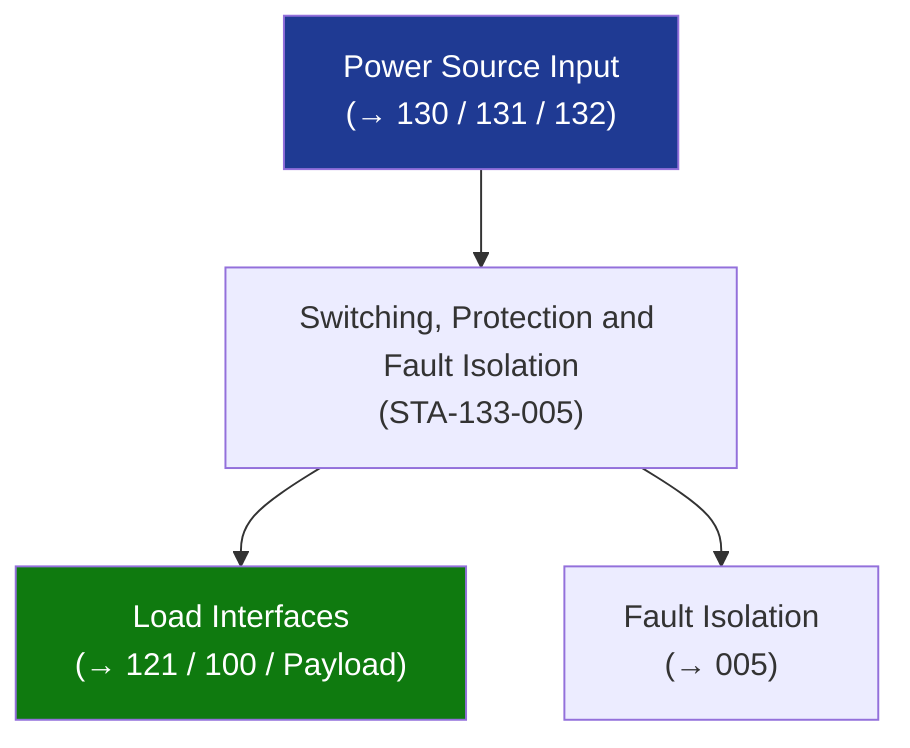

# STA 130-139 · 133-050 — Switching Protection and Fault Isolation

## 1. Purpose

Defines **load switching, protection, and fault isolation architecture** for electrical distribution on Q+ATLANTIDE STA-band platforms.

## 2. Scope

- **Remote power controllers (RPCs)** — solid-state switching; programmable current limits; latch-off on fault; telemetry-readable status; preferred for non-explosive pyro loads.
- **Latching current limiters (LCLs)** — active current limiting with latch-off; protects bus from load short-circuit; reset via telecommand.
- **Fuses** — passive protection (last resort); selected per ECSS-E-ST-20C Table B; not re-settable; used for high-reliability irreversible protection.
- **Fault isolation** — single-fault tolerance: any single short-circuit on a load must not propagate to adjacent bus; verified by worst-case fault analysis.
- **Pyrotechnic switching** — squib drivers for one-shot deployment/separation events; firing capacitor bank; inhibit plug for ground operations.

## 3. Diagram — Switching, Protection and Fault Isolation

## 4. Footprint

| Metric | Value |
|---|---|
| Subsection | `133` — Distribución Eléctrica |
| Subsubject | `005` — Switching, Protection and Fault Isolation |
| Primary Q-Division | Q-SPACE[^qdiv] |
| Governance class | `baseline`[^gov] |

## 5. References & Citations

[^ecssest20]: **ECSS-E-ST-20C — Electrical and Electronic**.
[^qdiv]: **Q-Division authority** — See [`organization/Q+ATLANTIDE.md` §4](../../../../organization/Q+ATLANTIDE.md#4-notes).
[^gov]: **Governance class** — `baseline`.

### Applicable industry standards
- ECSS-E-ST-20C — Electrical and Electronic
