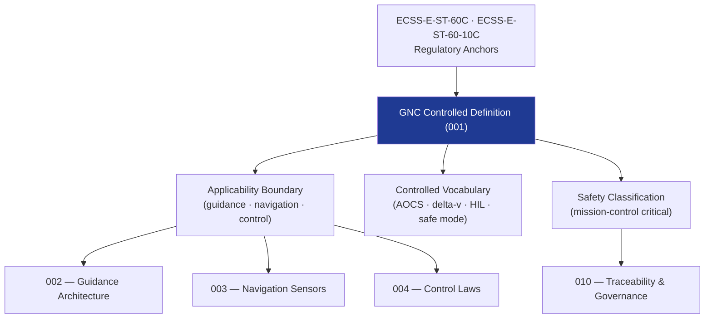

# STA 140-149 · Section 04 · Subsection 140 · Subsubject 001 — GNC Controlled Definition

## 1. Purpose

Establishes the **normative definition and controlled scope** of GNC (Guidance, Navigation and Control) within the Q+ATLANTIDE STA band, per ECSS-E-ST-60C[^ecssest60c].

## 2. Scope

- **Controlled definition** — GNC encompasses the algorithms, software functions, and hardware interfaces that determine a spacecraft's trajectory and attitude, estimate its state, and generate actuator commands to achieve mission-defined pointing and trajectory objectives throughout all operational mission phases.
- **Applicability boundary** — STA `140` covers the GNC subsystem on Q+ATLANTIDE STA-band platforms; excludes avionics hardware hosting (→ `141`), flight software execution environment (→ `142`), ground mission control (→ `143`), and autonomy decision logic above GNC layer (→ `144`).
- **Controlled vocabulary** — *Guidance*: trajectory and maneuver computation; *Navigation*: state estimation using sensor measurements; *Control*: actuator command generation to achieve desired state; *AOCS* (Attitude and Orbit Control System); *GNC loop*: sensor-estimator-controller-actuator cycle; *safe mode*: minimum-energy survival attitude; *delta-v*: velocity increment for maneuver execution; *HIL*: hardware-in-the-loop simulation.
- **Safety classification** — mission-control critical; GNC failures may result in uncontrolled spacecraft attitude, trajectory deviation, or mission loss.
- **Interface boundaries** — GNC interfaces with: flight software (142) via OBSW data exchange; avionics (141) via sensor data buses and actuator command channels; mission control (143) for TC/TM parameter updates; autonomy (144) for mode transitions.

## 3. Diagram — GNC Definition Framework

## 4. Footprint

| Metric | Value |
|---|---|
| Architecture | `STA` — Space Technology Architecture |
| Master range | `100–199` |
| Code range | `140-149` |
| Section | `04` — Aviónica y Control de Misión Espacial |
| Subsection | `140` — GNC — Guiado, Navegación y Control |
| Subsubject | `001` — GNC Controlled Definition |
| Primary Q-Division | Q-SPACE[^qdiv] |
| ORB support | ORB-PMO, ORB-LEG |
| Governance class | `baseline`[^gov] |
| Document | `001_GNC-Controlled-Definition.md` (this file) |
| Parent subsection | [`README.md`](./README.md) · [`000_Overview.md`](./000_Overview.md) |

## 5. References & Citations

[^ecssest60c]: **ECSS-E-ST-60C — Control Engineering** — European standard for spacecraft GNC system design and verification.

[^ecssest6010c]: **ECSS-E-ST-60-10C — Space Engineering: Control Performance** — European standard for GNC performance specification and analysis.

[^nasastd7009a]: **NASA-STD-7009A — Standard for Models and Simulations** — NASA standard for the development and use of models and simulations supporting GNC design.

[^qdiv]: **Q-Division authority** — See [`organization/Q+ATLANTIDE.md` §4](../../../../organization/Q+ATLANTIDE.md#4-notes).

[^gov]: **Governance class** — `baseline`.

### Applicable industry standards

- ECSS-E-ST-60C — Control Engineering[^ecssest60c]
- ECSS-E-ST-60-10C — Space Engineering: Control Performance[^ecssest6010c]
- NASA-STD-7009A — Standard for Models and Simulations[^nasastd7009a]
