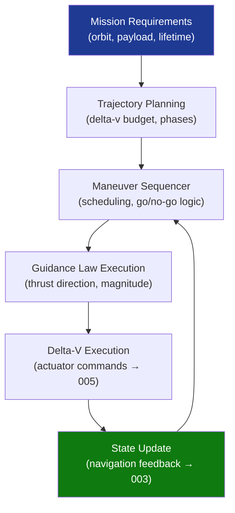

# STA 140-149 · Section 04 · Subsection 140 · Subsubject 002 — Guidance Architecture and Mission Trajectory Logic

## 1. Purpose

Defines the **guidance algorithm architecture** and mission trajectory logic for Q+ATLANTIDE STA-band spacecraft, establishing the framework for trajectory planning, maneuver execution, and delta-v accountability.

## 2. Scope

- **Guidance architecture** — multi-level guidance structure: mission-level trajectory planning, phase-level maneuver sequencing, and cycle-level guidance law execution; interfaces with navigation state estimates and control law inputs.
- **Orbital insertion guidance** — injection accuracy requirements, burn initiation logic, gravity-turn and closed-loop guidance algorithms for orbit insertion maneuvers; shutdown criteria and residual delta-v monitoring.
- **Station-keeping guidance** — secular and periodic perturbation compensation; slot maintenance algorithms; maneuver frequency and delta-v budget allocation over mission lifetime.
- **Rendezvous and proximity operations (RPO)** — relative navigation guidance, approach corridor definitions, forced-motion trajectories, hold-point logic, collision avoidance maneuver triggers.
- **Delta-v budget accountability** — mission-level delta-v budget decomposed by mission phase; margin policies (deterministic + statistical); budget update process at design reviews.
- **Maneuver execution logic** — burn scheduling, interruption criteria, post-burn orbit determination, go/no-go logic, and ground-confirmed vs autonomous maneuver modes.

## 3. Diagram — Guidance Architecture Flow

## 4. Footprint

| Metric | Value |
|---|---|
| Architecture | `STA` — Space Technology Architecture |
| Master range | `100–199` |
| Code range | `140-149` |
| Section | `04` — Aviónica y Control de Misión Espacial |
| Subsection | `140` — GNC — Guiado, Navegación y Control |
| Subsubject | `002` — Guidance Architecture and Mission Trajectory Logic |
| Primary Q-Division | Q-SPACE[^qdiv] |
| ORB support | ORB-PMO, ORB-LEG |
| Governance class | `baseline`[^gov] |
| Document | `002_Guidance-Architecture-and-Mission-Trajectory-Logic.md` (this file) |
| Parent subsection | [`README.md`](./README.md) · [`000_Overview.md`](./000_Overview.md) |

## 5. References & Citations

[^ecssest60c]: **ECSS-E-ST-60C — Control Engineering** — European standard for spacecraft GNC design including guidance algorithm requirements.

[^ecssest6010c]: **ECSS-E-ST-60-10C — Space Engineering: Control Performance** — Guidance performance requirements and analysis methods.

[^nasastd7009a]: **NASA-STD-7009A — Standard for Models and Simulations** — Requirements for trajectory simulation models used in guidance design verification.

[^qdiv]: **Q-Division authority** — See [`organization/Q+ATLANTIDE.md` §4](../../../../organization/Q+ATLANTIDE.md#4-notes).

[^gov]: **Governance class** — `baseline`.

### Applicable industry standards

- ECSS-E-ST-60C — Control Engineering[^ecssest60c]
- ECSS-E-ST-60-10C — Space Engineering: Control Performance[^ecssest6010c]
- NASA-STD-7009A — Standard for Models and Simulations[^nasastd7009a]
