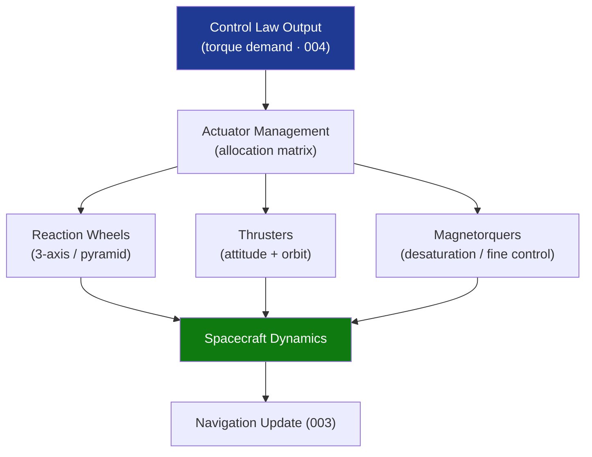

# STA 140-149 · Section 04 · Subsection 140 · Subsubject 005 — Actuators: Reaction Wheels, Thrusters and Magnetorquers

## 1. Purpose

Defines the **actuator suite selection, sizing, interface, and redundancy strategy** for GNC attitude and orbit control on Q+ATLANTIDE STA-band spacecraft, covering reaction wheels, thrusters, and magnetorquers.

## 2. Scope

- **Reaction wheel sizing and momentum management** — torque and angular momentum sizing per mission pointing requirements; wheel configuration (3-axis, pyramid, or tetrahedron arrangements); momentum saturation limits; momentum dumping strategy (magnetorquer-based or thruster-based); vibration micro-disturbance characterization and isolation requirements.
- **Thruster selection and interface** — cold gas, monopropellant hydrazine, and electric propulsion thruster selection criteria for attitude control and orbit maneuvers; thruster plume impingement analysis; minimum impulse bit (MIB) requirements; thruster valve command interface; propellant budget allocation for attitude control; interaction with propulsion subsystem (→ `121`).
- **Magnetorquer authority** — magnetic dipole generation by coils or permanent magnets; torque authority as function of orbit inclination and local geomagnetic field; duty cycle limitations; interaction with onboard magnetic cleanliness requirements; use for reaction wheel desaturation at LEO.
- **Actuator redundancy strategy** — failure mode effects analysis for each actuator type; cold/warm/hot redundancy architecture; cross-strap wiring logic; degraded-mode operations (reduced pointing accuracy in actuator-failed state).
- **Interface with GNC software** — actuator command word format, enable/disable logic, health monitoring via telemetry, and maximum command rate constraints; interface with avionics hardware (→ `141`) and flight software (→ `142`).

## 3. Diagram — Actuator Interface and Redundancy Architecture

## 4. Footprint

| Metric | Value |
|---|---|
| Architecture | `STA` — Space Technology Architecture |
| Master range | `100–199` |
| Code range | `140-149` |
| Section | `04` — Aviónica y Control de Misión Espacial |
| Subsection | `140` — GNC — Guiado, Navegación y Control |
| Subsubject | `005` — Actuators: Reaction Wheels, Thrusters and Magnetorquers |
| Primary Q-Division | Q-SPACE[^qdiv] |
| ORB support | ORB-PMO, ORB-LEG |
| Governance class | `baseline`[^gov] |
| Document | `005_Actuators-Reaction-Wheels-Thrusters-and-Magnetorquers.md` (this file) |
| Parent subsection | [`README.md`](./README.md) · [`000_Overview.md`](./000_Overview.md) |

## 5. References & Citations

[^ecssest60c]: **ECSS-E-ST-60C — Control Engineering** — Actuator interface and control allocation requirements.

[^ecssest35c]: **ECSS-E-ST-35C — Propulsion General Requirements** — Thruster performance specifications and qualification requirements.

[^ecssest3301c]: **ECSS-E-ST-33-01C — Mechanisms** — Momentum wheel and reaction wheel mechanism design and qualification standards.

[^qdiv]: **Q-Division authority** — See [`organization/Q+ATLANTIDE.md` §4](../../../../organization/Q+ATLANTIDE.md#4-notes).

[^gov]: **Governance class** — `baseline`.

### Applicable industry standards

- ECSS-E-ST-60C — Control Engineering[^ecssest60c]
- ECSS-E-ST-35C — Propulsion General Requirements[^ecssest35c]
- ECSS-E-ST-33-01C — Mechanisms[^ecssest3301c]
