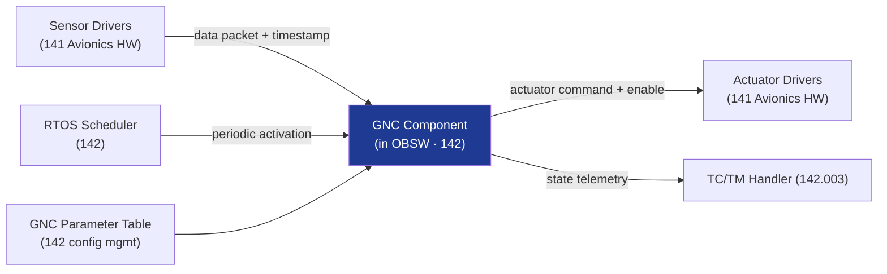

# STA 140-149 · Section 04 · Subsection 140 · Subsubject 007 — GNC Software Interfaces and Timing Constraints

## 1. Purpose

Defines the **interface boundary between the GNC subsystem and flight software (142)**, sensor data rates, actuator command timing, deterministic execution requirements, and OBSW integration constraints for Q+ATLANTIDE STA-band spacecraft.

## 2. Scope

- **GNC-to-FSW interface boundary** — GNC algorithms as software components hosted by the OBSW execution environment (→ `142`); API definition for sensor data input and actuator command output; parameter table interface for tunable gains and thresholds; GNC algorithm scheduling within the OBSW task framework.
- **Sensor data rates and latencies** — star tracker output rate (typically 1–10 Hz), gyroscope output rate (typically 100–1000 Hz), GPS solution update rate (1 Hz); maximum acceptable data latency per sensor type; time-tagging requirements for all sensor measurements; data buffering and overrun detection.
- **Actuator command timing** — reaction wheel torque command update rate; thruster pulse timing resolution and synchronization with attitude control loop period; magnetorquer command update rate; maximum command jitter allowed; closed-loop latency budget (sensor-to-actuator total loop delay).
- **Deterministic execution requirements** — GNC algorithm execution must be deterministic (fixed worst-case execution time, WCET); scheduler interaction; critical section protection for state vector updates; priority assignment within RTOS (→ `142` subsubject 007).
- **OBSW integration** — GNC component partitioning (ARINC 653 adapted); memory footprint budget; stack usage analysis; inter-component communication via shared memory or message passing; integrity of GNC data structures.
- **Interface Control Document (ICD)** — formal GNC-software ICD required; includes data element definitions, timing diagrams, error handling, and version compatibility management.

## 3. Diagram — GNC-FSW Interface and Timing Flow

## 4. Footprint

| Metric | Value |
|---|---|
| Architecture | `STA` — Space Technology Architecture |
| Master range | `100–199` |
| Code range | `140-149` |
| Section | `04` — Aviónica y Control de Misión Espacial |
| Subsection | `140` — GNC — Guiado, Navegación y Control |
| Subsubject | `007` — GNC Software Interfaces and Timing Constraints |
| Primary Q-Division | Q-SPACE[^qdiv] |
| ORB support | ORB-PMO, ORB-LEG |
| Governance class | `baseline`[^gov] |
| Document | `007_GNC-Software-Interfaces-and-Timing-Constraints.md` (this file) |
| Parent subsection | [`README.md`](./README.md) · [`000_Overview.md`](./000_Overview.md) |

## 5. References & Citations

[^ecssest60c]: **ECSS-E-ST-60C — Control Engineering** — GNC software interface requirements.

[^ecssest40c]: **ECSS-E-ST-40C — Software Engineering** — Software interface design and timing assurance requirements.

[^ecssest5012c]: **ECSS-E-ST-50-12C — SpaceWire** — SpaceWire data bus protocol for sensor and actuator data transport.

[^qdiv]: **Q-Division authority** — See [`organization/Q+ATLANTIDE.md` §4](../../../../organization/Q+ATLANTIDE.md#4-notes).

[^gov]: **Governance class** — `baseline`.

### Applicable industry standards

- ECSS-E-ST-60C — Control Engineering[^ecssest60c]
- ECSS-E-ST-40C — Software Engineering[^ecssest40c]
- ECSS-E-ST-50-12C — SpaceWire[^ecssest5012c]
- CCSDS — Consultative Committee for Space Data Systems (applicable data format standards)
