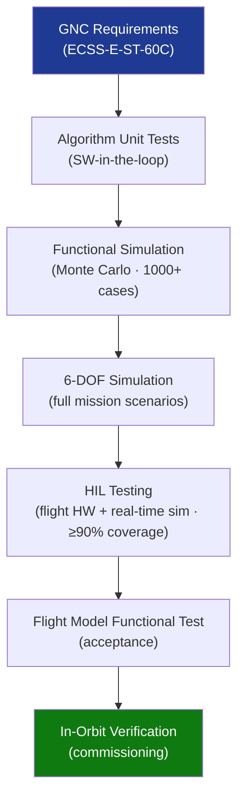

# STA 140-149 · Section 04 · Subsection 140 · Subsubject 008 — Verification, Validation, Simulation and HIL Testing

## 1. Purpose

Defines the **GNC verification and validation strategy**, covering functional simulation, 6-DOF simulation, hardware-in-the-loop (HIL) testing with actual sensors and actuators, and test coverage requirements for Q+ATLANTIDE STA-band spacecraft.

## 2. Scope

- **GNC V&V strategy** — multi-level verification: algorithm-level unit testing, functional simulation with Monte Carlo dispersion analysis, 6-DOF simulator with full mission scenario coverage, and HIL testing; traceability from each verification activity to GNC requirements.
- **Functional simulation** — closed-loop attitude and orbit simulation; disturbance environment models (gravity gradient, solar pressure, atmospheric drag, magnetic torques); Monte Carlo dispersion over sensor noise, actuator misalignments, and inertia uncertainties; minimum 1000-case Monte Carlo required for performance envelope characterisation.
- **6-DOF simulator** — high-fidelity rigid-body and flexible-body dynamics; multi-joint articulation (solar arrays, appendages); sensor and actuator truth models; real-time and faster-than-real-time modes; qualification status of simulation models per NASA-STD-7009A[^nasastd7009a].
- **HIL testing** — integration of flight-representative GNC hardware (star trackers, gyroscopes, reaction wheels) with real-time simulation environment; hardware stimulation equipment; test coverage requirement: HIL test coverage ≥ 90% of GNC operational modes; qualification HIL runs required before CDR.
- **Test coverage requirements** — GNC requirements closure matrix; functional test coverage (nominal modes), performance test coverage (accuracy, stability), and fault injection test coverage (sensor failures, actuator failures, safe mode entry).
- **Acceptance test procedure** — final functional GNC test on flight model; test-as-you-fly principle; comparison of HIL results vs flight model functional test.

## 3. Diagram — GNC V&V Pyramid

## 4. Footprint

| Metric | Value |
|---|---|
| Architecture | `STA` — Space Technology Architecture |
| Master range | `100–199` |
| Code range | `140-149` |
| Section | `04` — Aviónica y Control de Misión Espacial |
| Subsection | `140` — GNC — Guiado, Navegación y Control |
| Subsubject | `008` — Verification, Validation, Simulation and HIL Testing |
| Primary Q-Division | Q-SPACE[^qdiv] |
| ORB support | ORB-PMO, ORB-LEG |
| Governance class | `baseline`[^gov] |
| Document | `008_Verification-Validation-Simulation-and-HIL-Testing.md` (this file) |
| Parent subsection | [`README.md`](./README.md) · [`000_Overview.md`](./000_Overview.md) |

## 5. References & Citations

[^ecssest60c]: **ECSS-E-ST-60C — Control Engineering** — GNC verification requirements and simulation model qualification.

[^nasastd7009a]: **NASA-STD-7009A — Standard for Models and Simulations** — Requirements for development, qualification, and use of simulation models.

[^ecssest1002c]: **ECSS-E-ST-10-02C — Verification** — General spacecraft verification methodology including test coverage requirements.

[^qdiv]: **Q-Division authority** — See [`organization/Q+ATLANTIDE.md` §4](../../../../organization/Q+ATLANTIDE.md#4-notes).

[^gov]: **Governance class** — `baseline`.

### Applicable industry standards

- ECSS-E-ST-60C — Control Engineering[^ecssest60c]
- NASA-STD-7009A — Standard for Models and Simulations[^nasastd7009a]
- ECSS-E-ST-10-02C — Verification[^ecssest1002c]
