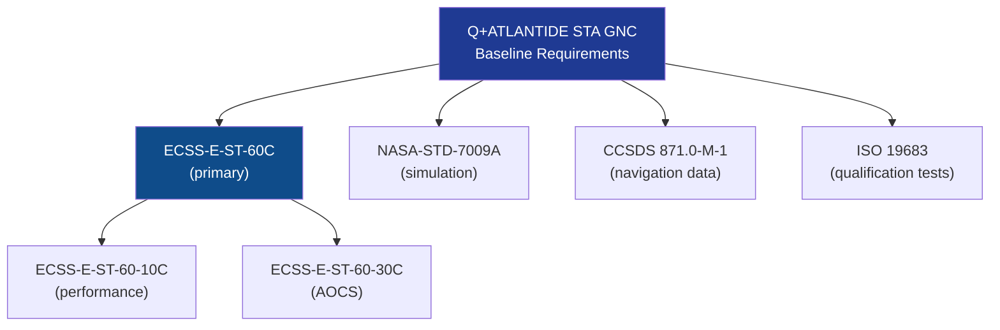

# STA 140-149 · Section 04 · Subsection 140 · Subsubject 009 — ECSS-NASA GNC Standards Mapping

## 1. Purpose

Provides a **normative standards mapping table and hierarchy** for all GNC-applicable standards within the Q+ATLANTIDE STA-band GNC subsystem, establishing applicability, precedence, and tailoring rules.

## 2. Scope

- **Standards mapping table** — maps each GNC functional area (guidance, navigation, control, actuators, verification, simulation) to the applicable normative standard, its edition, and applicability condition.
- **Standards hierarchy** — ECSS standards as primary requirement baseline for ESA-heritage programs; NASA standards as complementary reference or mandatory for NASA-funded activities; CCSDS for navigation data interfaces; ISO for quantities and units.
- **Tailoring provisions** — mandatory tailoring justifications when requirements are reduced from normative baseline; tailoring register maintained as part of the GNC V&V plan.
- **Standards currency** — standards listed at revision current at time of Q+ATLANTIDE v1.0.0 baseline; change notice process for edition updates.

| Standard | Edition | Title | GNC Applicability |
|---|---|---|---|
| ECSS-E-ST-60C | Rev. 1 (2013) | Control Engineering | Primary GNC design standard — guidance, navigation, control, safe modes |
| ECSS-E-ST-60-10C | Rev. 1 (2020) | Control Performance | Pointing performance budget and analysis |
| ECSS-E-ST-60-30C | Issue 1 (2013) | Satellite Attitude and Orbit Control System (AOCS) | AOCS functional requirements and test |
| NASA-STD-7009A | Rev. A (2016) | Standard for Models and Simulations | GNC simulation qualification and validation |
| CCSDS 871.0-M-1 | Issue 1 (2011) | Navigation Data — Definitions and Conventions | Navigation reference frames and data formats |
| ISO 19683 | 2017 | Space systems — Design qualification and acceptance tests | Qualification test programme including GNC HIL |

## 3. Diagram — GNC Standards Hierarchy

## 4. Footprint

| Metric | Value |
|---|---|
| Architecture | `STA` — Space Technology Architecture |
| Master range | `100–199` |
| Code range | `140-149` |
| Section | `04` — Aviónica y Control de Misión Espacial |
| Subsection | `140` — GNC — Guiado, Navegación y Control |
| Subsubject | `009` — ECSS-NASA GNC Standards Mapping |
| Primary Q-Division | Q-SPACE[^qdiv] |
| ORB support | ORB-PMO, ORB-LEG |
| Governance class | `baseline`[^gov] |
| Document | `009_ECSS-NASA-GNC-Standards-Mapping.md` (this file) |
| Parent subsection | [`README.md`](./README.md) · [`000_Overview.md`](./000_Overview.md) |

## 5. References & Citations

[^ecssest60c]: **ECSS-E-ST-60C — Control Engineering** — Primary GNC design and verification standard.

[^ecssest6010c]: **ECSS-E-ST-60-10C — Control Performance** — GNC performance specification and analysis.

[^ecssest6030c]: **ECSS-E-ST-60-30C — AOCS** — Attitude and orbit control system functional requirements.

[^nasastd7009a]: **NASA-STD-7009A — Standard for Models and Simulations** — GNC simulation qualification.

[^ccsds8710m1]: **CCSDS 871.0-M-1 — Navigation Data — Definitions and Conventions** — Navigation data standards.

[^iso19683]: **ISO 19683 — Space systems — Design qualification and acceptance tests** — GNC qualification test programme.

[^qdiv]: **Q-Division authority** — See [`organization/Q+ATLANTIDE.md` §4](../../../../organization/Q+ATLANTIDE.md#4-notes).

[^gov]: **Governance class** — `baseline`.

### Applicable industry standards

- ECSS-E-ST-60C — Control Engineering[^ecssest60c]
- ECSS-E-ST-60-10C — Control Performance[^ecssest6010c]
- ECSS-E-ST-60-30C — AOCS[^ecssest6030c]
- NASA-STD-7009A — Standard for Models and Simulations[^nasastd7009a]
- CCSDS 871.0-M-1 — Navigation Data — Definitions and Conventions[^ccsds8710m1]
- ISO 19683 — Space systems — Design qualification and acceptance tests[^iso19683]
