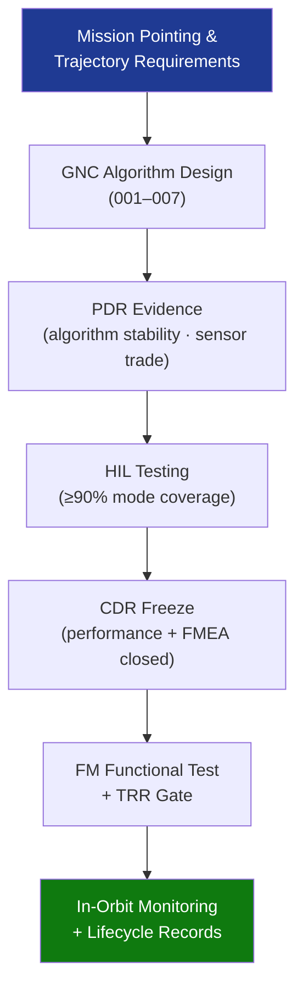

# STA 140-149 · Section 04 · Subsection 140 · Subsubject 010 — Traceability, Evidence and Lifecycle Governance

## 1. Purpose

Establishes **requirements traceability, design evidence gates, and lifecycle governance requirements** for the GNC subsystem on Q+ATLANTIDE STA-band spacecraft.

## 2. Scope

- **Requirements traceability** — GNC algorithm design requirements traced from mission-level pointing and trajectory requirements; traceability matrix linking each GNC requirement to the design element, verification activity, and evidence artefact; managed in the Q+ATLANTIDE requirements register.
- **Evidence gates** — PDR: algorithm stability analysis complete, GNC requirement set baselined, sensor/actuator trade-off concluded, simulation environment qualified; CDR: HIL test coverage ≥ 90% of GNC modes demonstrated, Monte Carlo performance envelope closed, control stability margins verified, FMEA closed at GNC level.
- **Delta-CDR and TRR gates** — delta-CDR for any post-CDR change to control law gains, sensor configuration, or actuator sizing; TRR gate: all GNC flight model functional tests passed, in-orbit verification plan approved.
- **In-orbit performance monitoring** — attitude knowledge error and pointing accuracy telemetry monitoring; GNC loop health monitoring (estimator residuals, actuator command saturation events); anomaly detection and escalation procedure; periodic performance trend analysis vs GNC design model.
- **Lifecycle records** — GNC algorithm version configuration item (CI) record; sensor calibration data traceability (ground calibration → in-orbit calibration updates); actuator performance trend data; end-of-life delta-v budget usage record.
- **Interface control documents (ICDs)** — GNC-to-FSW ICD freeze at CDR+; sensor ICDs maintained through qualification; actuator command interface ICD verified at HIL level.

## 3. Diagram — GNC Traceability and Governance Flow

## 4. Footprint

| Metric | Value |
|---|---|
| Architecture | `STA` — Space Technology Architecture |
| Master range | `100–199` |
| Code range | `140-149` |
| Section | `04` — Aviónica y Control de Misión Espacial |
| Subsection | `140` — GNC — Guiado, Navegación y Control |
| Subsubject | `010` — Traceability, Evidence and Lifecycle Governance |
| Primary Q-Division | Q-SPACE[^qdiv] |
| ORB support | ORB-PMO, ORB-LEG |
| Governance class | `baseline`[^gov] |
| Document | `010_Traceability-Evidence-and-Lifecycle-Governance.md` (this file) |
| Parent subsection | [`README.md`](./README.md) · [`000_Overview.md`](./000_Overview.md) |

## 5. References & Citations

[^ecssest60c]: **ECSS-E-ST-60C — Control Engineering** — GNC traceability and evidence requirements.

[^ecssest1002c]: **ECSS-E-ST-10-02C — Verification** — General verification methodology including requirements traceability and evidence gates.

[^qdiv]: **Q-Division authority** — See [`organization/Q+ATLANTIDE.md` §4](../../../../organization/Q+ATLANTIDE.md#4-notes).

[^gov]: **Governance class** — `baseline`.

### Applicable industry standards

- ECSS-E-ST-60C — Control Engineering[^ecssest60c]
- ECSS-E-ST-10-02C — Verification[^ecssest1002c]
