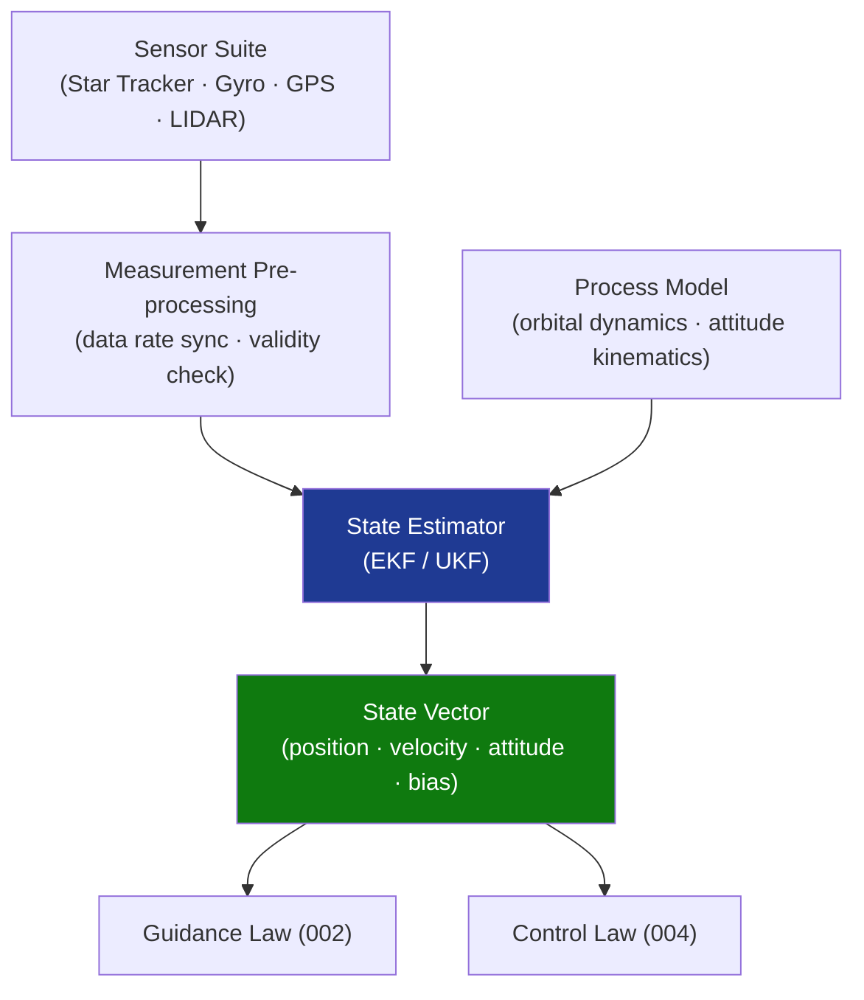

# STA 140-149 · 140-030 — Navigation Sensors State Estimation and Reference Frames

## 1. Purpose

Defines the **navigation sensor suite, state estimation algorithms, and reference frame conventions** used by the GNC subsystem on Q+ATLANTIDE STA-band spacecraft.

## 2. Scope

- **Navigation sensor suite** — star trackers (attitude determination, arcsecond accuracy), fibre-optic and MEMS gyroscopes (angular rate), GPS/GNSS receivers (orbit position and velocity), LIDAR/RADAR (proximity operations ranging), accelerometers (non-gravitational force sensing); sensor redundancy and cross-check architecture.
- **State estimation** — Kalman filter (linear, applicable to near-nominal conditions), Extended Kalman Filter (EKF, nonlinear dynamics), Unscented Kalman Filter (UKF, strongly nonlinear regimes); state vector definition (position, velocity, attitude quaternion, angular rate, bias states); measurement model and process noise tuning.
- **Reference frame definitions** — Earth-Centred Inertial (ECI, J2000.0); Earth-Centred Earth-Fixed (ECEF, ITRF); spacecraft body frame; local vertical local horizontal (LVLH / Hill frame); orbit-relative rendezvous frame; sensor-fixed frames and alignment calibration.
- **Sensor data fusion** — multi-sensor fusion architecture, data-rate matching, fault detection and isolation per sensor channel, sensor handover procedures.
- **Navigation accuracy budget** — position knowledge error (PKE), velocity knowledge error (VKE), attitude knowledge error (AKE) allocations per mission phase.

## 3. Diagram — Navigation State Estimation Loop

## 4. Footprint

| Metric | Value |
|---|---|
| Architecture | `STA` — Space Technology Architecture |
| Master range | `100–199` |
| Code range | `140-149` |
| Section | `04` — Aviónica y Control de Misión Espacial |
| Subsection | `140` — GNC — Guiado, Navegación y Control |
| Subsubject | `003` — Navigation Sensors, State Estimation and Reference Frames |
| Primary Q-Division | Q-SPACE[^qdiv] |
| ORB support | ORB-PMO, ORB-LEG |
| Governance class | `baseline`[^gov] |
| Document | `140-030-Navigation-Sensors-State-Estimation-and-Reference-Frames.md` (this file) |
| Parent subsection | [`README.md`](./README.md) · [`140-000-General.md`](./140-000-General.md) |

## 5. References & Citations

[^ecssest60c]: **ECSS-E-ST-60C — Control Engineering** — Navigation requirements for spacecraft GNC subsystems.

[^ccsds8710m1]: **CCSDS 871.0-M-1 — Navigation Data — Definitions and Conventions** — CCSDS standard for navigation data formats and reference frame conventions.

[^iso311]: **ISO 31-1 — Quantities and Units** — Reference standard for physical quantity definitions used in state estimation.

[^qdiv]: **Q-Division authority** — See [`organization/Q+ATLANTIDE.md` §4](../../../../organization/Q+ATLANTIDE.md#4-notes).

[^gov]: **Governance class** — `baseline`.

### Applicable industry standards

- ECSS-E-ST-60C — Control Engineering[^ecssest60c]
- CCSDS 871.0-M-1 — Navigation Data — Definitions and Conventions[^ccsds8710m1]
- ISO 31-1 — Quantities and Units[^iso311]
