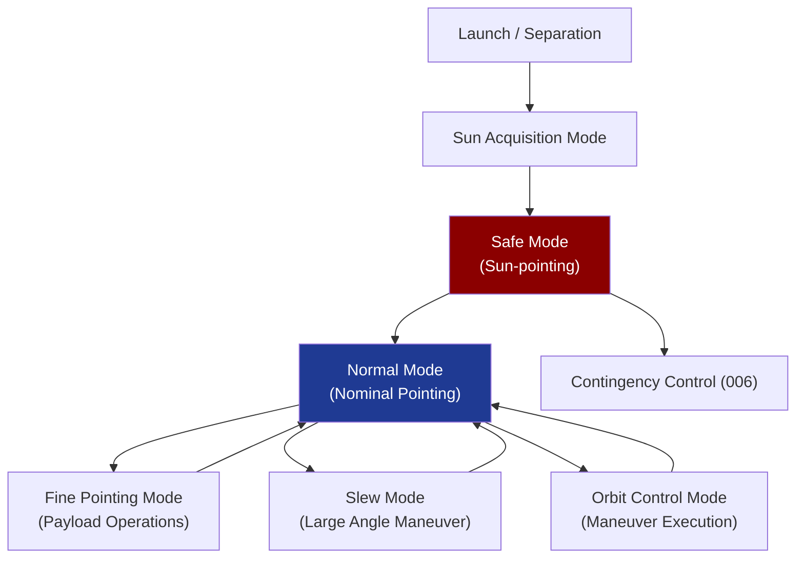

# STA 140-149 · 140-040 — Control Laws Attitude and Orbit Control

## 1. Purpose

Defines the **control law families, AOCS operational modes, and orbit control maneuver logic** for Q+ATLANTIDE STA-band spacecraft GNC subsystems.

## 2. Scope

- **Attitude control law families** — PD (proportional-derivative) control for simplicity and robustness; PID (proportional-integral-derivative) for steady-state disturbance rejection; LQR (Linear Quadratic Regulator) for optimal performance with known dynamics; sliding-mode control for robustness to model uncertainties and parameter variations; nonlinear control for large-angle slew maneuvers.
- **AOCS operational modes** — Normal mode (nominal pointing, fixed or tracking); Fine-pointing mode (high-accuracy payload pointing, active vibration isolation); Slew mode (large-angle attitude maneuver, momentum management); Safe mode (Sun-pointing, minimum-power survival); Transfer/orbit raising mode (thrust attitude hold); De-orbit mode (disposal pointing).
- **Attitude control performance** — pointing accuracy (absolute pointing error, APE), pointing stability (mean error, ME), pointing reproducibility (RPE); performance budget allocation to sensors, estimator, actuator, and structural flexibility.
- **Orbit control maneuver logic** — impulsive vs finite-burn maneuver modeling; orbit correction logic; out-of-plane maneuver management; maneuver inhibit conditions; delta-v allocation per maneuver type.
- **Control law verification** — stability margins (gain margin ≥ 6 dB, phase margin ≥ 30°), robustness to parameter uncertainty, flexible mode interaction analysis, actuator saturation handling.

## 3. Diagram — AOCS Mode Transition Logic

## 4. Footprint

| Metric | Value |
|---|---|
| Architecture | `STA` — Space Technology Architecture |
| Master range | `100–199` |
| Code range | `140-149` |
| Section | `04` — Aviónica y Control de Misión Espacial |
| Subsection | `140` — GNC — Guiado, Navegación y Control |
| Subsubject | `004` — Control Laws, Attitude and Orbit Control |
| Primary Q-Division | Q-SPACE[^qdiv] |
| ORB support | ORB-PMO, ORB-LEG |
| Governance class | `baseline`[^gov] |
| Document | `140-040-Control-Laws-Attitude-and-Orbit-Control.md` (this file) |
| Parent subsection | [`README.md`](./README.md) · [`140-000-General.md`](./140-000-General.md) |

## 5. References & Citations

[^ecssest60c]: **ECSS-E-ST-60C — Control Engineering** — Control law design requirements, stability analysis, and verification methods.

[^ecssest6010c]: **ECSS-E-ST-60-10C — Space Engineering: Control Performance** — Performance specification for attitude and orbit control systems.

[^nasastd7009a]: **NASA-STD-7009A — Standard for Models and Simulations** — Simulation requirements for control law verification.

[^qdiv]: **Q-Division authority** — See [`organization/Q+ATLANTIDE.md` §4](../../../../organization/Q+ATLANTIDE.md#4-notes).

[^gov]: **Governance class** — `baseline`.

### Applicable industry standards

- ECSS-E-ST-60C — Control Engineering[^ecssest60c]
- ECSS-E-ST-60-10C — Space Engineering: Control Performance[^ecssest6010c]
- NASA-STD-7009A — Standard for Models and Simulations[^nasastd7009a]
