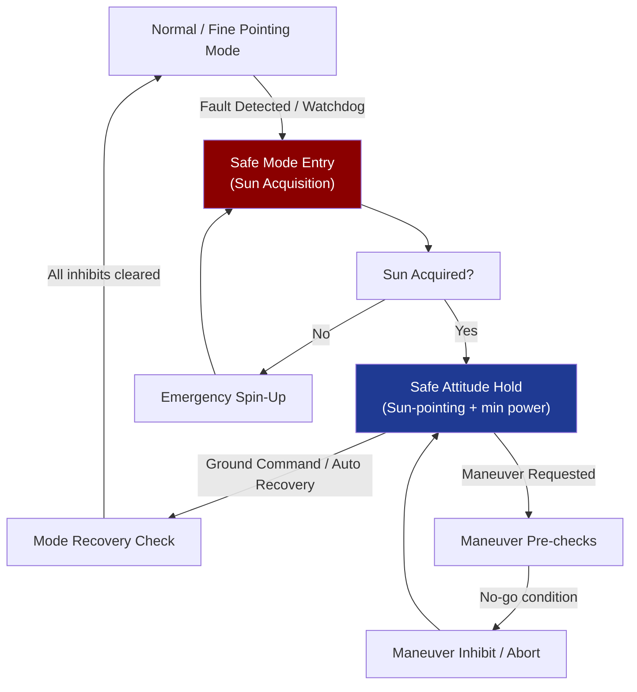

# STA 140-149 · 140-060 — Autonomous Modes Safe Modes and Contingency Control

## 1. Purpose

Defines the **autonomy logic, safe-mode behavior, and contingency control algorithms** embedded in the GNC subsystem for Q+ATLANTIDE STA-band spacecraft, ensuring spacecraft survival without ground intervention.

## 2. Scope

- **Sun-acquisition mode** — algorithm for recovering Sun-pointing from any initial attitude; rotation axis selection strategy; Sun sensor fusion with coarse Sun sensors; transition to fine-pointing once Sun is acquired; energy budget during acquisition.
- **Emergency spin-stabilization** — spin-up to gyroscopic stabilization when attitude control is lost; spin rate selection for thermal and power balance; despin and recovery sequence; conditions for autonomous spin-up trigger.
- **Safe attitude and Sun-pointing modes** — minimum-function GNC configuration: coarse Sun sensors + magnetorquers only; power-positive attitude maintenance; thermal protection attitude constraints; transition conditions back to normal mode.
- **Autonomous maneuver inhibit/abort logic** — pre-maneuver checks (power margin, thermal state, communication window, navigation convergence); in-flight maneuver abort triggers (thrust anomaly, attitude deviation threshold, navigation divergence); post-abort safing sequence.
- **Contingency mode transitions** — fault-detection-driven mode transition logic; time-out watchdog for missing ground command; ground-commanded recovery sequences; re-entry to normal mode criteria and inhibit mask management.
- **Interface with FDIR** — GNC-layer fault detection thresholds; escalation to avionics-level FDIR (→ `141`) and flight software FDIR (→ `142` subsubject 005); autonomous mode selection reporting via telemetry.

## 3. Diagram — Safe-Mode and Contingency Transition Logic

## 4. Footprint

| Metric | Value |
|---|---|
| Architecture | `STA` — Space Technology Architecture |
| Master range | `100–199` |
| Code range | `140-149` |
| Section | `04` — Aviónica y Control de Misión Espacial |
| Subsection | `140` — GNC — Guiado, Navegación y Control |
| Subsubject | `006` — Autonomous Modes, Safe Modes and Contingency Control |
| Primary Q-Division | Q-SPACE[^qdiv] |
| ORB support | ORB-PMO, ORB-LEG |
| Governance class | `baseline`[^gov] |
| Document | `140-060-Autonomous-Modes-Safe-Modes-and-Contingency-Control.md` (this file) |
| Parent subsection | [`README.md`](./README.md) · [`140-000-General.md`](./140-000-General.md) |

## 5. References & Citations

[^ecssest60c]: **ECSS-E-ST-60C — Control Engineering** — Safe mode and contingency control requirements for spacecraft GNC.

[^ecssest7011c]: **ECSS-E-ST-70-11C — Space Segment Operability** — Fault management and autonomy requirements for space segment operations.

[^qdiv]: **Q-Division authority** — See [`organization/Q+ATLANTIDE.md` §4](../../../../organization/Q+ATLANTIDE.md#4-notes).

[^gov]: **Governance class** — `baseline`.

### Applicable industry standards

- ECSS-E-ST-60C — Control Engineering[^ecssest60c]
- ECSS-E-ST-70-11C — Space Segment Operability[^ecssest7011c]
