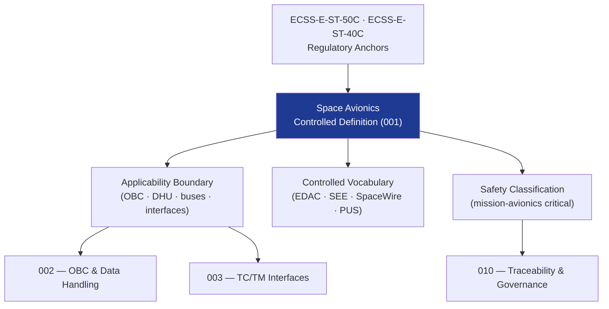

# STA 140-149 · Section 04 · Subsection 141 · Subsubject 001 — Space Avionics Controlled Definition

## 1. Purpose

Establishes the **normative definition and controlled scope** of space avionics within the Q+ATLANTIDE STA band, per ECSS-E-ST-50C[^ecssest50c].

## 2. Scope

- **Controlled definition** — Space avionics encompasses the onboard electronic hardware, data handling systems, and communication interfaces that acquire, process, distribute, and store data from sensors, generate commands to actuators and payloads, and manage telemetry and telecommand exchanges with ground stations throughout all mission phases.
- **Applicability boundary** — STA `141` covers the avionics hardware layer on Q+ATLANTIDE STA-band platforms: onboard computers, data handling units, avionics buses, interface units, and power conditioning electronics; excludes GNC algorithm software (→ `140`), flight software execution (→ `142`), ground control (→ `143`), and autonomy management (→ `144`).
- **Controlled vocabulary** — *Onboard Computer (OBC)*; *Data Handling Unit (DHU)*; *Remote Terminal Unit (RTU)*; *Error Detection and Correction (EDAC)*; *Fault Detection, Isolation and Recovery (FDIR)*; *Total Ionising Dose (TID)*; *Single Event Effect (SEE)*; *SpaceWire*; *MIL-STD-1553B*; *CCSDS PUS*.
- **Safety classification** — mission-avionics critical; avionics failures may result in loss of command/control, telemetry blackout, or mission loss.
- **Interface boundaries** — space avionics interfaces with: GNC sensors and actuators (→ `140`); flight software hosted on OBC (→ `142`); power distribution subsystem (→ `133`); payload instruments; and ground segment via RF link.

## 3. Diagram — Space Avionics Scope Boundary

## 4. Footprint

| Metric | Value |
|---|---|
| Architecture | `STA` — Space Technology Architecture |
| Master range | `100–199` |
| Code range | `140-149` |
| Section | `04` — Aviónica y Control de Misión Espacial |
| Subsection | `141` — Aviónica Espacial |
| Subsubject | `001` — Space Avionics Controlled Definition |
| Primary Q-Division | Q-SPACE[^qdiv] |
| ORB support | ORB-PMO, ORB-LEG |
| Governance class | `baseline`[^gov] |
| Document | `001_Space-Avionics-Controlled-Definition.md` (this file) |
| Parent subsection | [`README.md`](./README.md) · [`000_Overview.md`](./000_Overview.md) |

## 5. References & Citations

[^ecssest50c]: **ECSS-E-ST-50C — Communications** — European standard for spacecraft on-board data handling.

[^ecssest40c]: **ECSS-E-ST-40C — Software Engineering** — Interface definition between avionics hardware and software.

[^qdiv]: **Q-Division authority** — See [`organization/Q+ATLANTIDE.md` §4](../../../../organization/Q+ATLANTIDE.md#4-notes).

[^gov]: **Governance class** — `baseline`.

### Applicable industry standards

- ECSS-E-ST-50C — Communications[^ecssest50c]
- ECSS-E-ST-40C — Software Engineering[^ecssest40c]
