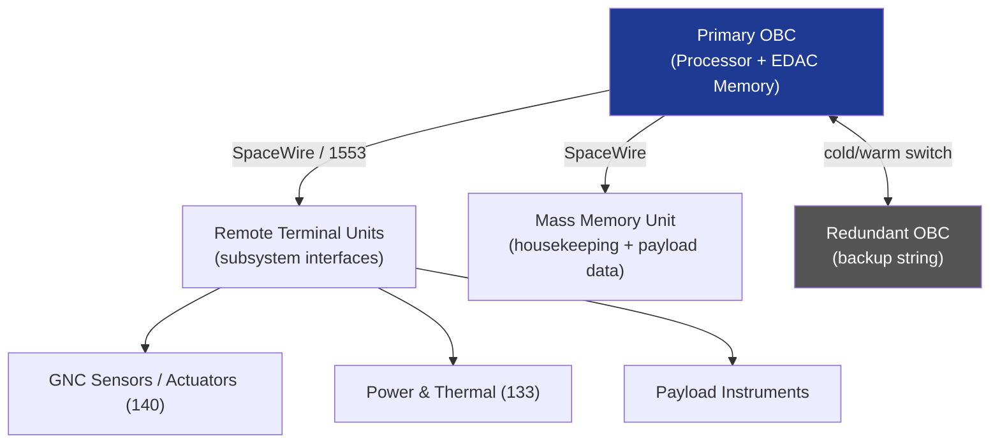

# STA 140-149 · Section 04 · Subsection 141 · Subsubject 002 — Onboard Computer and Data Handling Architecture

## 1. Purpose

Defines the **onboard computer (OBC) architecture, processor selection criteria, memory hierarchy, EDAC scheme, and data handling topology** for Q+ATLANTIDE STA-band spacecraft avionics.

## 2. Scope

- **Processor selection** — radiation-tolerant or radiation-hardened processor selection (LEON3/4, PowerPC, ARM radiation-hardened variants); processing performance budget (MIPS/MFLOPS) per application; operating frequency and power consumption trade-off; qualification level (QML-V, QML-Q, or equivalent commercial-with-mitigation).
- **Memory hierarchy** — SRAM for working memory with EDAC (single-bit correction, double-bit detection, SECDED); EEPROM/Flash for non-volatile parameter storage with scrubbing; SDRAM for mass memory; memory map partitioning for OS, application, and safety-critical data isolation; memory budget allocation.
- **EDAC scheme** — EDAC coverage for all critical memory arrays; scrubbing period requirements; multi-bit error alarm thresholds; EDAC status telemetry; interaction with software watchdog (→ `142` subsubject 007).
- **Centralized vs distributed data handling** — centralized OBC with RTUs (Remote Terminal Units) for subsystem interfacing; distributed intelligence with multiple processing nodes and inter-node communication; trade criteria for mission complexity and redundancy.
- **Processor redundancy** — cold-redundancy (backup powered off), warm-redundancy (backup synchronised), or hot-redundancy (dual-string simultaneous operation); switchover logic; data synchronization between strings.
- **FPGA usage** — radiation-tolerant FPGA for I/O interfacing (ECSS-Q-ST-60-02C[^ecssqst6002c]); design assurance requirements; configuration bitstream protection against SEU.

## 3. Diagram — OBC and Data Handling Architecture

## 4. Footprint

| Metric | Value |
|---|---|
| Architecture | `STA` — Space Technology Architecture |
| Master range | `100–199` |
| Code range | `140-149` |
| Section | `04` — Aviónica y Control de Misión Espacial |
| Subsection | `141` — Aviónica Espacial |
| Subsubject | `002` — Onboard Computer and Data Handling Architecture |
| Primary Q-Division | Q-SPACE[^qdiv] |
| ORB support | ORB-PMO, ORB-LEG |
| Governance class | `baseline`[^gov] |
| Document | `002_Onboard-Computer-and-Data-Handling-Architecture.md` (this file) |
| Parent subsection | [`README.md`](./README.md) · [`000_Overview.md`](./000_Overview.md) |

## 5. References & Citations

[^ecssest50c]: **ECSS-E-ST-50C — Communications** — Data handling architecture requirements.

[^ecssqst6002c]: **ECSS-Q-ST-60-02C — FPGA** — Design assurance requirements for space-grade FPGAs.

[^milstd1553b]: **MIL-STD-1553B — Digital Time Division Command/Response Multiplex Data Bus** — Data bus protocol for distributed avionics architectures.

[^qdiv]: **Q-Division authority** — See [`organization/Q+ATLANTIDE.md` §4](../../../../organization/Q+ATLANTIDE.md#4-notes).

[^gov]: **Governance class** — `baseline`.

### Applicable industry standards

- ECSS-E-ST-50C — Communications[^ecssest50c]
- ECSS-Q-ST-60-02C — FPGA[^ecssqst6002c]
- MIL-STD-1553B — Digital Time Division Command/Response Multiplex Data Bus[^milstd1553b]
