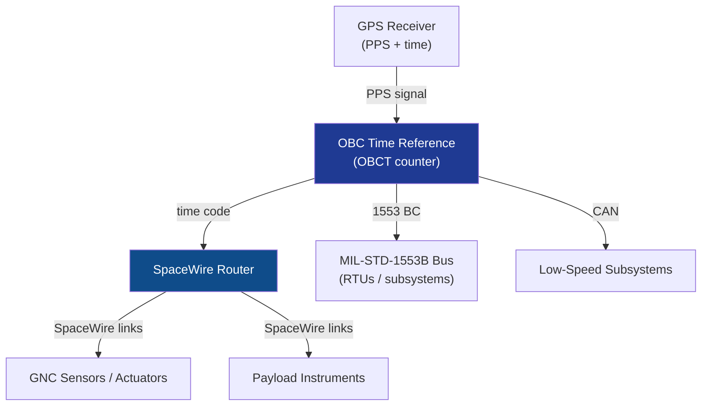

# STA 140-149 · Section 04 · Subsection 141 · Subsubject 005 — Time Synchronization and Data Bus Architecture

## 1. Purpose

Defines the **onboard time reference architecture, time synchronization protocols, and data bus topology** for Q+ATLANTIDE STA-band spacecraft avionics.

## 2. Scope

- **Onboard clock and time reference** — Onboard Correlation Time (OBCT) counter; crystal oscillator stability and aging requirements; GPS-derived time synchronization (pulse-per-second, PPS, input); time correlation telemetry per CCSDS 301.0-B-4[^ccsds3010b4]; time distribution to all nodes; time tagging accuracy requirements for sensor measurements and event records.
- **GPS-derived time synchronization** — GPS PPS signal distribution to OBC; time synchronization procedure at acquisition; holdover accuracy during GPS signal loss; comparison between onboard time and UTC; time jump management (step vs. slew).
- **SpaceWire bus topology** — SpaceWire point-to-point links and router network; logical topology (star, ring, custom); bandwidth budget per link (typical 100–400 Mbps); time-code distribution over SpaceWire; SpaceWire router configuration and fault tolerance.
- **MIL-STD-1553B bus** — bus controller (BC) and remote terminal (RT) assignment; bus message scheduling; minor frame timing; dual-redundant bus wiring; stub length and termination impedance requirements.
- **CAN bus** — CAN 2.0A/B for low-speed subsystem interfaces; bit rate (125 kbps – 1 Mbps); message identifier allocation; bus arbitration and error handling.
- **Bandwidth budgets** — total bandwidth budget per bus type; payload data, housekeeping data, GNC data, and management overhead allocation; peak vs average utilization; bandwidth margin requirements (≥ 30% headroom).

## 3. Diagram — Data Bus and Time Synchronization Architecture

## 4. Footprint

| Metric | Value |
|---|---|
| Architecture | `STA` — Space Technology Architecture |
| Master range | `100–199` |
| Code range | `140-149` |
| Section | `04` — Aviónica y Control de Misión Espacial |
| Subsection | `141` — Aviónica Espacial |
| Subsubject | `005` — Time Synchronization and Data Bus Architecture |
| Primary Q-Division | Q-SPACE[^qdiv] |
| ORB support | ORB-PMO, ORB-LEG |
| Governance class | `baseline`[^gov] |
| Document | `005_Time-Synchronization-and-Data-Bus-Architecture.md` (this file) |
| Parent subsection | [`README.md`](./README.md) · [`000_Overview.md`](./000_Overview.md) |

## 5. References & Citations

[^ccsds3010b4]: **CCSDS 301.0-B-4 — Time Code Formats** — CCSDS standard for onboard time code formats and time distribution.

[^milstd1553b]: **MIL-STD-1553B — Digital Time Division Command/Response Multiplex Data Bus** — Avionics data bus standard.

[^ecssest5012c]: **ECSS-E-ST-50-12C — SpaceWire** — SpaceWire network design and timing requirements.

[^qdiv]: **Q-Division authority** — See [`organization/Q+ATLANTIDE.md` §4](../../../../organization/Q+ATLANTIDE.md#4-notes).

[^gov]: **Governance class** — `baseline`.

### Applicable industry standards

- CCSDS 301.0-B-4 — Time Code Formats[^ccsds3010b4]
- MIL-STD-1553B — Digital Time Division Command/Response Multiplex Data Bus[^milstd1553b]
- ECSS-E-ST-50-12C — SpaceWire[^ecssest5012c]
