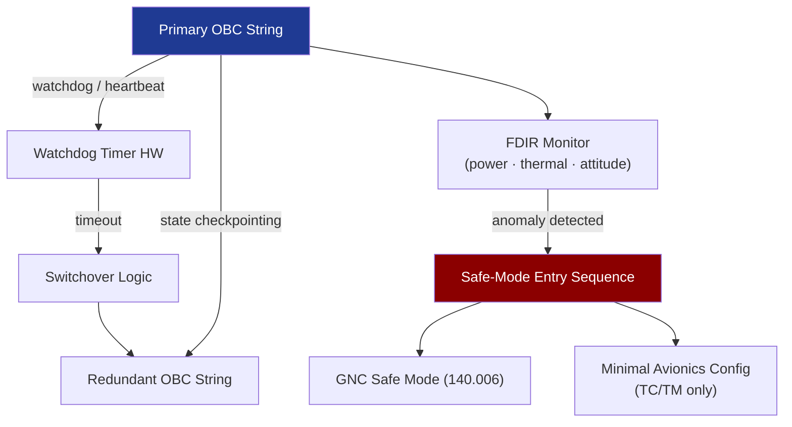

# STA 140-149 · Section 04 · Subsection 141 · Subsubject 006 — Redundancy, Fault Tolerance and Safe-Mode Support

## 1. Purpose

Defines the **redundancy architecture, fault-tolerance mechanisms, and safe-mode avionics support** for Q+ATLANTIDE STA-band spacecraft onboard computers and data handling systems.

## 2. Scope

- **Cold/warm/hot redundancy for OBC** — cold redundancy: backup OBC powered off, switch-on triggered by watchdog or ground command; warm redundancy: backup synchronised to primary state via checkpointing; hot redundancy: dual-string active with cross-comparison; selection criteria based on mission criticality and power budget.
- **Voting logic** — majority voting for triple-redundant or dual-redundant configurations; disagreement detection thresholds; voter output selection logic; voter bypass for known-failed element; voter implementation in hardware (FPGA) or software.
- **Watchdog timers** — hardware watchdog at OBC level (external watchdog IC); software watchdog within RTOS (→ `142` subsubject 007); watchdog kick period requirements; timer expiry action (reset, safe-mode entry, or switchover).
- **Autonomous safe-mode transition triggers** — power system anomaly (under-voltage); thermal anomaly (over-temperature sensor reading); watchdog expiry; attitude deviation beyond threshold; communication loss timeout; safe-mode entry sequence: OBC reset or switchover → GNC safe mode (→ `140` subsubject 006) → minimal avionics configuration.
- **FDIR interfaces** — avionics-layer FDIR event reporting to flight software (→ `142` subsubject 005); FDIR parameter table management; FDIR inhibit mask management; FDIR state machine per hardware element.
- **Degraded mode operations** — defined avionics capability in single-string (failed redundancy) configuration; minimum viable configuration for mission data downlink; mission impact and recovery plan for each failure scenario.

## 3. Diagram — Redundancy and Safe-Mode Architecture

## 4. Footprint

| Metric | Value |
|---|---|
| Architecture | `STA` — Space Technology Architecture |
| Master range | `100–199` |
| Code range | `140-149` |
| Section | `04` — Aviónica y Control de Misión Espacial |
| Subsection | `141` — Aviónica Espacial |
| Subsubject | `006` — Redundancy, Fault Tolerance and Safe-Mode Support |
| Primary Q-Division | Q-SPACE[^qdiv] |
| ORB support | ORB-PMO, ORB-LEG |
| Governance class | `baseline`[^gov] |
| Document | `006_Redundancy-Fault-Tolerance-and-Safe-Mode-Support.md` (this file) |
| Parent subsection | [`README.md`](./README.md) · [`000_Overview.md`](./000_Overview.md) |

## 5. References & Citations

[^ecssest50c]: **ECSS-E-ST-50C — Communications** — Avionics redundancy requirements.

[^ecssest7011c]: **ECSS-E-ST-70-11C — Space Segment Operability** — Fault management and safe-mode avionics requirements.

[^qdiv]: **Q-Division authority** — See [`organization/Q+ATLANTIDE.md` §4](../../../../organization/Q+ATLANTIDE.md#4-notes).

[^gov]: **Governance class** — `baseline`.

### Applicable industry standards

- ECSS-E-ST-50C — Communications[^ecssest50c]
- ECSS-E-ST-70-11C — Space Segment Operability[^ecssest7011c]
