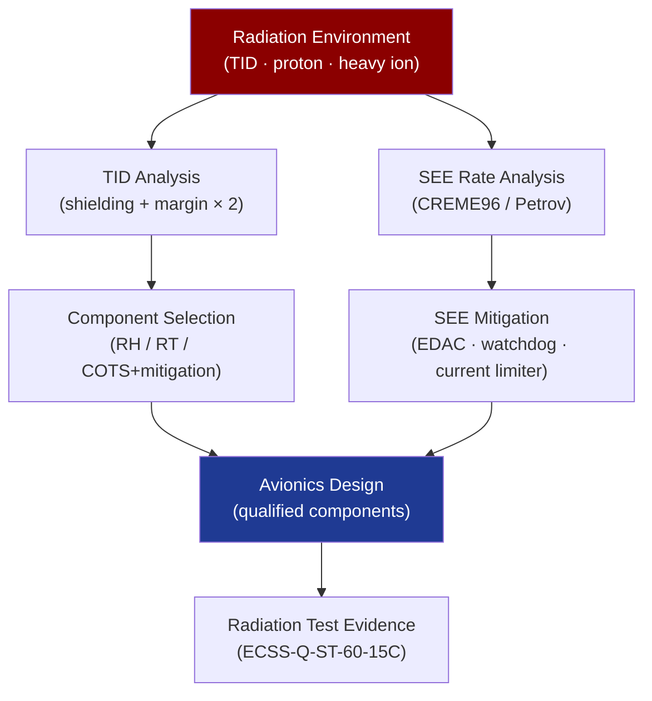

# STA 140-149 · Section 04 · Subsection 141 · Subsubject 007 — Radiation Hardening and Single Event Effects

## 1. Purpose

Defines the **radiation hardening approach, Total Ionising Dose (TID) budget, and Single Event Effect (SEE) mitigation strategy** for avionics components on Q+ATLANTIDE STA-band spacecraft.

## 2. Scope

- **Total Ionising Dose (TID) budget** — TID environment calculation per mission orbit and duration (proton and electron contribution, including solar proton events); shielding analysis (aluminium equivalent); component TID qualification level requirements; TID margin policy (safety factor ≥ 2 on component qualification level vs. mission dose).
- **SEE types and mitigation** — Single Event Upset (SEU): bit flip in memory or registers, mitigated by EDAC and memory scrubbing; Single Event Functional Interrupt (SEFI): device enters anomalous state, mitigated by watchdog and power cycling; Single Event Transient (SET): glitch propagation in combinatorial logic, mitigated by filtering and triple-redundant voting; Single Event Latch-up (SEL): destructive current surge, mitigated by current limiters and SEL-immune process selection.
- **Radiation-hardened vs COTS-with-mitigation** — radiation-hardened (RH) or radiation-tolerant (RT) components for critical data paths (processor, FPGA logic); COTS-with-mitigation approach for non-critical functions with adequate SEE analysis and system-level mitigation; trade-off criteria: TID level, SEE rate, availability, power, and cost.
- **Radiation analysis evidence** — component radiation test data (proton, heavy ion) per ECSS-Q-ST-60-15C[^ecssqst6015c] or equivalent; SEE rate calculation (CREME96 or similar tool); FMEA for radiation-induced failures; radiation test plan for custom ASICs.
- **Shielding strategy** — spot shielding for radiation-sensitive components; box-level shielding optimization; mass budget impact; verification by Monte Carlo transport simulation.

## 3. Diagram — Radiation Effect Mitigation Strategy

## 4. Footprint

| Metric | Value |
|---|---|
| Architecture | `STA` — Space Technology Architecture |
| Master range | `100–199` |
| Code range | `140-149` |
| Section | `04` — Aviónica y Control de Misión Espacial |
| Subsection | `141` — Aviónica Espacial |
| Subsubject | `007` — Radiation Hardening and Single Event Effects |
| Primary Q-Division | Q-SPACE[^qdiv] |
| ORB support | ORB-PMO, ORB-LEG |
| Governance class | `baseline`[^gov] |
| Document | `007_Radiation-Hardening-and-Single-Event-Effects.md` (this file) |
| Parent subsection | [`README.md`](./README.md) · [`000_Overview.md`](./000_Overview.md) |

## 5. References & Citations

[^ecssqst6015c]: **ECSS-Q-ST-60-15C — Radiation Hardness Assurance** — Component radiation testing and qualification standard.

[^jedecjesd57]: **JEDEC JESD57 — Test Procedures for the Measurement of Single-Event Effects** — Standard test procedures for SEE characterisation.

[^milstd883]: **MIL-STD-883 — Test Method Standard for Microcircuits** — Qualification test methods including radiation tests.

[^qdiv]: **Q-Division authority** — See [`organization/Q+ATLANTIDE.md` §4](../../../../organization/Q+ATLANTIDE.md#4-notes).

[^gov]: **Governance class** — `baseline`.

### Applicable industry standards

- ECSS-Q-ST-60-15C — Radiation Hardness Assurance[^ecssqst6015c]
- JEDEC JESD57 — Test Procedures for the Measurement of Single-Event Effects[^jedecjesd57]
- MIL-STD-883 — Test Method Standard for Microcircuits[^milstd883]
