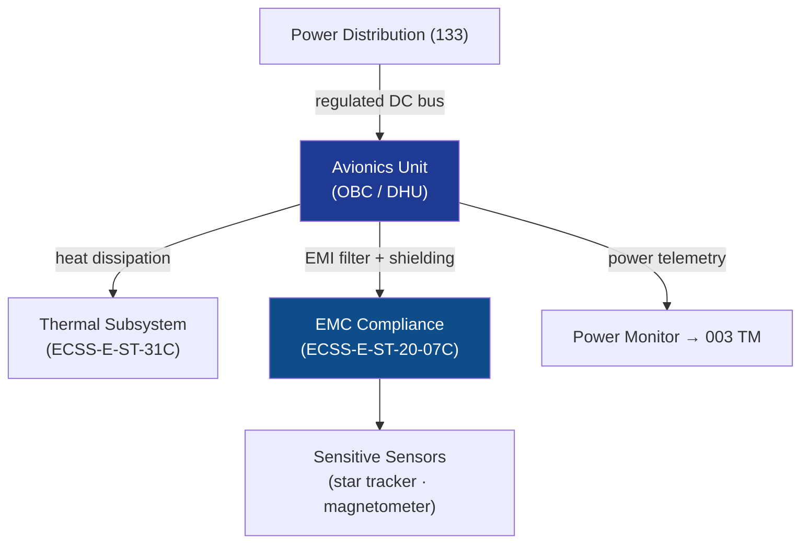

# STA 140-149 · Section 04 · Subsection 141 · Subsubject 008 — EMC, Thermal and Power Interface Boundaries

## 1. Purpose

Defines the **EMC design rules, thermal dissipation boundaries, and power interface constraints** for Q+ATLANTIDE STA-band spacecraft avionics in its operational environment.

## 2. Scope

- **EMC design rules — conducted emissions** — power supply ripple and noise limits on DC bus input; inrush current limits; EMI filter requirements at avionics unit power input; conducted susceptibility limits for avionics immunity to power bus disturbances per ECSS-E-ST-20-07C[^ecssest2007c].
- **EMC design rules — radiated emissions** — avionics clock frequency harmonics management; PCB layout rules for EMC (ground planes, decoupling, signal return paths); chassis shielding effectiveness requirements; radiated emission limits for compatibility with sensitive sensors (star trackers, magnetometers).
- **EMC susceptibility** — avionics immunity to RF environment (transponder transmit power, inter-unit electromagnetic coupling); susceptibility test levels per ECSS-E-ST-20-07C; worst-case RF environment definition.
- **Thermal dissipation boundaries** — avionics unit-level power dissipation budget (W); thermal interface resistance to mounting panel; permitted component junction temperature range; thermal cycling range and number of cycles to qualification; heater power budget for cold survival case; interface with thermal subsystem (→ ECSS-E-ST-31C[^ecssest31c]).
- **Power consumption budget** — unit-level power consumption in each operational mode (peak, nominal, standby, safe mode); power consumption measurement tolerance; interface with power distribution subsystem (→ `133`); over-current protection coordination.
- **Power interface** — supply voltage range (nominal, minimum, maximum transient); input capacitance limit; hold-up time requirement; power bus isolation switch coordination; connector and harness requirements for power lines.

## 3. Diagram — EMC, Thermal and Power Interface Boundaries

## 4. Footprint

| Metric | Value |
|---|---|
| Architecture | `STA` — Space Technology Architecture |
| Master range | `100–199` |
| Code range | `140-149` |
| Section | `04` — Aviónica y Control de Misión Espacial |
| Subsection | `141` — Aviónica Espacial |
| Subsubject | `008` — EMC, Thermal and Power Interface Boundaries |
| Primary Q-Division | Q-SPACE[^qdiv] |
| ORB support | ORB-PMO, ORB-LEG |
| Governance class | `baseline`[^gov] |
| Document | `008_EMC-Thermal-and-Power-Interface-Boundaries.md` (this file) |
| Parent subsection | [`README.md`](./README.md) · [`000_Overview.md`](./000_Overview.md) |

## 5. References & Citations

[^ecssest2007c]: **ECSS-E-ST-20-07C — Electromagnetic Compatibility** — Spacecraft EMC design requirements and test methods.

[^ecssest31c]: **ECSS-E-ST-31C — Thermal Control** — Thermal interface requirements between avionics and thermal control subsystem.

[^qdiv]: **Q-Division authority** — See [`organization/Q+ATLANTIDE.md` §4](../../../../organization/Q+ATLANTIDE.md#4-notes).

[^gov]: **Governance class** — `baseline`.

### Applicable industry standards

- ECSS-E-ST-20-07C — Electromagnetic Compatibility[^ecssest2007c]
- ECSS-E-ST-31C — Thermal Control[^ecssest31c]
