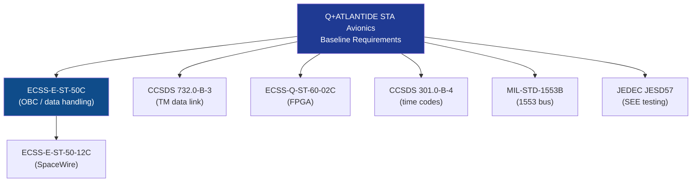

# STA 140-149 · Section 04 · Subsection 141 · Subsubject 009 — ECSS-NASA-CCSDS Avionics Standards Mapping

## 1. Purpose

Provides a **normative standards mapping table and hierarchy** for all space avionics applicable standards within the Q+ATLANTIDE STA-band avionics subsystem, establishing applicability, precedence, and tailoring rules.

## 2. Scope

- **Standards mapping table** — maps each avionics functional area (OBC/data handling, TC/TM, data buses, radiation, EMC, redundancy) to the applicable normative standard, its edition, and applicability condition.
- **Standards hierarchy** — ECSS as primary baseline; CCSDS for data link and TC/TM protocols; MIL-STD for bus standards; JEDEC for component testing; tailoring rules and precedence in case of conflict.

| Standard | Edition | Title | Avionics Applicability |
|---|---|---|---|
| ECSS-E-ST-50C | Rev. 2 (2014) | Communications | On-board data handling architecture |
| ECSS-E-ST-50-12C | Rev. 1 (2008) | SpaceWire | SpaceWire bus design and routing |
| ECSS-Q-ST-60-02C | Issue 1 (2008) | FPGA | FPGA design assurance for avionics |
| CCSDS 732.0-B-3 | Issue 3 (2015) | AOS Space Data Link Protocol | TM data link protocol |
| CCSDS 301.0-B-4 | Issue 4 (2010) | Time Code Formats | Onboard time tagging and distribution |
| MIL-STD-1553B | Rev. B (1978) | Digital Time Division Multiplex Data Bus | 1553 bus design |
| JEDEC JESD57 | 1996 | SEE Test Procedures | SEE characterisation testing |

## 3. Diagram — Avionics Standards Hierarchy

## 4. Footprint

| Metric | Value |
|---|---|
| Architecture | `STA` — Space Technology Architecture |
| Master range | `100–199` |
| Code range | `140-149` |
| Section | `04` — Aviónica y Control de Misión Espacial |
| Subsection | `141` — Aviónica Espacial |
| Subsubject | `009` — ECSS-NASA-CCSDS Avionics Standards Mapping |
| Primary Q-Division | Q-SPACE[^qdiv] |
| ORB support | ORB-PMO, ORB-LEG |
| Governance class | `baseline`[^gov] |
| Document | `009_ECSS-NASA-CCSDS-Avionics-Standards-Mapping.md` (this file) |
| Parent subsection | [`README.md`](./README.md) · [`000_Overview.md`](./000_Overview.md) |

## 5. References & Citations

[^ecssest50c]: **ECSS-E-ST-50C — Communications** — Primary avionics data handling standard.

[^ecssest5012c]: **ECSS-E-ST-50-12C — SpaceWire** — SpaceWire bus standard.

[^ecssqst6002c]: **ECSS-Q-ST-60-02C — FPGA** — FPGA design assurance.

[^ccsds7320b3]: **CCSDS 732.0-B-3 — AOS Space Data Link Protocol** — TM data link.

[^ccsds3010b4]: **CCSDS 301.0-B-4 — Time Code Formats** — Onboard time codes.

[^milstd1553b]: **MIL-STD-1553B** — Avionics data bus.

[^jedecjesd57]: **JEDEC JESD57** — SEE test procedures.

[^qdiv]: **Q-Division authority** — See [`organization/Q+ATLANTIDE.md` §4](../../../../organization/Q+ATLANTIDE.md#4-notes).

[^gov]: **Governance class** — `baseline`.

### Applicable industry standards

- ECSS-E-ST-50C — Communications[^ecssest50c]
- ECSS-E-ST-50-12C — SpaceWire[^ecssest5012c]
- ECSS-Q-ST-60-02C — FPGA[^ecssqst6002c]
- CCSDS 732.0-B-3 — AOS Space Data Link Protocol[^ccsds7320b3]
- CCSDS 301.0-B-4 — Time Code Formats[^ccsds3010b4]
- MIL-STD-1553B — Digital Time Division Command/Response Multiplex Data Bus[^milstd1553b]
- JEDEC JESD57 — Test Procedures for the Measurement of Single-Event Effects[^jedecjesd57]
