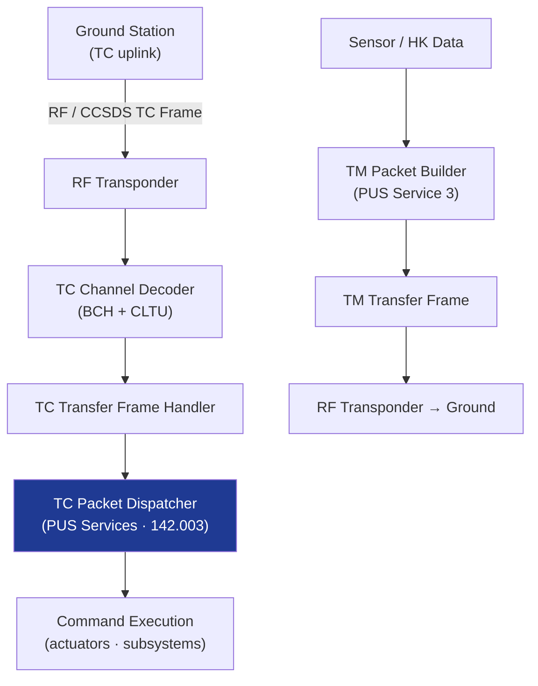

# STA 140-149 · 141-030 — Command and Telemetry Interfaces

## 1. Purpose

Defines the **telecommand (TC) and telemetry (TM) protocol stack, data rates, on-board parameter management, and command authentication** architecture for Q+ATLANTIDE STA-band spacecraft avionics.

## 2. Scope

- **CCSDS TC/TM protocol stack** — TC channel coding (BCH), TC transfer frame (CCSDS 232.0), TC segmentation layer, TC packet layer (PUS services via ECSS-E-ST-70-31C[^ecssest7031c]); TM transfer frame (CCSDS 732.0-B-3[^ccsds7320b3]), TM packet layer; packetization according to CCSDS 133.0-B-2.
- **PUS services** — PUS Service 1 (TC verification), Service 3 (housekeeping), Service 5 (event reporting), Service 9 (time management), Service 17 (test), Service 19 (on-board event action), and mission-specific services; service definition and parameter mapping.
- **Uplink/downlink data rates** — S-band uplink/downlink (typical LEO: 4 kbps – 4 Mbps TC; 100 kbps – 100 Mbps TM); X-band for high-rate payload data; data rate budget per ground station pass; link margin requirements.
- **On-board parameter management** — housekeeping parameter sampling, aggregation, and downlink scheduling; parameter identifier (APID, SID) allocation; on-board storage of telemetry during ground contact gaps; parameter update via memory management TC.
- **Command authentication** — command authentication code (CAC) or cryptographic authentication for safety-critical commands; authentication key management; command sequence counter monitoring; replay-attack prevention.
- **TC acceptance and validation** — TC frame decoding, checksum verification, pre-execution validation checks, command queuing, and execution reporting via PUS Service 1.

## 3. Diagram — TC/TM Protocol Stack

## 4. Footprint

| Metric | Value |
|---|---|
| Architecture | `STA` — Space Technology Architecture |
| Master range | `100–199` |
| Code range | `140-149` |
| Section | `04` — Aviónica y Control de Misión Espacial |
| Subsection | `141` — Aviónica Espacial |
| Subsubject | `003` — Command and Telemetry Interfaces |
| Primary Q-Division | Q-SPACE[^qdiv] |
| ORB support | ORB-PMO, ORB-LEG |
| Governance class | `baseline`[^gov] |
| Document | `141-030-Command-and-Telemetry-Interfaces.md` (this file) |
| Parent subsection | [`README.md`](./README.md) · [`141-000-General.md`](./141-000-General.md) |

## 5. References & Citations

[^ccsds7320b3]: **CCSDS 732.0-B-3 — AOS Space Data Link Protocol** — TM data link protocol standard.

[^ecssest7041c]: **ECSS-E-ST-70-41C — Telemetry and Telecommand Packet Utilization** — TC/TM packet definitions and utilization standard.

[^ecssest7031c]: **ECSS-E-ST-70-31C — Ground Systems and Operations: Monitoring and Control Data Definition** — PUS services definition.

[^qdiv]: **Q-Division authority** — See [`organization/Q+ATLANTIDE.md` §4](../../../../organization/Q+ATLANTIDE.md#4-notes).

[^gov]: **Governance class** — `baseline`.

### Applicable industry standards

- CCSDS 732.0-B-3 — AOS Space Data Link Protocol[^ccsds7320b3]
- ECSS-E-ST-70-41C — Telemetry and Telecommand Packet Utilization[^ecssest7041c]
- ECSS-E-ST-70-31C — Ground Systems and Operations: Monitoring and Control Data Definition[^ecssest7031c]
