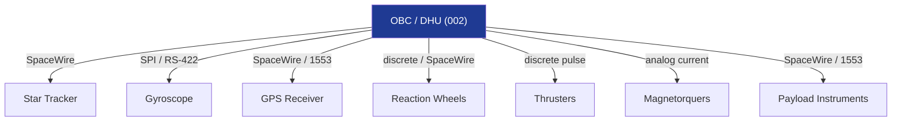

# STA 140-149 · 141-040 — Sensor Actuator and Payload Avionics Interfaces

## 1. Purpose

Defines the **avionics interface architecture for GNC sensors, attitude actuators, and payload instruments**, including ICD requirements for Q+ATLANTIDE STA-band spacecraft.

## 2. Scope

- **GNC sensor interfaces** — star tracker serial/SpaceWire interface (data format, frame rate, error reporting); gyroscope SPI/RS-422 interface (angular rate data, temperature compensation); magnetometer analog/digital interface; GPS receiver serial interface (NMEA or binary protocol); interface electrical specifications (voltage levels, current, impedance).
- **GNC actuator interfaces** — reaction wheel command/telemetry interface (torque command, speed telemetry, temperature, FDIR status); thruster enable/pulse command interface (discrete command signals, pulse width, arm/fire logic); magnetorquer current command interface; actuator health monitoring telemetry protocol.
- **Payload instrument interfaces** — standard payload interface types (SpaceWire, MIL-STD-1553, RS-422, LVDS); payload power switching; payload data volume budget; payload trigger and synchronization signals; payload health monitoring.
- **Interface Control Documents (ICDs)** — per ECSS-E-ST-10-06C[^ecssest1006c]: ICD structure, required fields, version control, and approval process; ICD freeze milestones; delta-ICD change process; compatibility verification between ICD versions.
- **Electrical interface standards** — supply voltage tolerances, ground isolation, signal level compatibility, ESD protection; connector standards; cable routing and harness ICD.
- **Interface verification** — interface compatibility testing at unit level; electrical stimulation/simulation for functional tests; continuity and isolation testing; end-to-end functional test at system level.

## 3. Diagram — Avionics Interface Architecture

## 4. Footprint

| Metric | Value |
|---|---|
| Architecture | `STA` — Space Technology Architecture |
| Master range | `100–199` |
| Code range | `140-149` |
| Section | `04` — Aviónica y Control de Misión Espacial |
| Subsection | `141` — Aviónica Espacial |
| Subsubject | `004` — Sensor, Actuator and Payload Avionics Interfaces |
| Primary Q-Division | Q-SPACE[^qdiv] |
| ORB support | ORB-PMO, ORB-LEG |
| Governance class | `baseline`[^gov] |
| Document | `141-040-Sensor-Actuator-and-Payload-Avionics-Interfaces.md` (this file) |
| Parent subsection | [`README.md`](./README.md) · [`141-000-General.md`](./141-000-General.md) |

## 5. References & Citations

[^ecssest50c]: **ECSS-E-ST-50C — Communications** — On-board interface standards.

[^ecssest5012c]: **ECSS-E-ST-50-12C — SpaceWire** — SpaceWire links, nodes, routers and networks.

[^ecssest1006c]: **ECSS-E-ST-10-06C — Technical requirements specification** — ICD structure and content requirements.

[^qdiv]: **Q-Division authority** — See [`organization/Q+ATLANTIDE.md` §4](../../../../organization/Q+ATLANTIDE.md#4-notes).

[^gov]: **Governance class** — `baseline`.

### Applicable industry standards

- ECSS-E-ST-50C — Communications[^ecssest50c]
- ECSS-E-ST-50-12C — SpaceWire[^ecssest5012c]
- ECSS-E-ST-10-06C — Technical requirements specification[^ecssest1006c]
