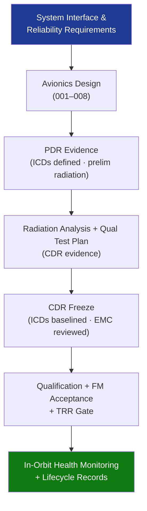

# STA 140-149 · 141-090 — Traceability Evidence and Lifecycle Governance

## 1. Purpose

Establishes **requirements traceability, design evidence gates, and lifecycle governance requirements** for the space avionics subsystem on Q+ATLANTIDE STA-band spacecraft.

## 2. Scope

- **Requirements traceability** — avionics requirements traced from system-level architecture, reliability, and interface requirements; traceability matrix linking each avionics requirement to the design element, verification activity, and evidence artefact; managed in the Q+ATLANTIDE requirements register.
- **Evidence gates** — PDR: interface ICDs defined (all sensor, actuator, payload, and ground interfaces); preliminary radiation analysis complete (TID budget with shielding defined); OBC architecture trade-off concluded. CDR: radiation analysis complete with all component TID and SEE data; qualification test plan approved; all ICDs at controlled baseline; EMC design review completed.
- **Delta-CDR and TRR gates** — delta-CDR for post-CDR changes to OBC configuration, bus topology, or component substitution; TRR gate: all avionics qualification tests passed, flight model acceptance tests passed.
- **In-orbit health monitoring** — OBC temperature, voltage, and current telemetry monitoring; EDAC single-bit and multi-bit error counters (SEU monitoring); watchdog reset event counters; data bus error rate monitoring; anomaly escalation procedure.
- **Lifecycle records** — avionics unit configuration item (CI) records including component lot traceability, EDAC configuration, and software version; radiation test data archive; component derating analysis records; end-of-life SEU rate trend vs design prediction.
- **Interface control documents (ICDs)** — all avionics ICDs (sensor, actuator, payload, power, TC/TM) at controlled baseline at CDR+; change control process for post-CDR ICD revisions.

## 3. Diagram — Avionics Traceability and Governance Flow

## 4. Footprint

| Metric | Value |
|---|---|
| Architecture | `STA` — Space Technology Architecture |
| Master range | `100–199` |
| Code range | `140-149` |
| Section | `04` — Aviónica y Control de Misión Espacial |
| Subsection | `141` — Aviónica Espacial |
| Subsubject | `010` — Traceability, Evidence and Lifecycle Governance |
| Primary Q-Division | Q-SPACE[^qdiv] |
| ORB support | ORB-PMO, ORB-LEG |
| Governance class | `baseline`[^gov] |
| Document | `141-090-Traceability-Evidence-and-Lifecycle-Governance.md` (this file) |
| Parent subsection | [`README.md`](./README.md) · [`141-000-General.md`](./141-000-General.md) |

## 5. References & Citations

[^ecssest50c]: **ECSS-E-ST-50C — Communications** — Avionics traceability requirements.

[^ecssest1002c]: **ECSS-E-ST-10-02C — Verification** — General verification methodology including requirements traceability and evidence gates.

[^qdiv]: **Q-Division authority** — See [`organization/Q+ATLANTIDE.md` §4](../../../../organization/Q+ATLANTIDE.md#4-notes).

[^gov]: **Governance class** — `baseline`.

### Applicable industry standards

- ECSS-E-ST-50C — Communications[^ecssest50c]
- ECSS-E-ST-10-02C — Verification[^ecssest1002c]
