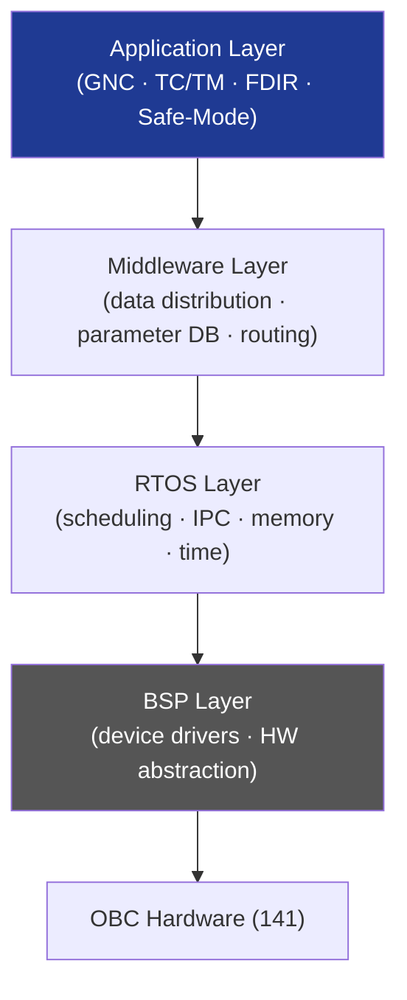

# STA 140-149 · Section 04 · Subsection 142 · Subsubject 002 — Onboard Software Architecture

## 1. Purpose

Defines the **onboard software (OBSW) layered architecture, component-based design approach, software configuration management, and partitioning strategy** for Q+ATLANTIDE STA-band spacecraft flight software.

## 2. Scope

- **FSW architecture layers** — Layer 0: Board Support Package (BSP) — hardware abstraction, device drivers, interrupt handlers; Layer 1: RTOS — task scheduling, inter-task communication, memory management, time services; Layer 2: Middleware — data distribution, message passing, parameter database, telecommand routing; Layer 3: Application — GNC interface (004), TC/TM management (003), FDIR (005), safe-mode management (006), autonomy interface (144).
- **Component-based design** — FSW decomposed into independently verifiable software components (SWC); component interface specifications; component dependency management; reuse policy for heritage components.
- **Software configuration management** — FSW version identification scheme; software baseline control (SWB); patch and parameter upload procedure (OBSW patching via ground command); software configuration item (SCI) register; change control board (CCB) process.
- **Partitioning (ARINC 653 adapted for space)** — temporal partitioning: guaranteed time windows per application partition; spatial partitioning: memory protection between partitions; fault containment regions aligned with FDIR levels; partitioning evidence for SIL A/B components.
- **Memory footprint budget** — code memory budget (ROM/Flash); data memory budget (RAM); stack usage per task; heap management policy (no dynamic allocation for safety-critical components); memory map.
- **Software development lifecycle** — requirements → architecture → detailed design → coding (MISRA-C or ECSS-E-ST-40C guidelines) → unit test → integration test → system test; lifecycle documentation set per ECSS-E-ST-40C[^ecssest40c].

## 3. Diagram — OBSW Layered Architecture

## 4. Footprint

| Metric | Value |
|---|---|
| Architecture | `STA` — Space Technology Architecture |
| Master range | `100–199` |
| Code range | `140-149` |
| Section | `04` — Aviónica y Control de Misión Espacial |
| Subsection | `142` — Software de Vuelo |
| Subsubject | `002` — Onboard Software Architecture |
| Primary Q-Division | Q-SPACE[^qdiv] |
| ORB support | ORB-PMO, ORB-LEG |
| Governance class | `baseline`[^gov] |
| Document | `002_Onboard-Software-Architecture.md` (this file) |
| Parent subsection | [`README.md`](./README.md) · [`000_Overview.md`](./000_Overview.md) |

## 5. References & Citations

[^ecssest40c]: **ECSS-E-ST-40C — Software Engineering** — FSW architecture and lifecycle requirements.

[^ecssqst80c]: **ECSS-Q-ST-80C — Software Product Assurance** — Software product assurance for architecture design.

[^do178c]: **DO-178C — Software Considerations in Airborne Systems** — Software architecture and partitioning reference (adapted for space).

[^qdiv]: **Q-Division authority** — See [`organization/Q+ATLANTIDE.md` §4](../../../../organization/Q+ATLANTIDE.md#4-notes).

[^gov]: **Governance class** — `baseline`.

### Applicable industry standards

- ECSS-E-ST-40C — Software Engineering[^ecssest40c]
- ECSS-Q-ST-80C — Software Product Assurance[^ecssqst80c]
- DO-178C — Software Considerations in Airborne Systems (adapted)[^do178c]
