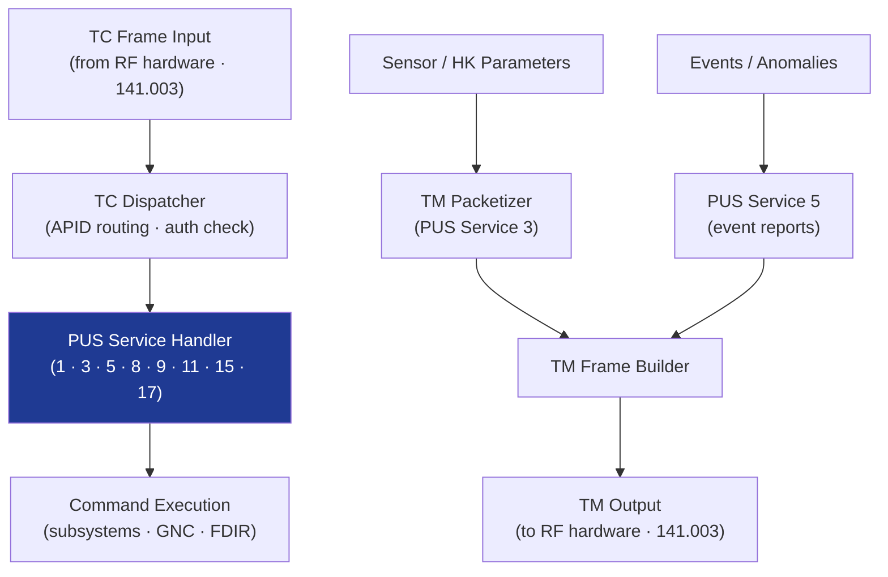

# STA 140-149 · Section 04 · Subsection 142 · Subsubject 003 — Command, Telemetry and Data Handling Software

## 1. Purpose

Defines the **flight software components for telecommand (TC) processing, telemetry (TM) generation, and mass memory data handling**, including CCSDS PUS services implementation for Q+ATLANTIDE STA-band spacecraft.

## 2. Scope

- **TC packet processing** — TC frame decoding (CCSDS 232.0), APID routing, PUS service dispatcher, TC acceptance and execution verification (PUS Service 1); command queue management; command scheduling (PUS Service 11); TC sequence counter validation; pre-execution and post-execution parameter checks.
- **Telecommand authentication and verification** — command authentication code (CAC) check in software; sequence counter monitoring; duplicate command detection; failed authentication reporting via PUS Event Service (Service 5).
- **Housekeeping telemetry generation** — parameter sampling (PUS Service 3): periodic and on-request sampling; housekeeping report generation and packetization; parameter scaling and calibration functions; telemetry filtering and compression; parameter identifier (SID) management.
- **PUS services implementation** — mandatory PUS services: 1 (verification), 3 (housekeeping), 5 (events), 8 (function management), 9 (time management), 11 (scheduling), 17 (test); mission-specific service definitions; service implementation traceability to ECSS-E-ST-70-31C[^ecssest7031c].
- **Mass memory management** — on-board data store (OBDS) for housekeeping, event, and payload data during communication gaps; circular buffer management; data store dump via PUS Service 15; data store status telemetry; data integrity (CRC or checksum per stored packet).
- **Software interface with avionics TC/TM hardware** — software driver interface to RF transponder TC demodulator and TM modulator (→ `141` subsubject 003); data rate adaptation; hardware handshake protocol.

## 3. Diagram — TC/TM Software Processing Flow

## 4. Footprint

| Metric | Value |
|---|---|
| Architecture | `STA` — Space Technology Architecture |
| Master range | `100–199` |
| Code range | `140-149` |
| Section | `04` — Aviónica y Control de Misión Espacial |
| Subsection | `142` — Software de Vuelo |
| Subsubject | `003` — Command, Telemetry and Data Handling Software |
| Primary Q-Division | Q-SPACE[^qdiv] |
| ORB support | ORB-PMO, ORB-LEG |
| Governance class | `baseline`[^gov] |
| Document | `003_Command-Telemetry-and-Data-Handling-Software.md` (this file) |
| Parent subsection | [`README.md`](./README.md) · [`000_Overview.md`](./000_Overview.md) |

## 5. References & Citations

[^ecssest7041c]: **ECSS-E-ST-70-41C — Telemetry and Telecommand Packet Utilization** — TC/TM packet definitions.

[^ecssest7031c]: **ECSS-E-ST-70-31C — Ground Systems and Operations: Monitoring and Control Data Definition** — PUS services specification.

[^ccsds7320b3]: **CCSDS 732.0-B-3 — AOS Space Data Link Protocol** — TM data link protocol.

[^qdiv]: **Q-Division authority** — See [`organization/Q+ATLANTIDE.md` §4](../../../../organization/Q+ATLANTIDE.md#4-notes).

[^gov]: **Governance class** — `baseline`.

### Applicable industry standards

- ECSS-E-ST-70-41C — Telemetry and Telecommand Packet Utilization[^ecssest7041c]
- ECSS-E-ST-70-31C — Ground Systems and Operations: Monitoring and Control Data Definition[^ecssest7031c]
- CCSDS 732.0-B-3 — AOS Space Data Link Protocol[^ccsds7320b3]
