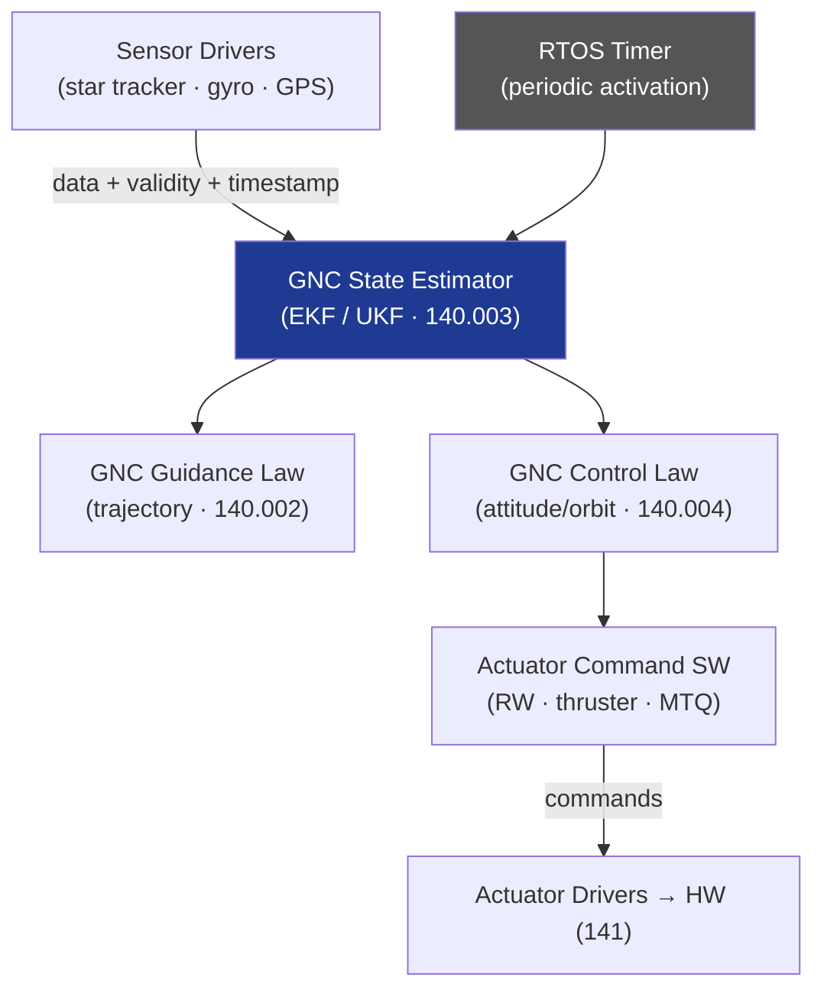

# STA 140-149 · Section 04 · Subsection 142 · Subsubject 004 — GNC Software Interfaces and Control Loops

## 1. Purpose

Defines the **software interface boundary between FSW and GNC algorithms (subsystem 140)**, including sensor driver software, actuator command generation software, and control-loop execution timing within the OBSW for Q+ATLANTIDE STA-band spacecraft.

## 2. Scope

- **Interface boundary FSW ↔ GNC** — GNC algorithms hosted as software components within OBSW application layer; API definitions for sensor measurement inputs (data type, frame rate, validity flag, time tag), state vector outputs (attitude quaternion, angular rates, position, velocity), and actuator command outputs (torque demands, delta-v commands); parameter table for GNC tunable gains and thresholds accessible via TC.
- **Sensor driver software** — star tracker data acquisition driver (serial / SpaceWire protocol decoding, quaternion extraction, validity checking); gyroscope driver (angular rate integration, temperature compensation, bias correction); GPS driver (position/velocity data parsing, PDOP/HDOP quality flag); sensor data validation and plausibility checks in software.
- **Actuator command generation software** — reaction wheel torque command distribution (allocation matrix execution, wheel speed telemetry readback); thruster pulse command generation (pulse width calculation, arm/fire discrete generation, minimum inhibit time enforcement); magnetorquer current command generation (dipole-to-current conversion, duty cycle management).
- **Control-loop execution timing** — GNC main loop activation by RTOS periodic timer (typical period 1 s for orbit control, 125 ms for attitude control); execution order within loop cycle: sensor read → state estimation → guidance computation → control law → actuator command output; loop deadline monitoring and overrun detection.
- **GNC mode management software** — software state machine implementing AOCS modes (→ `140` subsubject 004); mode transition logic, inhibit mask management, and mode status telemetry; interface with FDIR (005) for anomaly-driven mode transitions.
- **GNC parameter upload** — in-orbit GNC parameter table update via TC (PUS Service 3/6); parameter validation before activation; parameter change event reporting; rollback procedure for parameter update failure.

## 3. Diagram — GNC-FSW Interface and Control-Loop Flow

## 4. Footprint

| Metric | Value |
|---|---|
| Architecture | `STA` — Space Technology Architecture |
| Master range | `100–199` |
| Code range | `140-149` |
| Section | `04` — Aviónica y Control de Misión Espacial |
| Subsection | `142` — Software de Vuelo |
| Subsubject | `004` — GNC Software Interfaces and Control Loops |
| Primary Q-Division | Q-SPACE[^qdiv] |
| ORB support | ORB-PMO, ORB-LEG |
| Governance class | `baseline`[^gov] |
| Document | `004_GNC-Software-Interfaces-and-Control-Loops.md` (this file) |
| Parent subsection | [`README.md`](./README.md) · [`000_Overview.md`](./000_Overview.md) |

## 5. References & Citations

[^ecssest40c]: **ECSS-E-ST-40C — Software Engineering** — Software interface requirements and timing assurance.

[^ecssest60c]: **ECSS-E-ST-60C — Control Engineering** — GNC algorithm software interface requirements.

[^qdiv]: **Q-Division authority** — See [`organization/Q+ATLANTIDE.md` §4](../../../../organization/Q+ATLANTIDE.md#4-notes).

[^gov]: **Governance class** — `baseline`.

### Applicable industry standards

- ECSS-E-ST-40C — Software Engineering[^ecssest40c]
- ECSS-E-ST-60C — Control Engineering[^ecssest60c]
