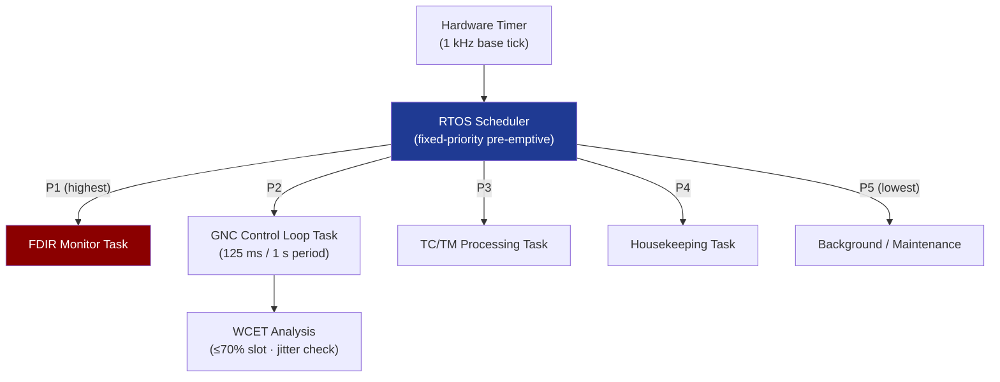

# STA 140-149 · Section 04 · Subsection 142 · Subsubject 007 — Real-Time Scheduling, Timing and Determinism

## 1. Purpose

Defines the **RTOS selection and configuration, task priority scheme, WCET analysis, jitter budget, and timing verification approach** for Q+ATLANTIDE STA-band spacecraft flight software.

## 2. Scope

- **RTOS selection and configuration** — space-qualified RTOS options (RTEMS, VxWorks 653, LynxOS-178 adapted); qualification level requirements (DO-178C Level A adapted, or ECSS-E-ST-40C SIL A); RTOS configuration parameters (number of tasks, scheduling algorithm, stack sizes, interrupt latency); RTOS certification evidence.
- **Task priority scheme** — fixed-priority pre-emptive scheduling; priority assignment rationale: FDIR highest, GNC control loop, TC/TM processing, housekeeping, background tasks; priority inversion prevention (priority inheritance protocol); task communication via message queues or shared memory with mutual exclusion.
- **Worst-Case Execution Time (WCET) analysis** — WCET measurement and analytical bounding per task; WCET tool qualification; cache behaviour analysis on target processor; WCET budget allocation per task vs. available time per scheduling period; margin policy (WCET ≤ 70% of available slot).
- **Jitter budget** — allowable timing jitter for GNC sensor data acquisition and actuator command output (jitter budget allocated as fraction of GNC loop period); jitter sources: RTOS scheduling latency, interrupt latency, bus access latency; jitter measurement and verification.
- **Timing verification** — hardware timer and logic analyser-based timing measurements on target hardware; end-to-end latency measurement (sensor input to actuator output); comparison against GNC timing requirements; worst-case test scenarios.
- **Determinism requirements** — no dynamic memory allocation in safety-critical tasks; bounded loops only (no unbounded iterations); disabled interrupts duration limits; stack depth analysis and overflow protection; stack canary implementation.

## 3. Diagram — RTOS Scheduling and Timing Flow

## 4. Footprint

| Metric | Value |
|---|---|
| Architecture | `STA` — Space Technology Architecture |
| Master range | `100–199` |
| Code range | `140-149` |
| Section | `04` — Aviónica y Control de Misión Espacial |
| Subsection | `142` — Software de Vuelo |
| Subsubject | `007` — Real-Time Scheduling, Timing and Determinism |
| Primary Q-Division | Q-SPACE[^qdiv] |
| ORB support | ORB-PMO, ORB-LEG |
| Governance class | `baseline`[^gov] |
| Document | `007_Real-Time-Scheduling-Timing-and-Determinism.md` (this file) |
| Parent subsection | [`README.md`](./README.md) · [`000_Overview.md`](./000_Overview.md) |

## 5. References & Citations

[^ecssest40c]: **ECSS-E-ST-40C — Software Engineering** — Timing assurance and RTOS requirements for space FSW.

[^do178c]: **DO-178C — Software Considerations in Airborne Systems** — WCET analysis and scheduling requirements (adapted as reference).

[^isoiec25010]: **ISO/IEC 25010 — Systems and software Quality Requirements and Evaluation** — Software quality characteristics including timing efficiency.

[^qdiv]: **Q-Division authority** — See [`organization/Q+ATLANTIDE.md` §4](../../../../organization/Q+ATLANTIDE.md#4-notes).

[^gov]: **Governance class** — `baseline`.

### Applicable industry standards

- ECSS-E-ST-40C — Software Engineering[^ecssest40c]
- DO-178C — Software Considerations in Airborne Systems (adapted)[^do178c]
- ISO/IEC 25010 — Systems and software Quality Requirements and Evaluation[^isoiec25010]
