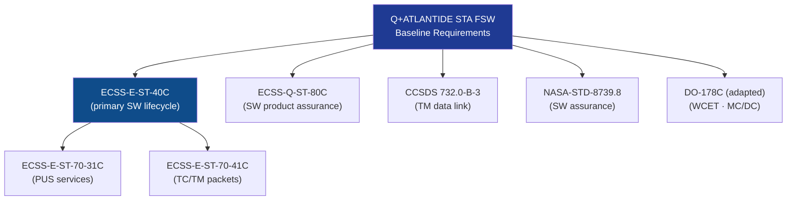

# STA 140-149 · Section 04 · Subsection 142 · Subsubject 009 — ECSS-NASA-CCSDS Software Standards Mapping

## 1. Purpose

Provides a **normative standards mapping table and applicability hierarchy** for all flight software applicable standards within the Q+ATLANTIDE STA-band FSW subsystem, establishing applicability, precedence, and tailoring rules.

## 2. Scope

- **Standards mapping table** — maps each FSW functional area (software lifecycle, architecture, TC/TM services, FDIR, timing, verification) to the applicable normative standard, its edition, and applicability condition.
- **Standards hierarchy** — ECSS-E-ST-40C as primary FSW standard; ECSS-Q-ST-80C for software product assurance; ECSS-E-ST-70-31C / -70-41C for PUS TC/TM; CCSDS 732.0-B-3 for data link; NASA-STD-8739.8 for software assurance; DO-178C as reference for WCET and coverage criteria.

| Standard | Edition | Title | FSW Applicability |
|---|---|---|---|
| ECSS-E-ST-40C | Rev. 1 (2009) | Software Engineering | Primary FSW development lifecycle and requirements |
| ECSS-Q-ST-80C | Rev. 1 (2009) | Software Product Assurance | Software PA, testing, and review requirements |
| ECSS-E-ST-70-31C | Rev. 1 (2008) | Ground Systems: Monitoring and Control Data Definition | PUS services specification |
| ECSS-E-ST-70-41C | Rev. 1 (2016) | Telemetry and Telecommand Packet Utilization | TC/TM packet definitions |
| CCSDS 732.0-B-3 | Issue 3 (2015) | AOS Space Data Link Protocol | TM data link layer software |
| NASA-STD-8739.8 | Rev. C (2018) | Software Assurance Standard | Software assurance and testing |
| DO-178C | 2011 | Software Considerations in Airborne Systems (adapted) | WCET analysis, MC/DC coverage criteria |

## 3. Diagram — FSW Standards Applicability

## 4. Footprint

| Metric | Value |
|---|---|
| Architecture | `STA` — Space Technology Architecture |
| Master range | `100–199` |
| Code range | `140-149` |
| Section | `04` — Aviónica y Control de Misión Espacial |
| Subsection | `142` — Software de Vuelo |
| Subsubject | `009` — ECSS-NASA-CCSDS Software Standards Mapping |
| Primary Q-Division | Q-SPACE[^qdiv] |
| ORB support | ORB-PMO, ORB-LEG |
| Governance class | `baseline`[^gov] |
| Document | `009_ECSS-NASA-CCSDS-Software-Standards-Mapping.md` (this file) |
| Parent subsection | [`README.md`](./README.md) · [`000_Overview.md`](./000_Overview.md) |

## 5. References & Citations

[^ecssest40c]: **ECSS-E-ST-40C — Software Engineering** — Primary FSW lifecycle standard.

[^ecssqst80c]: **ECSS-Q-ST-80C — Software Product Assurance** — SW PA requirements.

[^ecssest7031c]: **ECSS-E-ST-70-31C** — PUS services standard.

[^ecssest7041c]: **ECSS-E-ST-70-41C** — TC/TM packet standard.

[^ccsds7320b3]: **CCSDS 732.0-B-3** — TM data link protocol.

[^nasastd87398]: **NASA-STD-8739.8** — Software assurance.

[^do178c]: **DO-178C** — Software considerations (adapted reference).

[^qdiv]: **Q-Division authority** — See [`organization/Q+ATLANTIDE.md` §4](../../../../organization/Q+ATLANTIDE.md#4-notes).

[^gov]: **Governance class** — `baseline`.

### Applicable industry standards

- ECSS-E-ST-40C — Software Engineering[^ecssest40c]
- ECSS-Q-ST-80C — Software Product Assurance[^ecssqst80c]
- ECSS-E-ST-70-31C — Ground Systems: Monitoring and Control Data Definition[^ecssest7031c]
- ECSS-E-ST-70-41C — Telemetry and Telecommand Packet Utilization[^ecssest7041c]
- CCSDS 732.0-B-3 — AOS Space Data Link Protocol[^ccsds7320b3]
- NASA-STD-8739.8 — Software Assurance Standard[^nasastd87398]
- DO-178C — Software Considerations in Airborne Systems (adapted)[^do178c]
