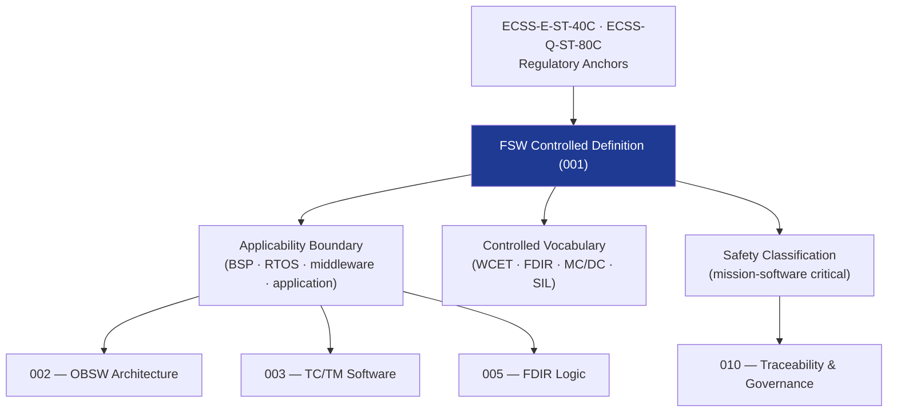

# STA 140-149 · 142-010 — Flight Software Controlled Definition

## 1. Purpose

Establishes the **normative definition and controlled scope** of Flight Software (FSW) within the Q+ATLANTIDE STA band, per ECSS-E-ST-40C[^ecssest40c].

## 2. Scope

- **Controlled definition** — Flight Software (FSW) encompasses all software executing on the onboard computer(s) that implements spacecraft functional behaviour, including the board support package (BSP), real-time operating system (RTOS), middleware services, and application software components (TC/TM management, FDIR, GNC interface, data handling, and autonomy functions).
- **Applicability boundary** — STA `142` covers FSW executing on the spacecraft OBC defined in avionics subsystem `141`; excludes GNC algorithm mathematical formulation (→ `140`), avionics hardware design (→ `141`), ground software and mission control systems (→ `143`), and autonomy policy management (→ `144`).
- **Controlled vocabulary** — *Board Support Package (BSP)*: hardware abstraction layer; *RTOS*: real-time operating system; *Worst-Case Execution Time (WCET)*; *FDIR*: fault detection, isolation and recovery; *software criticality level* (per ECSS-E-ST-40C: SIL A–D); *MC/DC*: modified condition/decision coverage; *OBSW*: on-board software; *SIL*: software-in-the-loop; *HIL*: hardware-in-the-loop.
- **Safety classification** — mission-software critical; FSW failures may result in loss of spacecraft control, mission abort, or loss of mission.
- **Software criticality levels** — FSW classified per ECSS-E-ST-40C SIL A (most critical: safety, mission-critical functions) to SIL D (non-critical); safety and mission-critical FSW components require SIL A/B treatment including 100% MC/DC code coverage.

## 3. Diagram — FSW Scope and Layer Architecture

## 4. Footprint

| Metric | Value |
|---|---|
| Architecture | `STA` — Space Technology Architecture |
| Master range | `100–199` |
| Code range | `140-149` |
| Section | `04` — Aviónica y Control de Misión Espacial |
| Subsection | `142` — Software de Vuelo |
| Subsubject | `001` — Flight Software Controlled Definition |
| Primary Q-Division | Q-SPACE[^qdiv] |
| ORB support | ORB-PMO, ORB-LEG |
| Governance class | `baseline`[^gov] |
| Document | `142-010-Flight-Software-Controlled-Definition.md` (this file) |
| Parent subsection | [`README.md`](./README.md) · [`142-000-General.md`](./142-000-General.md) |

## 5. References & Citations

[^ecssest40c]: **ECSS-E-ST-40C — Software Engineering** — Primary FSW development lifecycle and criticality classification standard.

[^ecssqst80c]: **ECSS-Q-ST-80C — Software Product Assurance** — Software product assurance requirements for space projects.

[^qdiv]: **Q-Division authority** — See [`organization/Q+ATLANTIDE.md` §4](../../../../organization/Q+ATLANTIDE.md#4-notes).

[^gov]: **Governance class** — `baseline`.

### Applicable industry standards

- ECSS-E-ST-40C — Software Engineering[^ecssest40c]
- ECSS-Q-ST-80C — Software Product Assurance[^ecssqst80c]
