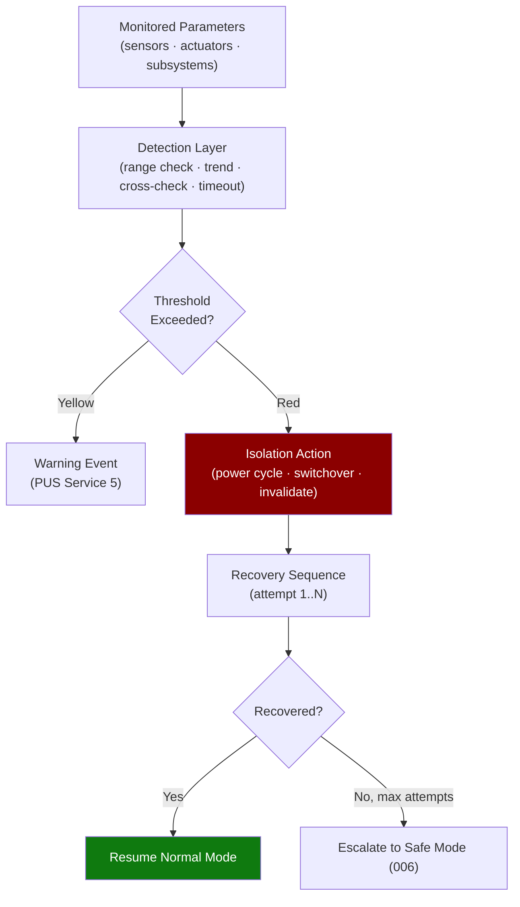

# STA 140-149 · 142-050 — FDIR Fault Detection Isolation and Recovery Logic

## 1. Purpose

Defines the **software-based FDIR (Fault Detection, Isolation and Recovery) architecture**, including fault detection algorithms, anomaly thresholds, isolation actions, recovery sequences, and interaction with hardware watchdogs for Q+ATLANTIDE STA-band spacecraft flight software.

## 2. Scope

- **FDIR architecture in software** — multi-level FDIR: component-level (sensor/actuator monitoring), subsystem-level (GNC, avionics, power), and system-level (mission-critical fault handling); FDIR state machine per monitored resource; fault isolation containment boundaries aligned with software partitions (→ `002`).
- **Fault detection algorithms** — parameter out-of-range checks (upper/lower bounds); trend monitoring (rate-of-change threshold); cross-check between redundant sensors (disagreement detection, majority voting); communication timeout detection; checksum / EDAC error monitoring; GNC estimator divergence detection (innovation gate rejection).
- **Anomaly thresholds** — threshold parameter table managed via TC parameter upload; threshold levels: yellow (warning, log event), red (anomaly, trigger action); hysteresis parameters to prevent chattering; inhibit flags per monitored parameter for ground override.
- **Isolation actions** — power cycling of failed unit; switch to redundant unit (OBC switchover, sensor/actuator cross-strapping); data source invalidation flag; FDIR event report (PUS Service 5) with fault identifier and isolation action record.
- **Recovery sequences** — defined recovery action sequences per fault class; recovery outcome verification check; maximum recovery attempt count before escalation; escalation to safe-mode entry (→ `006`); recovery sequence execution time budget.
- **Interaction with hardware watchdogs** — RTOS watchdog kick task; hardware watchdog (WDT) reset inhibit during critical software operations; hardware reset event detection and cause logging in non-volatile memory; reset cause telemetry on reboot.

## 3. Diagram — FDIR Multi-Level Architecture

## 4. Footprint

| Metric | Value |
|---|---|
| Architecture | `STA` — Space Technology Architecture |
| Master range | `100–199` |
| Code range | `140-149` |
| Section | `04` — Aviónica y Control de Misión Espacial |
| Subsection | `142` — Software de Vuelo |
| Subsubject | `005` — FDIR: Fault Detection, Isolation and Recovery Logic |
| Primary Q-Division | Q-SPACE[^qdiv] |
| ORB support | ORB-PMO, ORB-LEG |
| Governance class | `baseline`[^gov] |
| Document | `142-050-FDIR-Fault-Detection-Isolation-and-Recovery-Logic.md` (this file) |
| Parent subsection | [`README.md`](./README.md) · [`142-000-General.md`](./142-000-General.md) |

## 5. References & Citations

[^ecssest7011c]: **ECSS-E-ST-70-11C — Space Segment Operability** — FDIR requirements for space segment onboard systems.

[^ecssest40c]: **ECSS-E-ST-40C — Software Engineering** — FDIR software implementation requirements.

[^qdiv]: **Q-Division authority** — See [`organization/Q+ATLANTIDE.md` §4](../../../../organization/Q+ATLANTIDE.md#4-notes).

[^gov]: **Governance class** — `baseline`.

### Applicable industry standards

- ECSS-E-ST-70-11C — Space Segment Operability[^ecssest7011c]
- ECSS-E-ST-40C — Software Engineering[^ecssest40c]
