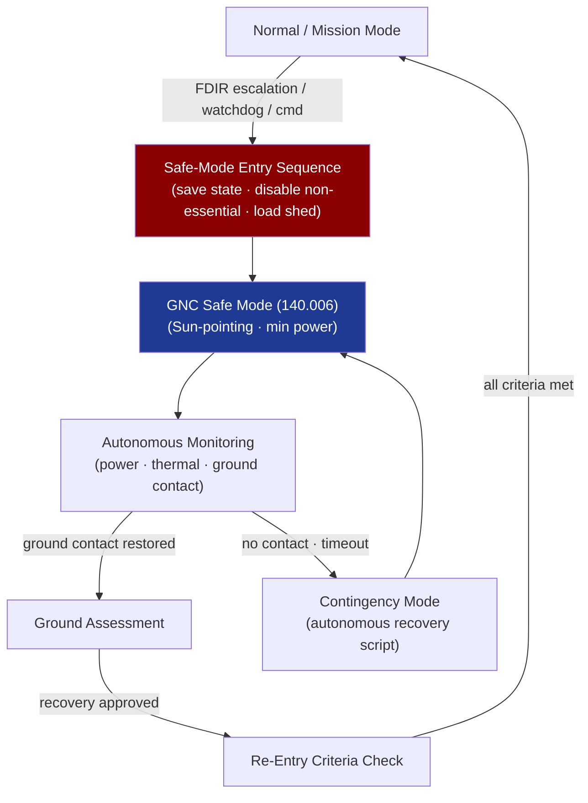

# STA 140-149 · 142-060 — Safe Mode Contingency and Autonomous Recovery Software

## 1. Purpose

Defines the **flight software components for safe-mode entry, contingency mode management, and autonomous recovery sequences** that ensure spacecraft survival without ground intervention on Q+ATLANTIDE STA-band spacecraft.

## 2. Scope

- **Safe-mode transition sequences** — software-controlled safe-mode entry: save current state to non-volatile memory, disable non-essential functions, transition GNC to safe mode (→ `140` subsubject 006), reduce OBC load to minimum; safe-mode entry trigger sources: FDIR escalation (→ `005`), hardware watchdog expiry, ground-commanded entry.
- **Autonomous onboard emergency management** — autonomous power management (load shedding sequence for under-voltage); autonomous thermal management (heater activation/deactivation); onboard time-out logic for ground contact loss (enter contingency after N consecutive missed contact windows); recovery from anomalous software state via boot sequence with NVRAM configuration.
- **Contingency mode logic** — defined contingency modes for specific fault classes (GNC sensor failure contingency, power contingency, thermal contingency, communication contingency); contingency mode state machine; parameter tables configuring contingency mode behaviour; ground-commanded exit from contingency.
- **Ground-command-free recovery procedures** — fully autonomous recovery sequences executable without ground intervention; required coverage: recovery from any single-point failure within defined recovery time objective (RTO); ground command authority to override or inhibit autonomous recovery.
- **Non-volatile memory management** — boot configuration stored in EEPROM/Flash (bootloader parameters, safe-mode configuration, recovery script pointers); integrity checking (CRC) on boot data; multiple boot attempts with degraded configuration fallback.
- **Safe-mode to normal mode re-entry criteria** — all FDIR inhibits cleared, power positive, navigation converged, thermal within limits, ground-acknowledged recovery; re-entry inhibit counter management.

## 3. Diagram — Safe-Mode Entry and Autonomous Recovery Flow

## 4. Footprint

| Metric | Value |
|---|---|
| Architecture | `STA` — Space Technology Architecture |
| Master range | `100–199` |
| Code range | `140-149` |
| Section | `04` — Aviónica y Control de Misión Espacial |
| Subsection | `142` — Software de Vuelo |
| Subsubject | `006` — Safe-Mode, Contingency and Autonomous Recovery Software |
| Primary Q-Division | Q-SPACE[^qdiv] |
| ORB support | ORB-PMO, ORB-LEG |
| Governance class | `baseline`[^gov] |
| Document | `142-060-Safe-Mode-Contingency-and-Autonomous-Recovery-Software.md` (this file) |
| Parent subsection | [`README.md`](./README.md) · [`142-000-General.md`](./142-000-General.md) |

## 5. References & Citations

[^ecssest7011c]: **ECSS-E-ST-70-11C — Space Segment Operability** — Safe-mode and contingency software requirements.

[^ecssest40c]: **ECSS-E-ST-40C — Software Engineering** — Safe-mode software implementation requirements.

[^qdiv]: **Q-Division authority** — See [`organization/Q+ATLANTIDE.md` §4](../../../../organization/Q+ATLANTIDE.md#4-notes).

[^gov]: **Governance class** — `baseline`.

### Applicable industry standards

- ECSS-E-ST-70-11C — Space Segment Operability[^ecssest7011c]
- ECSS-E-ST-40C — Software Engineering[^ecssest40c]
