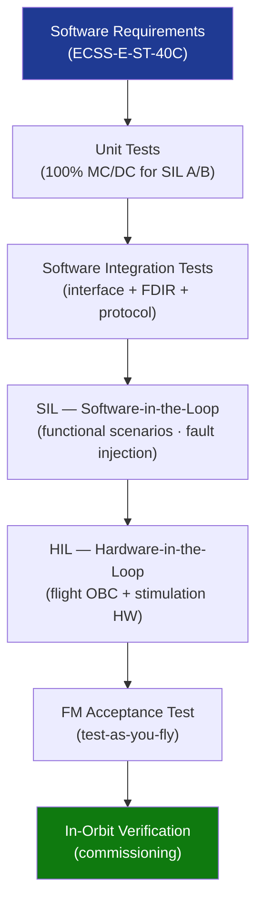

# STA 140-149 · 142-080 — Verification Validation Simulation and HIL Testing

## 1. Purpose

Defines the **flight software V&V strategy**, covering unit testing, integration testing, software-in-the-loop (SIL), hardware-in-the-loop (HIL), and final functional testing on the flight model (FM) for Q+ATLANTIDE STA-band spacecraft.

## 2. Scope

- **FSW V&V strategy** — four-level approach: (1) unit testing of individual software components; (2) software integration testing; (3) SIL simulation (FSW on host or target with simulated hardware); (4) HIL testing (FSW on flight OBC with real or simulated avionics hardware); each level with defined entry/exit criteria and coverage requirements.
- **Unit testing** — automated unit tests for all software components; minimum statement coverage 100% for SIL A/B components; branch coverage and MC/DC coverage 100% for safety-critical functions; unit test framework qualification; regression test suite maintained in software CI pipeline.
- **Software integration testing** — integration order and strategy; interface testing between software components; TC/TM protocol compliance testing; FDIR activation and recovery sequence testing in SIL environment; RTOS scheduling validation.
- **Software-in-the-loop (SIL)** — FSW executing on host simulator with hardware models (sensor models, actuator models, environment model); functional scenario coverage; FDIR injection testing; performance regression testing; SIL environment qualification per NASA-STD-7009A[^nasastd7009a].
- **Hardware-in-the-loop (HIL)** — FSW executing on flight-representative OBC hardware (→ `141`); real sensor data injection via hardware stimulation; real actuator command monitoring; HIL facility qualification; HIL test campaign coverage requirements per mission scenarios; HIL test evidence required at CDR.
- **Final functional testing on FM** — flight model acceptance functional test procedure; test-as-you-fly principle; comparison of FM test results vs HIL baseline; pre-launch software verification check.

## 3. Diagram — FSW V&V Pyramid

## 4. Footprint

| Metric | Value |
|---|---|
| Architecture | `STA` — Space Technology Architecture |
| Master range | `100–199` |
| Code range | `140-149` |
| Section | `04` — Aviónica y Control de Misión Espacial |
| Subsection | `142` — Software de Vuelo |
| Subsubject | `008` — Verification, Validation, Simulation and HIL Testing |
| Primary Q-Division | Q-SPACE[^qdiv] |
| ORB support | ORB-PMO, ORB-LEG |
| Governance class | `baseline`[^gov] |
| Document | `142-080-Verification-Validation-Simulation-and-HIL-Testing.md` (this file) |
| Parent subsection | [`README.md`](./README.md) · [`142-000-General.md`](./142-000-General.md) |

## 5. References & Citations

[^ecssest40c]: **ECSS-E-ST-40C — Software Engineering** — FSW V&V requirements and lifecycle.

[^ecssqst80c]: **ECSS-Q-ST-80C — Software Product Assurance** — Software testing and coverage requirements.

[^nasastd87398]: **NASA-STD-8739.8 — Software Assurance Standard** — Software test requirements for NASA projects.

[^nasastd7009a]: **NASA-STD-7009A — Standard for Models and Simulations** — SIL and HIL simulation qualification requirements.

[^qdiv]: **Q-Division authority** — See [`organization/Q+ATLANTIDE.md` §4](../../../../organization/Q+ATLANTIDE.md#4-notes).

[^gov]: **Governance class** — `baseline`.

### Applicable industry standards

- ECSS-E-ST-40C — Software Engineering[^ecssest40c]
- ECSS-Q-ST-80C — Software Product Assurance[^ecssqst80c]
- NASA-STD-8739.8 — Software Assurance Standard[^nasastd87398]
