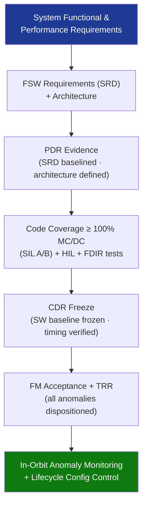

# STA 140-149 · 142-090 — Traceability Evidence and Lifecycle Governance

## 1. Purpose

Establishes **FSW requirements traceability, design evidence gates, in-orbit anomaly monitoring, and lifecycle configuration control** for the flight software subsystem on Q+ATLANTIDE STA-band spacecraft.

## 2. Scope

- **FSW requirements traceability** — all FSW requirements traced from system-level functional and performance requirements; traceability matrix: requirement → software component → unit test → integration test → SIL/HIL test case → evidence artefact; managed in Q+ATLANTIDE requirements register; bidirectional traceability maintained throughout development.
- **Evidence gates** — PDR: software requirements baselined (SRD approved), software architecture defined, RTOS and development toolchain selected; CDR: code coverage ≥ 100% MC/DC for all safety-critical (SIL A/B) components demonstrated; HIL test campaign complete with full scenario coverage; FDIR injection tests passed; timing analysis completed with all WCET budgets met.
- **Delta-CDR and TRR gates** — delta-CDR required for post-CDR changes to safety-critical software components; TRR gate: FM acceptance tests passed, all software anomalies at CDR+ dispositioned, software baseline frozen; pre-launch readiness review (LRR) software verification closure.
- **In-orbit anomaly monitoring** — software exception/error telemetry (unhandled exceptions, watchdog resets, memory corruption events); FDIR activation event log; GNC software performance monitoring (estimator residuals, loop timing); periodic software health report via housekeeping telemetry.
- **Lifecycle configuration control** — software configuration item (SCI) records: FSW version, OBSW patch history, parameter table versions, boot configuration; software change record (SCR) for all in-orbit patches; configuration control board (CCB) for all changes; software lifecycle documentation set archived per ECSS-E-ST-40C[^ecssest40c].
- **End-of-life software governance** — FSW decommissioning procedure (safe-mode entry, de-orbit sequence activation); post-mission FSW anomaly review; lessons-learned capture; heritage software reuse assessment for future missions.

## 3. Diagram — FSW Traceability and Lifecycle Governance Flow

## 4. Footprint

| Metric | Value |
|---|---|
| Architecture | `STA` — Space Technology Architecture |
| Master range | `100–199` |
| Code range | `140-149` |
| Section | `04` — Aviónica y Control de Misión Espacial |
| Subsection | `142` — Software de Vuelo |
| Subsubject | `010` — Traceability, Evidence and Lifecycle Governance |
| Primary Q-Division | Q-SPACE[^qdiv] |
| ORB support | ORB-PMO, ORB-LEG |
| Governance class | `baseline`[^gov] |
| Document | `142-090-Traceability-Evidence-and-Lifecycle-Governance.md` (this file) |
| Parent subsection | [`README.md`](./README.md) · [`142-000-General.md`](./142-000-General.md) |

## 5. References & Citations

[^ecssest40c]: **ECSS-E-ST-40C — Software Engineering** — FSW lifecycle documentation and traceability requirements.

[^ecssqst80c]: **ECSS-Q-ST-80C — Software Product Assurance** — Software PA requirements including configuration control and traceability.

[^ecssest1002c]: **ECSS-E-ST-10-02C — Verification** — General verification methodology including evidence gates and lifecycle records.

[^qdiv]: **Q-Division authority** — See [`organization/Q+ATLANTIDE.md` §4](../../../../organization/Q+ATLANTIDE.md#4-notes).

[^gov]: **Governance class** — `baseline`.

### Applicable industry standards

- ECSS-E-ST-40C — Software Engineering[^ecssest40c]
- ECSS-Q-ST-80C — Software Product Assurance[^ecssqst80c]
- ECSS-E-ST-10-02C — Verification[^ecssest1002c]
