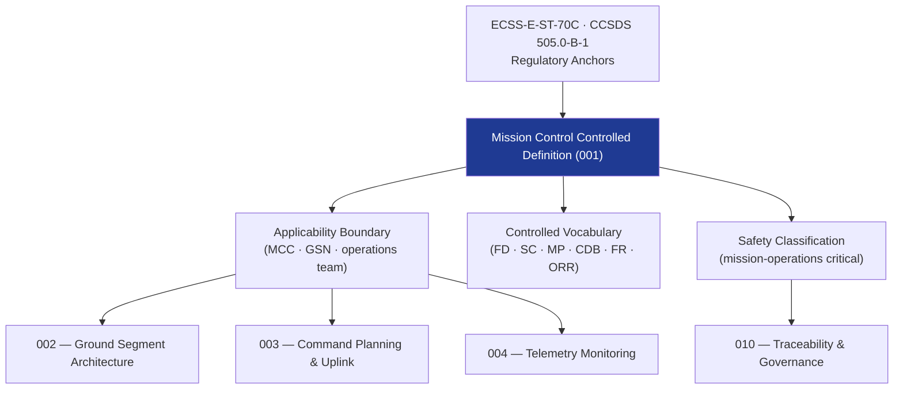

# STA 140-149 · Section 04 · Subsection 143 · Subsubject 001 — Mission Control Controlled Definition

## 1. Purpose

Establishes the **normative definition and controlled scope** of Mission Control (MC) within the Q+ATLANTIDE STA band, per ECSS-E-ST-70C[^ecssest70c].

## 2. Scope

- **Controlled definition** — Mission Control encompasses all ground-based functions and personnel responsible for commanding, monitoring, planning, and managing the spacecraft and its mission from launch through end of life. Mission Control includes the Mission Control Centre (MCC), the Ground Station Network (GSN), and all associated software, procedures, and operational processes.
- **Applicability boundary** — STA `143` covers mission control functions and ground segment architecture; excludes onboard flight software (→ `142`), GNC algorithms and onboard execution (→ `140`), space avionics hardware (→ `141`), and autonomous onboard decision functions (→ `144`). Communications infrastructure for telemetry/command relay is addressed in `150_SATCOM` and `152_Redes-Espaciales`.
- **Controlled vocabulary** — *Flight Director (FD)*: senior operations authority on console; *Spacecraft Controller (SC)*: real-time spacecraft commanding and monitoring; *Mission Planner (MP)*: mission timeline and activity scheduling; *Command Database (CDB)*: controlled repository of all spacecraft telecommands; *Flight Rules (FR)*: constraints and rules governing spacecraft operations; *Operational Readiness Review (ORR)*: formal gate verifying mission control team and systems readiness; *Anomaly Response Procedure (ARP)*: formal procedure for responding to spacecraft anomalies.
- **Safety classification** — mission-operations critical; mission control failures may result in loss of spacecraft, crew safety events (for crewed missions), or loss of mission.
- **Command authority hierarchy** — Flight Director holds final authority for all mission-critical decisions; Spacecraft Controller holds authority for routine commanding within Flight Rule boundaries; escalation hierarchy defined in operations procedures library.

## 3. Diagram — Mission Control Scope and Authority Hierarchy

## 4. Footprint

| Metric | Value |
|---|---|
| Architecture | `STA` — Space Technology Architecture |
| Master range | `100–199` |
| Code range | `140-149` |
| Section | `04` — Aviónica y Control de Misión Espacial |
| Subsection | `143` — Control de Misión |
| Subsubject | `001` — Mission Control Controlled Definition |
| Primary Q-Division | Q-SPACE[^qdiv] |
| ORB support | ORB-PMO, ORB-LEG |
| Governance class | `baseline`[^gov] |
| Document | `001_Mission-Control-Controlled-Definition.md` (this file) |
| Parent subsection | [`README.md`](./README.md) · [`000_Overview.md`](./000_Overview.md) |

## 5. References & Citations

[^ecssest70c]: **ECSS-E-ST-70C — Ground Systems and Operations** — Primary standard for mission control and ground segment requirements.

[^ccsds505]: **CCSDS 505.0-B-1 — Mission Operations Reference Architecture** — CCSDS reference architecture for mission operations systems.

[^qdiv]: **Q-Division authority** — See [`organization/Q+ATLANTIDE.md` §4](../../../../organization/Q+ATLANTIDE.md#4-notes).

[^gov]: **Governance class** — `baseline`.

### Applicable industry standards

- ECSS-E-ST-70C — Ground Systems and Operations[^ecssest70c]
- CCSDS 505.0-B-1 — Mission Operations Reference Architecture[^ccsds505]
