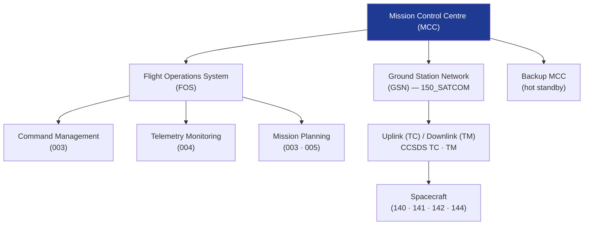

# STA 140-149 · Section 04 · Subsection 143 · Subsubject 002 — Ground Segment and Control Centre Architecture

## 1. Purpose

Defines the **ground segment decomposition and Mission Control Centre (MCC) architecture** for Q+ATLANTIDE STA-band missions, per ECSS-E-ST-70C[^ecssest70c] and CCSDS 505.0-B-1[^ccsds505].

## 2. Scope

- **Ground segment decomposition** — mission control segment (MCS): MCC operations infrastructure; ground station segment (GSS): antenna network for RF telemetry/command relay; mission planning segment (MPS): mission timeline, activity scheduling, orbit determination; data management segment (DMS): telemetry archiving, data distribution, long-term storage; mission analysis segment (MAS): orbit/attitude analysis, mission performance assessment.
- **Mission Control Centre architecture** — MCC core systems: flight operations system (FOS) integrating command management, telemetry monitoring, mission planning, and simulation; consoles and displays: dedicated operator workstations per function (FD, SC, MP); internal MCC networks: operations LAN separated from external interfaces; MCC redundancy: hot-standby backup MCC for mission-critical operations.
- **Ground Station Network architecture** — primary ground station: high-gain antenna for nominal operations; backup ground stations: geographic redundancy for contingency contact; station-keeping contacts: pass scheduling and contact plan management; ranging and Doppler for orbit determination; inter-station network: dedicated links for real-time telemetry relay to MCC.
- **Ground-to-space interface** — RF link interface (→ `150_SATCOM`, `152_Redes-Espaciales`): uplink (command carrier) and downlink (telemetry carrier); CCSDS TC and TM VCID scheme; forward and return link frequency plan; security layer for command authentication.
- **Ground segment interfaces with spacecraft** — onboard software command/telemetry interface (→ `142`); GNC ground support interface (→ `140`); avionics telemetry interface (→ `141`); autonomy ground override interface (→ `144`).

## 3. Diagram — Ground Segment Architecture

## 4. Footprint

| Metric | Value |
|---|---|
| Architecture | `STA` — Space Technology Architecture |
| Master range | `100–199` |
| Code range | `140-149` |
| Section | `04` — Aviónica y Control de Misión Espacial |
| Subsection | `143` — Control de Misión |
| Subsubject | `002` — Ground Segment and Control Centre Architecture |
| Primary Q-Division | Q-SPACE[^qdiv] |
| ORB support | ORB-PMO, ORB-LEG |
| Governance class | `baseline`[^gov] |
| Document | `002_Ground-Segment-and-Control-Centre-Architecture.md` (this file) |
| Parent subsection | [`README.md`](./README.md) · [`000_Overview.md`](./000_Overview.md) |

## 5. References & Citations

[^ecssest70c]: **ECSS-E-ST-70C — Ground Systems and Operations** — Ground segment architecture and MCC requirements.

[^ccsds505]: **CCSDS 505.0-B-1 — Mission Operations Reference Architecture** — Reference architecture for ground segment and mission operations.

[^ecssest5001c]: **ECSS-E-ST-50-01C — Spacecraft Data-Handling Communication** — Ground-to-space interface and CCSDS TC/TM requirements.

[^qdiv]: **Q-Division authority** — See [`organization/Q+ATLANTIDE.md` §4](../../../../organization/Q+ATLANTIDE.md#4-notes).

[^gov]: **Governance class** — `baseline`.

### Applicable industry standards

- ECSS-E-ST-70C — Ground Systems and Operations[^ecssest70c]
- CCSDS 505.0-B-1 — Mission Operations Reference Architecture[^ccsds505]
- ECSS-E-ST-50-01C — Spacecraft Data-Handling Communication[^ecssest5001c]
