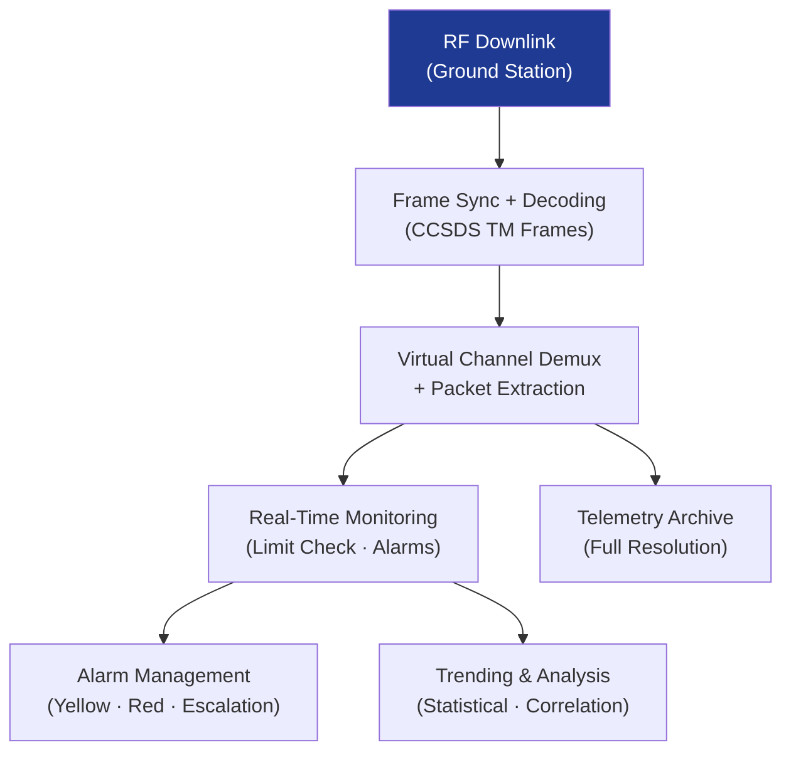

# STA 140-149 · Section 04 · Subsection 143 · Subsubject 004 — Telemetry Reception, Monitoring and Trending

## 1. Purpose

Defines the **telemetry reception pipeline, real-time monitoring, limit checking, and trending architecture** for Q+ATLANTIDE STA-band mission operations, per ECSS-E-ST-70C[^ecssest70c] and CCSDS 133.0-B-2[^ccsds133].

## 2. Scope

- **Telemetry reception pipeline** — RF downlink reception at ground station; CCSDS TM frame synchronisation and reed-Solomon/turbo decoding; virtual channel demultiplexing; packet extraction (CCSDS Space Packet Protocol); telemetry distribution to MCC Flight Operations System; real-time forwarding and archival.
- **Real-time monitoring displays** — operator display system: configurable parameter displays, spacecraft status pages, mimic diagrams; alarm summary display: active alarm list with severity, timestamp, and acknowledgement status; trend plot displays: real-time and historical parameter trending; spacecraft 3D attitude visualisation.
- **Limit checking and alarm management** — parametric limit checking: yellow (warning) and red (alarm) limit bands for all monitored parameters; limit database management: configurable limits per mission phase, temperature range, and operational mode; alarm suppression: controlled suppression of expected alarms during mode transitions; alarm escalation: automatic paging/alerting for unacknowledged red alarms after configurable timeout.
- **Telemetry trending** — trend analysis: parameter history plots with configurable time windows; anomaly detection algorithms: statistical deviation, rate-of-change monitoring, correlation analysis; performance trending: battery state-of-charge, fuel mass, orbit evolution, payload performance; health and status reporting: periodic automatic health reports.
- **Telemetry archiving and data distribution** — long-term data archive: complete telemetry history at full resolution; data quality flagging: bad frame indicators, gap marking; data distribution: real-time and replay feeds to mission analysis teams; export formats: CCSDS TM, CSV, HDF5 for analysis tools.

## 3. Diagram — Telemetry Reception and Monitoring Pipeline

## 4. Footprint

| Metric | Value |
|---|---|
| Architecture | `STA` — Space Technology Architecture |
| Master range | `100–199` |
| Code range | `140-149` |
| Section | `04` — Aviónica y Control de Misión Espacial |
| Subsection | `143` — Control de Misión |
| Subsubject | `004` — Telemetry Reception, Monitoring and Trending |
| Primary Q-Division | Q-SPACE[^qdiv] |
| ORB support | ORB-PMO, ORB-LEG |
| Governance class | `baseline`[^gov] |
| Document | `004_Telemetry-Reception-Monitoring-and-Trending.md` (this file) |
| Parent subsection | [`README.md`](./README.md) · [`000_Overview.md`](./000_Overview.md) |

## 5. References & Citations

[^ecssest70c]: **ECSS-E-ST-70C — Ground Systems and Operations** — Telemetry monitoring and limit checking requirements.

[^ccsds133]: **CCSDS 133.0-B-2 — Space Packet Protocol** — CCSDS space packet protocol for telemetry data distribution.

[^ccsds131]: **CCSDS 131.0-B-4 — TM Synchronisation and Channel Coding** — Telemetry frame synchronisation and coding standards.

[^qdiv]: **Q-Division authority** — See [`organization/Q+ATLANTIDE.md` §4](../../../../organization/Q+ATLANTIDE.md#4-notes).

[^gov]: **Governance class** — `baseline`.

### Applicable industry standards

- ECSS-E-ST-70C — Ground Systems and Operations[^ecssest70c]
- CCSDS 133.0-B-2 — Space Packet Protocol[^ccsds133]
- CCSDS 131.0-B-4 — TM Synchronisation and Channel Coding[^ccsds131]
