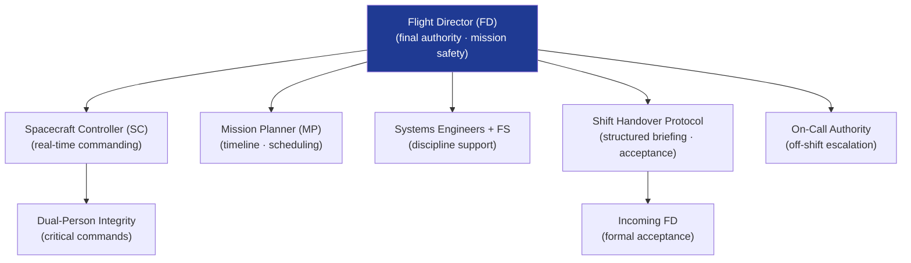

# STA 140-149 · Section 04 · Subsection 143 · Subsubject 007 — Mission Operations Roles, Authority and Handover

## 1. Purpose

Defines the **mission operations roles, authority hierarchy, delegation protocols, and shift handover procedures** for Q+ATLANTIDE STA-band mission control teams.

## 2. Scope

- **Operations team roles and responsibilities** — Flight Director (FD): senior operations authority; responsible for all mission-critical decisions, Flight Rule interpretation, contingency activation, and mission safety; Spacecraft Controller (SC): real-time spacecraft state monitoring and commanding within approved Flight Rule limits; Mission Planner (MP): activity scheduling, timeline management, resource planning; Systems Engineers (SE per discipline): subject-matter expert support on console or on call; Flight Surgeon (FS) for crewed missions: crew health and safety authority; Payload Operations Engineer: payload activity coordination.
- **Authority hierarchy and delegation** — command authority: FD has final authority for all critical commands; SC may issue normal commands within Flight Rule boundaries without FD approval; delegation protocol: FD may formally delegate specific command authorities to SC for defined time periods and activity classes; dual-person integrity: critical command classes require co-authorisation by FD and SC; authority revocation: FD may revoke SC command authority instantly in anomaly conditions.
- **Shift handover protocol** — structured handover document: spacecraft status summary, active anomalies list with dispositions, pending actions, upcoming activities within next shift, outstanding flags, and Flight Director notes; handover briefing: minimum 15-minute face-to-face (or equivalent) briefing between outgoing and incoming teams; handover acceptance: formal acceptance signature by incoming FD before outgoing FD is released; handover operations freeze: no non-emergency commanding during handover period unless explicitly approved by incoming FD.
- **On-call authority and escalation** — off-shift on-call hierarchy: primary on-call FD, secondary on-call FD, Mission Manager; on-call notification threshold: any Level 2 or above anomaly; on-call response time: primary on-call FD reachable within 5 minutes; on-call command authority: on-call FD has full command authority when activated.
- **Operations certification and readiness** — operator certification: all console operators certified per role-specific competence matrix; recertification: periodic refresher training and simulation exercises; currency requirements: minimum console hours per role per month; certification records: maintained in mission operations quality management system.

## 3. Diagram — Mission Operations Authority and Handover Flow

## 4. Footprint

| Metric | Value |
|---|---|
| Architecture | `STA` — Space Technology Architecture |
| Master range | `100–199` |
| Code range | `140-149` |
| Section | `04` — Aviónica y Control de Misión Espacial |
| Subsection | `143` — Control de Misión |
| Subsubject | `007` — Mission Operations Roles, Authority and Handover |
| Primary Q-Division | Q-SPACE[^qdiv] |
| ORB support | ORB-PMO, ORB-LEG |
| Governance class | `baseline`[^gov] |
| Document | `007_Mission-Operations-Roles-Authority-and-Handover.md` (this file) |
| Parent subsection | [`README.md`](./README.md) · [`000_Overview.md`](./000_Overview.md) |

## 5. References & Citations

[^ecssest70c]: **ECSS-E-ST-70C — Ground Systems and Operations** — Operations team roles, responsibilities, and authority requirements.

[^ecssm70c]: **ECSS-M-ST-70C — Mission Operations** — Mission operations management and team governance.

[^nasastd87198]: **NASA-STD-8719.8 — Mission Operations Safety** — Operations authority, handover, and safety governance.

[^qdiv]: **Q-Division authority** — See [`organization/Q+ATLANTIDE.md` §4](../../../../organization/Q+ATLANTIDE.md#4-notes).

[^gov]: **Governance class** — `baseline`.

### Applicable industry standards

- ECSS-E-ST-70C — Ground Systems and Operations[^ecssest70c]
- ECSS-M-ST-70C — Mission Operations[^ecssm70c]
- NASA-STD-8719.8 — Mission Operations Safety[^nasastd87198]
