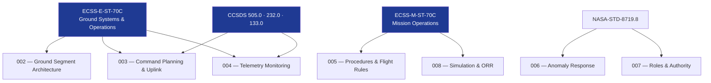

# STA 140-149 · Section 04 · Subsection 143 · Subsubject 009 — ECSS-NASA-CCSDS Mission Control Standards Mapping

## 1. Purpose

Maps the applicable **ECSS, NASA, and CCSDS standards** to the mission control functional areas within STA `143`, establishing the normative standards hierarchy for Q+ATLANTIDE STA-band mission operations.

## 2. Scope

- **ECSS standards applicable to mission control** — ECSS-E-ST-70C (Ground Systems and Operations): top-level standard for ground segment architecture, MCC systems, command/telemetry processing, and operations procedures; ECSS-M-ST-70C (Mission Operations): mission operations management, team organisation, simulation, and ORR governance; ECSS-E-ST-10-03C (Testing): testing standards applicable to ground segment acceptance and simulation validation.
- **NASA standards applicable to mission control** — NASA-STD-8719.8 (Mission Operations Safety): safety requirements for mission control operations, command authority, and anomaly response; NASA-NPR-7120.5 (Space Systems Development): mission operations requirements within the system development lifecycle; NASA-HDBK-7120.6 (Lessons Learned): mission operations lessons-learned capture and heritage database.
- **CCSDS standards applicable to mission control** — CCSDS 505.0-B-1 (Mission Operations Reference Architecture): reference architecture for mission operations systems; CCSDS 232.0-B-4 (TC Space Data Link Protocol): telecommand uplink protocol standard; CCSDS 133.0-B-2 (Space Packet Protocol): packet-level telemetry and command processing; CCSDS 131.0-B-4 (TM Synchronisation and Channel Coding): telemetry frame processing; CCSDS 651.0-M-1 (Mission Operations MAL): MAL messaging standard for ground system interoperability.
- **Standards applicability matrix** — mapping of each standards requirement to applicable STA `143` subsubject; identification of deviations and waivers; standards version control and update monitoring.
- **Interoperability standards** — IOAG standards: Inter-Agency Operations Advisory Group guidelines for cross-agency mission support; ESA/NASA interoperability: CCSDS cross-support agreements; ground segment interface standards: standardised ground station service interfaces.

## 3. Diagram — Mission Control Standards Hierarchy

## 4. Footprint

| Metric | Value |
|---|---|
| Architecture | `STA` — Space Technology Architecture |
| Master range | `100–199` |
| Code range | `140-149` |
| Section | `04` — Aviónica y Control de Misión Espacial |
| Subsection | `143` — Control de Misión |
| Subsubject | `009` — ECSS-NASA-CCSDS Mission Control Standards Mapping |
| Primary Q-Division | Q-SPACE[^qdiv] |
| ORB support | ORB-PMO, ORB-LEG |
| Governance class | `baseline`[^gov] |
| Document | `009_ECSS-NASA-CCSDS-Mission-Control-Standards-Mapping.md` (this file) |
| Parent subsection | [`README.md`](./README.md) · [`000_Overview.md`](./000_Overview.md) |

## 5. References & Citations

[^ecssest70c]: **ECSS-E-ST-70C — Ground Systems and Operations** — Primary mission control standards.

[^ecssm70c]: **ECSS-M-ST-70C — Mission Operations** — Mission operations management standards.

[^ccsds505]: **CCSDS 505.0-B-1 — Mission Operations Reference Architecture** — CCSDS mission operations reference.

[^ccsds232]: **CCSDS 232.0-B-4 — TC Space Data Link Protocol** — Telecommand protocol.

[^nasastd87198]: **NASA-STD-8719.8 — Mission Operations Safety** — NASA mission operations safety.

[^qdiv]: **Q-Division authority** — See [`organization/Q+ATLANTIDE.md` §4](../../../../organization/Q+ATLANTIDE.md#4-notes).

[^gov]: **Governance class** — `baseline`.

### Applicable industry standards

- ECSS-E-ST-70C — Ground Systems and Operations[^ecssest70c]
- ECSS-M-ST-70C — Mission Operations[^ecssm70c]
- CCSDS 505.0-B-1 — Mission Operations Reference Architecture[^ccsds505]
- CCSDS 232.0-B-4 — TC Space Data Link Protocol[^ccsds232]
- NASA-STD-8719.8 — Mission Operations Safety[^nasastd87198]
