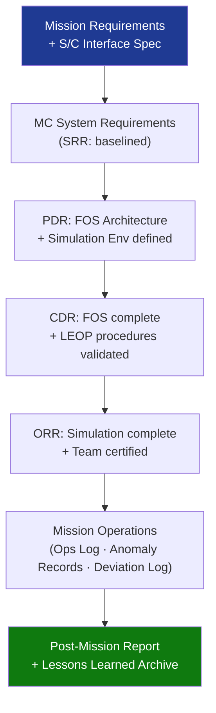

# STA 140-149 · Section 04 · Subsection 143 · Subsubject 010 — Traceability, Evidence and Lifecycle Governance

## 1. Purpose

Establishes **mission control requirements traceability, evidence gates, operations readiness gates, and lifecycle configuration control** for Q+ATLANTIDE STA-band mission control systems and operations.

## 2. Scope

- **Mission control requirements traceability** — all mission control system requirements traced from mission requirements and spacecraft interface specifications; traceability matrix: requirement → ground segment system → operations procedure → simulation test case → ORR evidence artefact; bidirectional traceability maintained through all mission phases; deviations and waivers formally registered and approved.
- **Evidence gates** — System Requirements Review (SRR): mission control requirements baselined (MCC requirements document approved), ground segment architecture defined; Preliminary Design Review (PDR): MCC system design frozen, Flight Operations System (FOS) architecture approved, simulation environment architecture defined; Critical Design Review (CDR): FOS implementation complete, simulation environment operational, LEOP procedure library complete and validated; Operations Readiness Review (ORR): all simulation campaign milestones complete, all procedures validated, all console operators certified, all open anomalies dispositioned.
- **Configuration control of operations products** — controlled configuration items: command database (CDB), flight rules database (FR), operations procedure library (OPL), mission timeline templates, simulation scenario library; change control board (CCB): formal approval required for any change to controlled configuration items; version management: all operations products version-controlled with unique revision identifier; distribution control: controlled distribution of approved operations products to console operators.
- **In-mission traceability** — operations log: timestamped record of all commanding actions, anomalies, and decisions during operations; anomaly record system: complete lifecycle record for all anomalies from detection to closure; deviation log: record of all deviations from approved Flight Rules and procedure steps; post-mission report: compilation of mission performance, anomaly analysis, and lessons learned.
- **End-of-mission governance** — mission closeout review: final review of mission performance, anomaly disposition, and outstanding items; lessons-learned database: structured capture for future mission heritage; operations product archival: long-term archival of all mission operations data, procedures, and configuration items; operations team certification retention: record of all operator certifications for mission lifecycle.

## 3. Diagram — Mission Control Traceability and Lifecycle Governance

## 4. Footprint

| Metric | Value |
|---|---|
| Architecture | `STA` — Space Technology Architecture |
| Master range | `100–199` |
| Code range | `140-149` |
| Section | `04` — Aviónica y Control de Misión Espacial |
| Subsection | `143` — Control de Misión |
| Subsubject | `010` — Traceability, Evidence and Lifecycle Governance |
| Primary Q-Division | Q-SPACE[^qdiv] |
| ORB support | ORB-PMO, ORB-LEG |
| Governance class | `baseline`[^gov] |
| Document | `010_Traceability-Evidence-and-Lifecycle-Governance.md` (this file) |
| Parent subsection | [`README.md`](./README.md) · [`000_Overview.md`](./000_Overview.md) |

## 5. References & Citations

[^ecssest70c]: **ECSS-E-ST-70C — Ground Systems and Operations** — Mission control lifecycle and traceability requirements.

[^ecssm70c]: **ECSS-M-ST-70C — Mission Operations** — Mission operations configuration control and lifecycle governance.

[^ecssest1002c]: **ECSS-E-ST-10-02C — Verification** — General verification methodology including evidence gates and lifecycle records.

[^qdiv]: **Q-Division authority** — See [`organization/Q+ATLANTIDE.md` §4](../../../../organization/Q+ATLANTIDE.md#4-notes).

[^gov]: **Governance class** — `baseline`.

### Applicable industry standards

- ECSS-E-ST-70C — Ground Systems and Operations[^ecssest70c]
- ECSS-M-ST-70C — Mission Operations[^ecssm70c]
- ECSS-E-ST-10-02C — Verification[^ecssest1002c]
