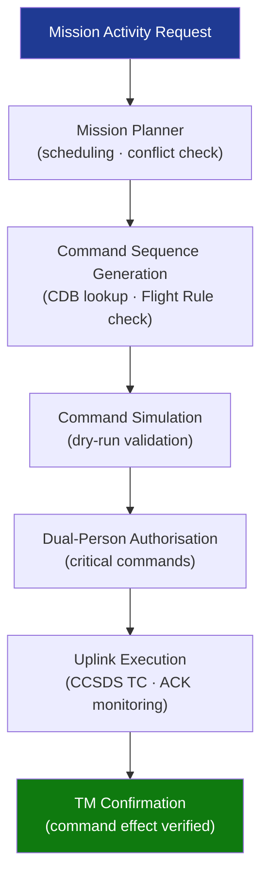

# STA 140-149 · 143-030 — Command Planning Validation and Uplink Control

## 1. Purpose

Defines the **command planning workflow, command validation chain, and uplink control procedures** for Q+ATLANTIDE STA-band mission operations, per ECSS-E-ST-70C[^ecssest70c] and CCSDS 232.0-B-4[^ccsds232].

## 2. Scope

- **Command planning workflow** — mission activity request and approval lifecycle: from payload request through Mission Planner scheduling to command sequence generation; mission timeline integration: activity scheduling within resource constraints (power, thermal, communication window); conflict detection: automated checking against Flight Rules database before command sequence approval.
- **Command Database (CDB) management** — command database as controlled configuration item: all telecommand definitions, parameter ranges, criticality levels; command criticality classification: critical commands (require dual authorisation), normal commands (single authorisation), inhibit commands (protected); CDB change control: formal change record and approval process for CDB updates.
- **Command validation chain** — syntax validation: command format and parameter range checking; semantic validation: context-dependent constraint checking (e.g., mode prerequisites); Flight Rule validation: automated cross-check against Flight Rules database; command sequence simulation: dry-run execution in simulation environment before live uplink; authorisation: dual-person integrity for critical commands.
- **Uplink control procedures** — command load preparation: TC packet generation (CCSDS TC frame formatting); uplink scheduling: selection of ground station contact window; uplink execution: command transmission, receipt acknowledgement (ACK/NAK) monitoring; command execution verification: telemetry confirmation of command effect.
- **Command abort and inhibit** — real-time command abort: immediate inhibit of pending command sequence; inhibit state management: hardware inhibit states tracked in command stack; critical command exclusion zones: time windows during which certain command classes are prohibited.

## 3. Diagram — Command Planning and Uplink Workflow

## 4. Footprint

| Metric | Value |
|---|---|
| Architecture | `STA` — Space Technology Architecture |
| Master range | `100–199` |
| Code range | `140-149` |
| Section | `04` — Aviónica y Control de Misión Espacial |
| Subsection | `143` — Control de Misión |
| Subsubject | `003` — Command Planning, Validation and Uplink Control |
| Primary Q-Division | Q-SPACE[^qdiv] |
| ORB support | ORB-PMO, ORB-LEG |
| Governance class | `baseline`[^gov] |
| Document | `143-030-Command-Planning-Validation-and-Uplink-Control.md` (this file) |
| Parent subsection | [`README.md`](./README.md) · [`143-000-General.md`](./143-000-General.md) |

## 5. References & Citations

[^ecssest70c]: **ECSS-E-ST-70C — Ground Systems and Operations** — Command planning and uplink control requirements.

[^ccsds232]: **CCSDS 232.0-B-4 — TC Space Data Link Protocol** — CCSDS telecommand link-layer protocol standard.

[^ccsds201]: **CCSDS 201.0-B-4 — Telecommand Summary of Concept and Service** — CCSDS telecommand services and command validation requirements.

[^qdiv]: **Q-Division authority** — See [`organization/Q+ATLANTIDE.md` §4](../../../../organization/Q+ATLANTIDE.md#4-notes).

[^gov]: **Governance class** — `baseline`.

### Applicable industry standards

- ECSS-E-ST-70C — Ground Systems and Operations[^ecssest70c]
- CCSDS 232.0-B-4 — TC Space Data Link Protocol[^ccsds232]
- CCSDS 201.0-B-4 — Telecommand Summary of Concept and Service[^ccsds201]
