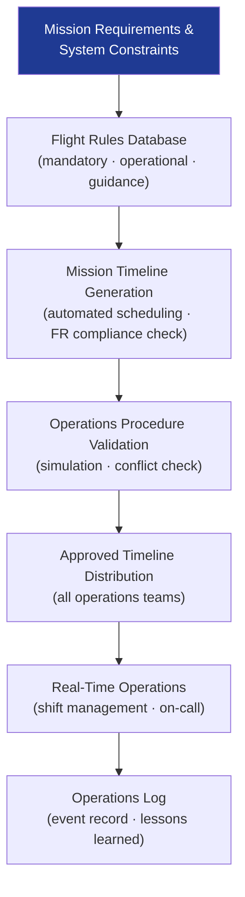

# STA 140-149 · 143-050 — Operations Procedures Timelines and Flight Rules

## 1. Purpose

Defines the **operations procedure library, mission timeline framework, and Flight Rules governance** for Q+ATLANTIDE STA-band mission operations.

## 2. Scope

- **Operations procedure library** — procedure types: nominal procedures (routine operations), contingency procedures (anomaly response), emergency procedures (safety-critical responses); procedure structure: standardised format with steps, prerequisites, expected results, and go/no-go criteria; procedure validation: simulation-validated before flight; procedure version control: configuration-managed as controlled documents.
- **Mission timeline development and validation** — mission timeline types: short-range timeline (24–48 h), medium-range timeline (weekly), long-range planning timeline; timeline generation: automated activity scheduling respecting resource constraints and operational restrictions; timeline validation: conflict checking, Flight Rule compliance verification, margin analysis; timeline distribution: approved timeline distributed to all operations teams.
- **Flight Rules (FR) database** — flight rule structure: rule identifier, applicable modes, constraints, rationale, violation consequence; flight rule categories: mandatory rules (safety-critical), operational rules (efficiency), guidance rules (best-practice); flight rule update process: formal engineering change request, validation, approval, and version-controlled database update; operational rule application: automated and manual checking at command planning and real-time operations.
- **On-call and shift management** — shift schedule: 24/7 operations coverage for mission-critical phases; shift handover protocol: structured handover briefing covering spacecraft status, active anomalies, upcoming activities, and outstanding actions; on-call coverage: defined on-call authority hierarchy for off-shift anomaly response; operations log: chronological log of all significant events, commanding actions, and decisions.
- **Mission phase operations** — launch and early orbit phase (LEOP): operations mode for first contact through initial acquisition; commissioning: subsystem activation and verification operations; nominal operations: routine mission operations per approved timeline; decommissioning and end-of-life: passivation sequence, de-orbit operations, final contact.

## 3. Diagram — Operations Procedure and Timeline Governance

## 4. Footprint

| Metric | Value |
|---|---|
| Architecture | `STA` — Space Technology Architecture |
| Master range | `100–199` |
| Code range | `140-149` |
| Section | `04` — Aviónica y Control de Misión Espacial |
| Subsection | `143` — Control de Misión |
| Subsubject | `005` — Operations Procedures, Timelines and Flight Rules |
| Primary Q-Division | Q-SPACE[^qdiv] |
| ORB support | ORB-PMO, ORB-LEG |
| Governance class | `baseline`[^gov] |
| Document | `143-050-Operations-Procedures-Timelines-and-Flight-Rules.md` (this file) |
| Parent subsection | [`README.md`](./README.md) · [`143-000-General.md`](./143-000-General.md) |

## 5. References & Citations

[^ecssest70c]: **ECSS-E-ST-70C — Ground Systems and Operations** — Operations procedures and flight rules requirements.

[^ecssm70c]: **ECSS-M-ST-70C — Mission Operations** — Mission operations management and timeline governance.

[^qdiv]: **Q-Division authority** — See [`organization/Q+ATLANTIDE.md` §4](../../../../organization/Q+ATLANTIDE.md#4-notes).

[^gov]: **Governance class** — `baseline`.

### Applicable industry standards

- ECSS-E-ST-70C — Ground Systems and Operations[^ecssest70c]
- ECSS-M-ST-70C — Mission Operations[^ecssm70c]
