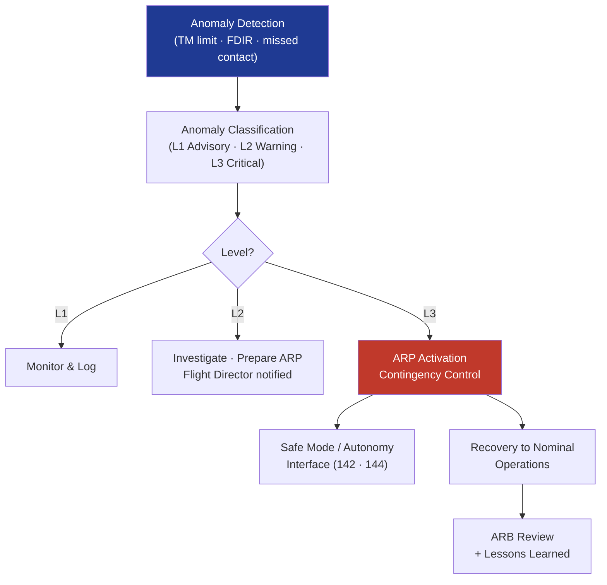

# STA 140-149 · 143-060 — Anomaly Response Escalation and Contingency Control

## 1. Purpose

Defines the **anomaly detection, response workflow, escalation procedures, and contingency control framework** for Q+ATLANTIDE STA-band mission operations.

## 2. Scope

- **Anomaly detection and classification** — anomaly detection sources: telemetry limit violations, FDIR onboard activations, missed contact (loss of signal), command non-execution, operator-observed anomalies; anomaly classification: Level 1 (advisory — monitor, no immediate action), Level 2 (warning — investigate, prepare contingency), Level 3 (critical — immediate action required, contingency activation); anomaly logging: mandatory anomaly record creation with timestamp, classification, detected parameters, and initial disposition.
- **Anomaly response workflow** — initial assessment: rapid triage by Spacecraft Controller to classify anomaly level and identify applicable contingency procedure; anomaly isolation: targeted data collection to narrow root cause; contingency procedure selection: identification of applicable Anomaly Response Procedure (ARP) from operations library; Flight Director decision: go/no-go for contingency activation; anomaly resolution record: closure of anomaly record with root cause, corrective actions, and lessons-learned.
- **Escalation procedures** — Level 1 → Level 2: automatic escalation on limit violation persistence beyond configurable timeout; Level 2 → Level 3: Flight Director authority for escalation on mission risk assessment; on-call escalation: off-shift escalation protocol to on-call Flight Director; mission manager notification: mandatory notification for Level 3 anomalies and mission operations deviations.
- **Contingency control** — contingency mode activation: structured transition from nominal to contingency operations per approved contingency procedure; safe mode interface (→ `142`): coordination with FSW for onboard safe-mode commands; autonomy contingency response interface (→ `144`): coordination with onboard autonomous contingency functions; contingency recovery: structured transition back to nominal operations with verification.
- **Anomaly review lifecycle** — immediate anomaly investigation report: within 24 hours for Level 3 anomalies; formal Anomaly Review Board (ARB): root cause analysis, corrective action tracking, operations procedure update; Mission Operations Review (MOR): periodic review of anomaly trends, operations efficiency, and procedure improvements; lessons-learned database: structured capture for future mission heritage.

## 3. Diagram — Anomaly Response and Escalation Workflow

## 4. Footprint

| Metric | Value |
|---|---|
| Architecture | `STA` — Space Technology Architecture |
| Master range | `100–199` |
| Code range | `140-149` |
| Section | `04` — Aviónica y Control de Misión Espacial |
| Subsection | `143` — Control de Misión |
| Subsubject | `006` — Anomaly Response, Escalation and Contingency Control |
| Primary Q-Division | Q-SPACE[^qdiv] |
| ORB support | ORB-PMO, ORB-LEG |
| Governance class | `baseline`[^gov] |
| Document | `143-060-Anomaly-Response-Escalation-and-Contingency-Control.md` (this file) |
| Parent subsection | [`README.md`](./README.md) · [`143-000-General.md`](./143-000-General.md) |

## 5. References & Citations

[^ecssest70c]: **ECSS-E-ST-70C — Ground Systems and Operations** — Anomaly response and contingency operations requirements.

[^ecssm70c]: **ECSS-M-ST-70C — Mission Operations** — Mission anomaly management and escalation procedures.

[^nasanhb87194]: **NASA-HDBK-8719.4 — Contingency Planning** — NASA contingency planning and anomaly response guidelines.

[^qdiv]: **Q-Division authority** — See [`organization/Q+ATLANTIDE.md` §4](../../../../organization/Q+ATLANTIDE.md#4-notes).

[^gov]: **Governance class** — `baseline`.

### Applicable industry standards

- ECSS-E-ST-70C — Ground Systems and Operations[^ecssest70c]
- ECSS-M-ST-70C — Mission Operations[^ecssm70c]
- NASA-HDBK-8719.4 — Contingency Planning[^nasanhb87194]
