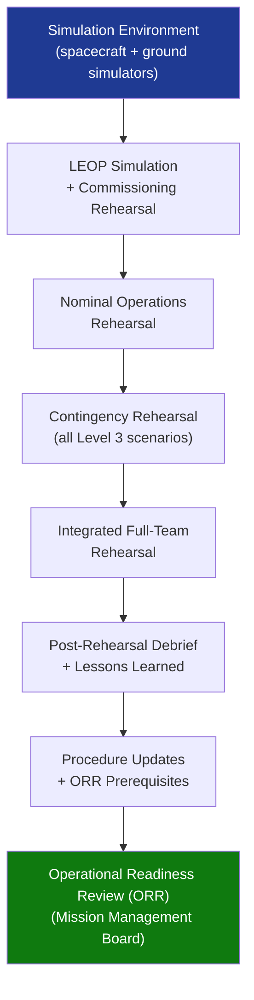

# STA 140-149 · 143-080 — Simulation Rehearsal and Operational Readiness Testing

## 1. Purpose

Defines the **mission simulation environment, rehearsal campaign, and Operational Readiness Review (ORR) framework** for Q+ATLANTIDE STA-band mission operations, per ECSS-E-ST-70C[^ecssest70c].

## 2. Scope

- **Mission simulation environment** — spacecraft dynamic simulator: high-fidelity model of spacecraft dynamics, onboard software, FDIR, and telemetry generation; ground segment simulator: simulated telemetry reception, command uplink, and FOS integration; end-to-end simulation: combined spacecraft and ground segment simulation for full LEOP and nominal operations rehearsal; simulator fidelity requirements: simulator shall reproduce all mission-critical modes, FDIR activations, and anomaly scenarios used in rehearsal campaigns.
- **Simulation campaigns** — LEOP simulation: comprehensive end-to-end simulation of launch and early orbit phase (first contact through initial acquisition); commissioning rehearsal: simulation of all commissioning activities for each spacecraft subsystem; nominal operations rehearsal: representative sample of nominal operations timelines; contingency rehearsal: simulation of all Level 3 anomaly scenarios per contingency procedure library; integrated rehearsal: combined full-team rehearsal including all MCC functions and ground station interactions.
- **Rehearsal objectives and metrics** — nominal performance: successful execution of all planned activities without ground intervention; anomaly response: correct identification, escalation, and resolution of injected anomalies within specified response time; procedure validation: all operations procedures validated and anomalies in procedures corrected; team readiness: all console operators demonstrated competence in their assigned roles.
- **Operational Readiness Review (ORR)** — ORR prerequisites: completion of all simulation campaign milestones; procedure library approved and distributed; all console operator certifications current; MCC systems fully functional and tested; ORR agenda: review of simulation campaign results, anomaly closure, procedure status, team certification status, outstanding risks; ORR criteria: no open critical action items; all simulation campaign objectives met; Mission Management Board approval required for launch clearance.
- **Lessons-learned integration** — post-simulation debrief: structured team debrief after each simulation; lessons-learned capture: formal recording of lessons identified; procedure update cycle: mandatory update of affected procedures before next rehearsal; operational heritage: simulation lessons fed into future mission heritage database.

## 3. Diagram — Simulation, Rehearsal and ORR Campaign Flow

## 4. Footprint

| Metric | Value |
|---|---|
| Architecture | `STA` — Space Technology Architecture |
| Master range | `100–199` |
| Code range | `140-149` |
| Section | `04` — Aviónica y Control de Misión Espacial |
| Subsection | `143` — Control de Misión |
| Subsubject | `008` — Simulation, Rehearsal and Operational Readiness Testing |
| Primary Q-Division | Q-SPACE[^qdiv] |
| ORB support | ORB-PMO, ORB-LEG |
| Governance class | `baseline`[^gov] |
| Document | `143-080-Simulation-Rehearsal-and-Operational-Readiness-Testing.md` (this file) |
| Parent subsection | [`README.md`](./README.md) · [`143-000-General.md`](./143-000-General.md) |

## 5. References & Citations

[^ecssest70c]: **ECSS-E-ST-70C — Ground Systems and Operations** — Simulation and operational readiness requirements.

[^ecssm70c]: **ECSS-M-ST-70C — Mission Operations** — Simulation campaign and ORR governance.

[^ecssest40c]: **ECSS-E-ST-40C — Software Engineering** — Software simulation and HIL testing requirements applicable to FSW simulator integration.

[^qdiv]: **Q-Division authority** — See [`organization/Q+ATLANTIDE.md` §4](../../../../organization/Q+ATLANTIDE.md#4-notes).

[^gov]: **Governance class** — `baseline`.

### Applicable industry standards

- ECSS-E-ST-70C — Ground Systems and Operations[^ecssest70c]
- ECSS-M-ST-70C — Mission Operations[^ecssm70c]
- ECSS-E-ST-40C — Software Engineering (simulator integration)[^ecssest40c]
