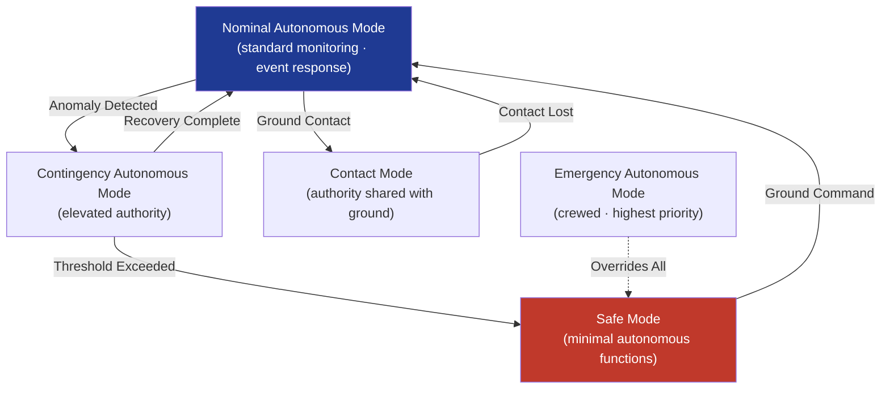

# STA 140-149 · Section 04 · Subsection 144 · Subsubject 002 — Autonomous Modes and Authority Boundaries

## 1. Purpose

Defines the **taxonomy of onboard autonomous modes, authority levels, permission matrices, and mode-transition logic** for Q+ATLANTIDE STA-band spacecraft.

## 2. Scope

- **Autonomous mode taxonomy** — nominal autonomous mode: standard onboard autonomous monitoring and event-response functions active; contact mode: ground contact established, autonomous authority partially delegated to ground; contingency autonomous mode: elevated autonomous authority activated following anomaly detection, reduced ground-oversight period; safe mode: minimal autonomous functions active, spacecraft in protected state; emergency autonomous mode (crewed missions only): highest priority autonomous safety functions active.
- **Authority levels and permission matrix** — authority levels define which classes of spacecraft actions each autonomous function may initiate without ground confirmation; authority matrix: maps each autonomous function to the command classes it may issue per mode; inhibit states: hardware-enforced inhibit of specified command classes regardless of autonomous authority level; authority escalation: onboard condition-based escalation to higher authority level following specific event triggers with defined evidence.
- **Autonomous-to-ground transition logic** — ground command override: any ground command takes precedence over active autonomous function; mode transition commands: ground-commanded mode changes interrupt current autonomous activity; re-entry to nominal autonomous mode: requires explicit ground command or onboard criterion satisfaction after contingency or safe-mode periods; transition hysteresis: prevention of rapid mode toggling by time-qualified transition criteria.
- **Authority boundary enforcement** — onboard supervision logic: continuous verification that autonomous functions operate within permitted authority boundaries; boundary violation response: automatic autonomous function inhibit on authority boundary violation detection; inhibit notification: telemetry event generated on any inhibit action; authority audit trail: onboard log of all autonomous actions and authority levels at time of action.
- **Mode compatibility constraints** — autonomous mode inter-dependencies: defined compatibility matrix for simultaneous active autonomous functions; mode exclusion: functions that cannot operate simultaneously (e.g., payload autonomous scheduling during safe mode); resource allocation: CPU and memory budgets per mode configuration.

## 3. Diagram — Autonomous Mode Transitions and Authority Hierarchy

## 4. Footprint

| Metric | Value |
|---|---|
| Architecture | `STA` — Space Technology Architecture |
| Master range | `100–199` |
| Code range | `140-149` |
| Section | `04` — Aviónica y Control de Misión Espacial |
| Subsection | `144` — Autonomía |
| Subsubject | `002` — Autonomous Modes and Authority Boundaries |
| Primary Q-Division | Q-SPACE[^qdiv] |
| ORB support | ORB-PMO, ORB-LEG |
| Governance class | `baseline`[^gov] |
| Document | `002_Autonomous-Modes-and-Authority-Boundaries.md` (this file) |
| Parent subsection | [`README.md`](./README.md) · [`000_Overview.md`](./000_Overview.md) |

## 5. References & Citations

[^ecssest40c]: **ECSS-E-ST-40C — Software Engineering** — FSW mode management and authority control requirements.

[^ecssest70c]: **ECSS-E-ST-70C — Ground Systems and Operations** — Ground override interface and authority delegation requirements.

[^qdiv]: **Q-Division authority** — See [`organization/Q+ATLANTIDE.md` §4](../../../../organization/Q+ATLANTIDE.md#4-notes).

[^gov]: **Governance class** — `baseline`.

### Applicable industry standards

- ECSS-E-ST-40C — Software Engineering[^ecssest40c]
- ECSS-E-ST-70C — Ground Systems and Operations[^ecssest70c]
