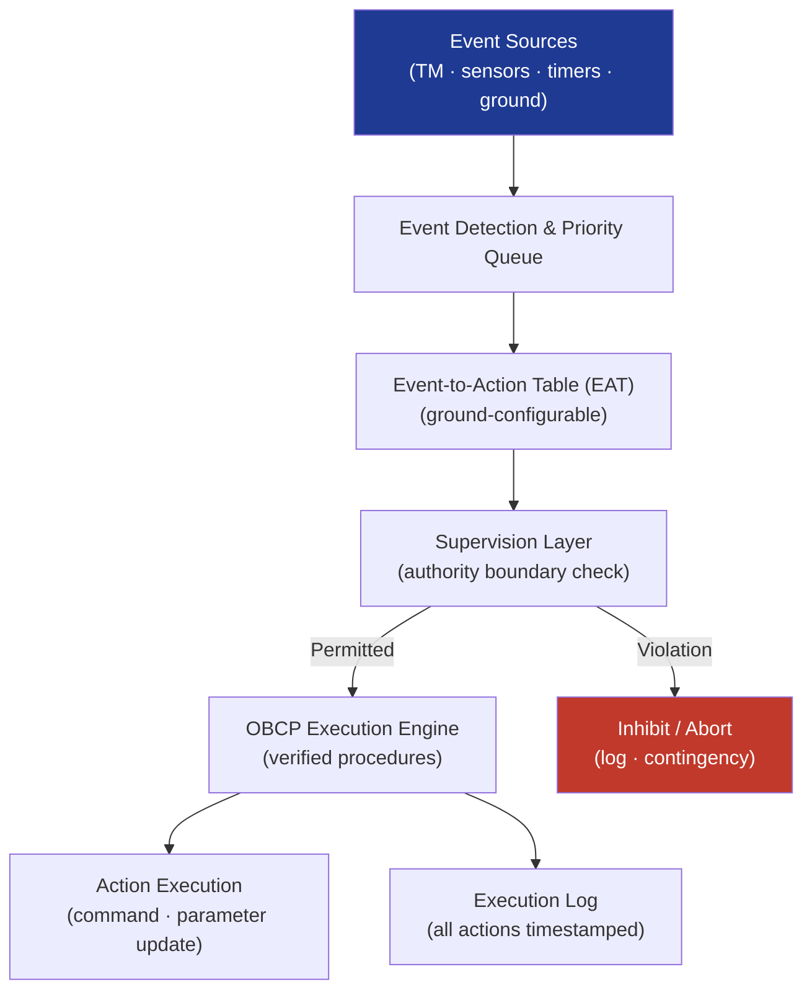

# STA 140-149 · Section 04 · Subsection 144 · Subsubject 003 — Onboard Decision Logic and Supervision

## 1. Purpose

Defines the **onboard event-based decision logic architecture, supervision framework, state machine design principles, and execution management** for Q+ATLANTIDE STA-band autonomous spacecraft functions.

## 2. Scope

- **Event-based decision logic architecture** — event detection: telemetry parameter monitoring, onboard sensor event flags, timer-based events, ground-uplinked event triggers; event-to-action tables (EAT): ground-configurable tables mapping detected events to autonomous response actions; event priority: prioritised event queue management with pre-emption capability for safety-critical events; event logging: all detected events and triggered actions logged with timestamp.
- **Onboard state machine design** — spacecraft state machine: formal finite-state-machine (FSM) specification of all spacecraft modes and transitions; state machine properties: deterministic (unique response to any event in any state), deadlock-free, livelock-free; state machine specification format: formal specification (e.g., SDL, SCADE, or proprietary toolchain with formal verification capability); state machine verification: formal verification proof of FSM properties prior to flight software integration.
- **Supervision architecture** — supervision layer: independent software layer monitoring executing autonomous functions against permitted authority boundaries; supervision response actions: warning (log event, continue), inhibit (block pending action, log), abort (terminate executing function, enter contingency mode); supervision independence: supervision logic shall not share code paths or data memory with supervised autonomous functions.
- **Execution management** — Onboard Control Procedure (OBCP) execution engine: controlled environment for execution of pre-validated autonomous procedures; OBCP lifecycle: ground-uplinked, validated (syntax and semantic), stored in OBCP library, activated by event or ground command, logged on completion; parallel OBCP execution: limited by resource budget and conflict-free execution constraint; OBCP conflict detection: onboard check for resource and constraint conflicts before OBCP activation.
- **Decision logic update and validation** — ground uplink of event-action table updates: configuration change requiring formal uplink validation and approval; OBCP update: new or revised OBCP requires ground-side simulation validation before uplink; configuration baseline management: all decision logic configuration items version-controlled.

## 3. Diagram — Onboard Decision Logic and Supervision Architecture

## 4. Footprint

| Metric | Value |
|---|---|
| Architecture | `STA` — Space Technology Architecture |
| Master range | `100–199` |
| Code range | `140-149` |
| Section | `04` — Aviónica y Control de Misión Espacial |
| Subsection | `144` — Autonomía |
| Subsubject | `003` — Onboard Decision Logic and Supervision |
| Primary Q-Division | Q-SPACE[^qdiv] |
| ORB support | ORB-PMO, ORB-LEG |
| Governance class | `baseline`[^gov] |
| Document | `003_Onboard-Decision-Logic-and-Supervision.md` (this file) |
| Parent subsection | [`README.md`](./README.md) · [`000_Overview.md`](./000_Overview.md) |

## 5. References & Citations

[^ecssest40c]: **ECSS-E-ST-40C — Software Engineering** — Onboard software architecture and state machine design requirements.

[^ecssest20c]: **ECSS-E-ST-20C — Electrical and Electronic** — Event detection and monitoring requirements for onboard systems.

[^qdiv]: **Q-Division authority** — See [`organization/Q+ATLANTIDE.md` §4](../../../../organization/Q+ATLANTIDE.md#4-notes).

[^gov]: **Governance class** — `baseline`.

### Applicable industry standards

- ECSS-E-ST-40C — Software Engineering[^ecssest40c]
- ECSS-E-ST-20C — Electrical and Electronic[^ecssest20c]
