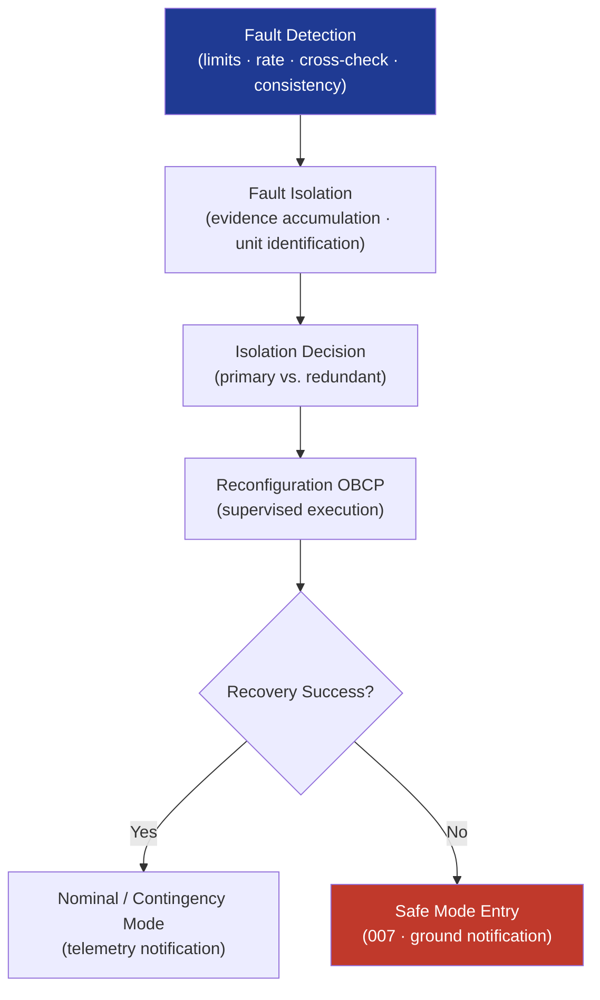

# STA 140-149 · Section 04 · Subsection 144 · Subsubject 004 — FDIR Autonomy and Contingency Response

## 1. Purpose

Defines the **autonomous FDIR architecture, onboard fault detection algorithms, isolation strategy, autonomous recovery sequences, and contingency response logic** for Q+ATLANTIDE STA-band spacecraft, in coordination with flight software FDIR (→ `142`).

## 2. Scope

- **FDIR architecture within autonomy** — FDIR autonomy scope: fault detection (monitoring, threshold checking, deviation detection), fault isolation (suspect component identification, reconfiguration logic), fault recovery (autonomous safe-state transition, redundancy switchover, recovery OBCP execution); FDIR scope boundary with FSW `142`: software-level FDIR (watchdog, exception handling, memory scrubbing) is implemented in FSW `142`; hardware-level FDIR (redundancy management, cross-strapping) is governed by avionics `141`; autonomy `144` provides the supervisory FDIR logic that coordinates across both.
- **Fault detection algorithms** — parametric limit monitoring: yellow/red limits per parameter per spacecraft mode; rate-of-change detection: monitoring of parameter derivative for incipient failure detection; cross-correlation monitoring: consistency checks between redundant sensors and actuators; state consistency checks: verification of spacecraft state consistency (e.g., attitude estimate vs. reaction wheel speeds); fault isolation evidence accumulation: time-qualified fault flags to prevent false positive isolation.
- **Isolation strategy and reconfiguration** — isolation decision: selection of primary vs. redundant unit based on fault evidence; reconfiguration OBCP: pre-validated OBCP for each major reconfiguration action; isolation lock-out: inhibit of isolated unit following confirmed isolation; isolation record: telemetry event generated with fault evidence summary.
- **Autonomous recovery sequences** — recovery OBCP library: pre-validated recovery procedure for each FDIR scenario; recovery sequence execution: supervised OBCP execution following isolation decision; recovery success criteria: defined telemetry conditions confirming successful recovery; recovery failure path: escalation to safe mode if recovery OBCP fails to meet success criteria within defined timeout.
- **Contingency response logic** — contingency trigger conditions: defined set of conditions that activate contingency autonomous mode; contingency OBCP activation: selection of appropriate contingency procedure from OBCP library; ground notification: automatic generation of contingency event telemetry packet; ground handover: structured transition of contingency authority back to ground on re-acquisition of contact.

## 3. Diagram — FDIR Autonomy Architecture

## 4. Footprint

| Metric | Value |
|---|---|
| Architecture | `STA` — Space Technology Architecture |
| Master range | `100–199` |
| Code range | `140-149` |
| Section | `04` — Aviónica y Control de Misión Espacial |
| Subsection | `144` — Autonomía |
| Subsubject | `004` — FDIR Autonomy and Contingency Response |
| Primary Q-Division | Q-SPACE[^qdiv] |
| ORB support | ORB-PMO, ORB-LEG |
| Governance class | `baseline`[^gov] |
| Document | `004_FDIR-Autonomy-and-Contingency-Response.md` (this file) |
| Parent subsection | [`README.md`](./README.md) · [`000_Overview.md`](./000_Overview.md) |

## 5. References & Citations

[^ecssest40c]: **ECSS-E-ST-40C — Software Engineering** — FDIR software architecture and implementation requirements.

[^ecssest7041c]: **ECSS-E-ST-70-41C — Space FDIR** — Spacecraft FDIR architecture, design, and verification requirements.

[^qdiv]: **Q-Division authority** — See [`organization/Q+ATLANTIDE.md` §4](../../../../organization/Q+ATLANTIDE.md#4-notes).

[^gov]: **Governance class** — `baseline`.

### Applicable industry standards

- ECSS-E-ST-40C — Software Engineering[^ecssest40c]
- ECSS-E-ST-70-41C — Space FDIR[^ecssest7041c]
