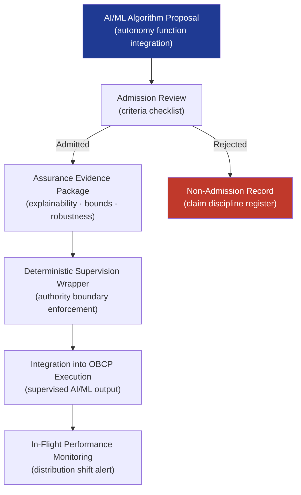

# STA 140-149 · Section 04 · Subsection 144 · Subsubject 005 — AI/ML Autonomy Admission and Assurance Boundaries

## 1. Purpose

Defines the **admission criteria, assurance requirements, explainability constraints, and claim discipline** for AI/ML algorithms deployed within spacecraft autonomous functions in the Q+ATLANTIDE STA band.

## 2. Scope

- **Admission criteria for AI/ML in autonomous functions** — admission gate: all AI/ML algorithms proposed for integration into mission-critical autonomous functions shall undergo formal admission review before integration; admission criteria: (a) mission-critical safety functions (safety_boundary declared) shall not rely on AI/ML with non-deterministic outputs; (b) AI/ML may be admitted for advisory, optimisation, or Level 3-and-below autonomy functions where a deterministic supervision and override layer wraps the AI/ML output; (c) admitted AI/ML algorithms shall have verifiable, bounded output envelopes in all operating conditions.
- **Assurance requirements for admitted AI/ML** — explainability: admitted AI/ML shall produce explainable outputs traceable to defined input features; formal verification: where formal verification tools are applicable (e.g., neural network verification tools), formal bounds on output shall be demonstrated; test coverage: AI/ML test dataset shall cover full operational envelope; adversarial robustness: sensitivity to out-of-distribution inputs shall be characterised and bounded; distribution shift monitoring: in-flight monitoring of input distribution drift with alert thresholds.
- **Claim discipline** — claim control: all claims about AI/ML performance in spacecraft autonomous functions shall be quantified, evidence-based, and traceable; unsubstantiated claims (e.g., "the AI will always correctly identify the anomaly") are prohibited; performance claims shall be qualified with confidence intervals, test coverage statistics, and operational domain limitations; claims shall be registered in the Q+ATLANTIDE requirements register with evidence citations.
- **Non-admission boundary** — the following applications are non-admissible for AI/ML in this baseline: autonomous commanding of inhibited or safety-critical command classes without deterministic supervision override; AI/ML with unverifiable output bounds in any mission-critical mode; AI/ML-driven FDIR isolation decisions for safety-critical components without fallback deterministic FDIR; AI/ML-driven safe-mode entry or exit.
- **Review and update process** — admission decisions recorded in admission register as controlled configuration items; re-admission required on AI/ML algorithm update, model retrain, or change in operational domain; post-flight AI/ML performance review: comparison of in-flight performance against pre-admission characterisation.

## 3. Diagram — AI/ML Admission and Assurance Boundaries

## 4. Footprint

| Metric | Value |
|---|---|
| Architecture | `STA` — Space Technology Architecture |
| Master range | `100–199` |
| Code range | `140-149` |
| Section | `04` — Aviónica y Control de Misión Espacial |
| Subsection | `144` — Autonomía |
| Subsubject | `005` — AI/ML Autonomy Admission and Assurance Boundaries |
| Primary Q-Division | Q-SPACE[^qdiv] |
| ORB support | ORB-PMO, ORB-LEG |
| Governance class | `baseline`[^gov] |
| Document | `005_AI-ML-Autonomy-Admission-and-Assurance-Boundaries.md` (this file) |
| Parent subsection | [`README.md`](./README.md) · [`000_Overview.md`](./000_Overview.md) |

## 5. References & Citations

[^ecssest40c]: **ECSS-E-ST-40C — Software Engineering** — FSW development and assurance requirements applicable to AI/ML software.

[^esaaisafety]: **ESA AI in Space — Safety and Assurance Framework** — ESA guidance on AI/ML safety assurance for space applications.

[^do178c]: **DO-178C — Software Considerations in Airborne Systems** — Aviation software assurance methodology adapted as reference for AI/ML qualification.

[^qdiv]: **Q-Division authority** — See [`organization/Q+ATLANTIDE.md` §4](../../../../organization/Q+ATLANTIDE.md#4-notes).

[^gov]: **Governance class** — `baseline`.

### Applicable industry standards

- ECSS-E-ST-40C — Software Engineering[^ecssest40c]
- ESA AI in Space — Safety and Assurance Framework[^esaaisafety]
- DO-178C — Software Considerations in Airborne Systems (adapted)[^do178c]
