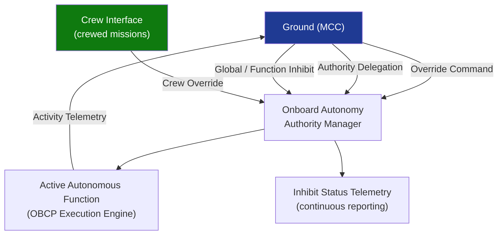

# STA 140-149 · Section 04 · Subsection 144 · Subsubject 006 — Human-in-the-Loop and Ground Override Interfaces

## 1. Purpose

Defines the **human-in-the-loop supervision architecture, ground command override authority, real-time inhibit interfaces, and authority delegation protocols** for Q+ATLANTIDE STA-band spacecraft autonomous systems.

## 2. Scope

- **Human-in-the-loop (HITL) supervision architecture** — HITL modes: continuous monitoring (ground monitors all autonomous actions via telemetry); advisory (ground reviews pending autonomous actions before execution, when contact allows); execution approval (ground must approve specific autonomous action classes before onboard execution, with uplinked enable command); override authority (ground issues override command at any time, superseding active autonomous function); HITL monitoring interface: dedicated telemetry stream carrying onboard autonomy activity log for real-time ground monitoring.
- **Ground command override authority** — override immediacy: any ground command uplinked and successfully validated shall immediately interrupt and supersede any active autonomous function within the affected command class; override propagation: override command generates telemetry event logging the interrupted autonomous function and the override action; re-entry control: return to autonomous mode requires explicit ground command after override; override audit trail: complete record of all override events in operations log.
- **Real-time inhibit interfaces** — global autonomy inhibit: single telecommand that transitions spacecraft to Level 0 (no autonomous actions, all actions ground-commanded); function-level inhibit: targeted inhibit of specific autonomous function classes; inhibit status telemetry: continuous status reporting of all inhibit states; inhibit persistence: inhibit states maintained across power cycling unless explicitly cleared by ground command.
- **Authority delegation interfaces** — uplinkable authority expansion: specific command classes may have their autonomous execution authority temporarily expanded via ground uplink, for periods when ground contact is not available (e.g., occultation); authority expansion record: all authority expansions logged with duration, scope, and authorising ground personnel; authority delegation expiry: automatic reversion to baseline authority level at delegation expiry or on ground command.
- **Crew authority interfaces (crewed missions)** — onboard crew override authority: crew members aboard have defined authority to override autonomous functions via onboard crew interface; crew authority hierarchy: defined priority between crew commands and ongoing autonomous functions; crew override telemetry: crew override actions reported to MCC via telemetry; crew authority coordination with FD: crew authority decisions for critical functions subject to FD coordination when contact permits.

## 3. Diagram — HITL and Ground Override Architecture

## 4. Footprint

| Metric | Value |
|---|---|
| Architecture | `STA` — Space Technology Architecture |
| Master range | `100–199` |
| Code range | `140-149` |
| Section | `04` — Aviónica y Control de Misión Espacial |
| Subsection | `144` — Autonomía |
| Subsubject | `006` — Human-in-the-Loop and Ground Override Interfaces |
| Primary Q-Division | Q-SPACE[^qdiv] |
| ORB support | ORB-PMO, ORB-LEG |
| Governance class | `baseline`[^gov] |
| Document | `006_Human-in-the-Loop-and-Ground-Override-Interfaces.md` (this file) |
| Parent subsection | [`README.md`](./README.md) · [`000_Overview.md`](./000_Overview.md) |

## 5. References & Citations

[^ecssest70c]: **ECSS-E-ST-70C — Ground Systems and Operations** — Ground override interface and HITL supervision requirements.

[^ecssest40c]: **ECSS-E-ST-40C — Software Engineering** — Onboard software authority management and override interface requirements.

[^nasastd3001]: **NASA-STD-3001 — Human Integration Design Requirements** — Crew interface authority and override requirements for crewed missions.

[^qdiv]: **Q-Division authority** — See [`organization/Q+ATLANTIDE.md` §4](../../../../organization/Q+ATLANTIDE.md#4-notes).

[^gov]: **Governance class** — `baseline`.

### Applicable industry standards

- ECSS-E-ST-70C — Ground Systems and Operations[^ecssest70c]
- ECSS-E-ST-40C — Software Engineering[^ecssest40c]
- NASA-STD-3001 — Human Integration Design Requirements (crewed missions)[^nasastd3001]
